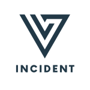
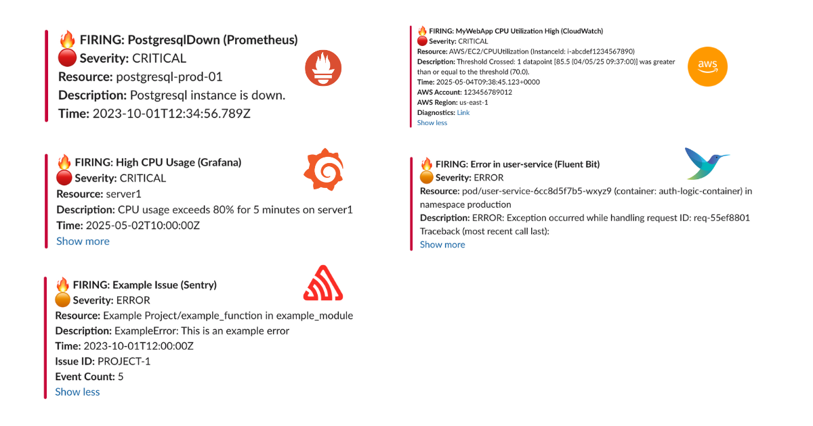

<h1 align="center" style="border-bottom: none">
  
</h1>

[](https://goreportcard.com/report/github.com/yourusername/versus)
[](https://opensource.org/licenses/MIT)

An incident management tool that supports alerting across multiple channels with easy custom messaging and on-call integrations. Compatible with any tool supporting webhook alerts, it's designed for modern DevOps teams to quickly respond to production incidents.

🚀 Boost Your SRE Skills with the Book: [On-Call in Action](https://a.co/d/4A8zrWR).

## Table of Contents
- [Features](#features)
- [Getting Started](#get-started-in-60-seconds)
- [Development Custom Templates](#development-custom-templates)
  - [Docker](#docker)
  - [Understanding Custom Templates](#understanding-custom-templates-with-monitoring-webhooks)
  - [Kubernetes](#kubernetes)
- [SNS Usage](#sns-usage)
- [On-call](#on-call)
- [Configuration](#complete-configuration)
- [Environment Variables](#environment-variables)
- [Dynamic Configuration with Query Parameters](#dynamic-configuration-with-query-parameters)
- [Template Syntax](https://versuscontrol.github.io/versus-incident/userguide/template-syntax.html)
- [Migration Guides](#migration-guides)
  - [Migrating to v1.2.0](#migrating-to-v120)
  - [Migrating to v1.3.0](#migrating-to-v130)
- [Roadmap](#roadmap)
- [Contributing](#contributing)
- [License](#license)

## Features

- 🚨 **Multi-channel Alerts**: Send incident notifications to Slack, Microsoft Teams, Telegram, Email, and Lark (more channels coming!)
- 📝 **Custom Templates**: Define your own alert messages using Go templates
- 🔧 **Easy Configuration**: YAML-based configuration with environment variables support
- 📡 **REST API**: Simple HTTP interface to receive alerts
- 📡 **On-call**: On-call integrations with AWS Incident Manager and PagerDuty


## Get Started in 60 Seconds

### Easy Installation with Docker

```bash
docker run -p 3000:3000 \
  -e SLACK_ENABLE=true \
  -e SLACK_TOKEN=your_token \
  -e SLACK_CHANNEL_ID=your_channel \
  ghcr.io/versuscontrol/versus-incident
```

Versus listens on port 3000 by default and exposes the `/api/incidents` endpoint, which you can configure as a webhook URL in your monitoring tools. This endpoint accepts JSON payloads from various monitoring systems and forwards the alerts to your configured notification channels.

### Universal Alert Template Support

Our default template (Slack, Telegram) automatically handles alerts from multiple sources, including:
- Alertmanager (Prometheus)
- Grafana Alerts
- Sentry
- CloudWatch SNS
- FluentBit

#### Example JSON Payload Sent by Alertmanager

```bash
curl -X POST "http://localhost:3000/api/incidents" \
  -H "Content-Type: application/json" \
  -d '{
    "receiver": "webhook-incident",
    "status": "firing",
    "alerts": [ 
      {                
        "status": "firing",                         
        "labels": {                                   
          "alertname": "PostgresqlDown",
          "instance": "postgresql-prod-01",
          "severity": "critical"
        },                        
        "annotations": {                                                
          "summary": "Postgresql down (instance postgresql-prod-01)",
          "description": "Postgresql instance is down."
        },                                     
        "startsAt": "2023-10-01T12:34:56.789Z",                         
        "endsAt": "2023-10-01T12:44:56.789Z",                
        "generatorURL": ""
      }                                  
    ],                                 
    "groupLabels": {                                                                  
      "alertname": "PostgresqlDown"     
    },                                                                    
    "commonLabels": {                                                           
      "alertname": "PostgresqlDown",                                                       
      "severity": "critical",
      "instance": "postgresql-prod-01"
    },  
    "commonAnnotations": {                                                                                  
      "summary": "Postgresql down (instance postgresql-prod-01)",
      "description": "Postgresql instance is down."
    },            
    "externalURL": ""            
  }'
```

#### Example JSON Payload Sent by Sentry

```bash
curl -X POST "http://localhost:3000/api/incidents" \
  -H "Content-Type: application/json" \
  -d '{
    "action": "created",
    "data": {
      "issue": {
        "id": "123456",
        "title": "Example Issue",
        "culprit": "example_function in example_module",
        "shortId": "PROJECT-1",
        "project": {
          "id": "1",
          "name": "Example Project",
          "slug": "example-project"
        },
        "metadata": {
          "type": "ExampleError",
          "value": "This is an example error"
        },
        "status": "unresolved",
        "level": "error",
        "firstSeen": "2023-10-01T12:00:00Z",
        "lastSeen": "2023-10-01T12:05:00Z",
        "count": 5,
        "userCount": 3
      }
    },
    "installation": {
      "uuid": "installation-uuid"
    },
    "actor": {
      "type": "user",
      "id": "789",
      "name": "John Doe"
    }
  }'
```

**Result:**



## Development Custom Templates

### Docker

Create a configuration file:

```
mkdir -p ./config && touch config.yaml
```

`config.yaml`:
```yaml
name: versus
host: 0.0.0.0
port: 3000

alert:
  slack:
    enable: true
    token: ${SLACK_TOKEN}
    channel_id: ${SLACK_CHANNEL_ID}
    template_path: "/app/config/slack_message.tmpl" # For containerized env

  telegram:
    enable: false

  msteams:
    enable: false
```

**Slack Template**

Create your Slack message template, for example `config/slack_message.tmpl`:

```
🔥 *Critical Error in {{.ServiceName}}*

❌ Error Details:
```{{.Logs}}```

Owner <@{{.UserID}}> please investigate
```

**Run with volume mount:**

```bash
docker run -d \
  -p 3000:3000 \
  -v $(pwd)/config:/app/config \
  -e SLACK_ENABLE=true \
  -e SLACK_TOKEN=your_slack_token \
  -e SLACK_CHANNEL_ID=your_channel_id \
  --name versus \
  ghcr.io/versuscontrol/versus-incident
```

To test, simply send an incident to Versus:

```bash
curl -X POST http://localhost:3000/api/incidents \
  -H "Content-Type: application/json" \
  -d '{
    "Logs": "[ERROR] This is an error log from User Service that we can obtain using Fluent Bit.",
    "ServiceName": "order-service",
    "UserID": "SLACK_USER_ID"
  }'
```

Response:

```json
{
    "status":"Incident created"
}
```

**Result:**


### Understanding Custom Templates with Monitoring Webhooks

When integrating Versus with any monitoring tool that supports webhooks, you need to understand the JSON payload structure that the tool sends to create an effective template. Here's a step-by-step guide:

1. **Enable Debug Mode**: First, enable debug_body in your config to see the exact payload structure:

```yaml
alert:
  debug_body: true  # This will print the incoming payload to the console
```

2. **Capture Sample Payload**: Send a test alert to Versus, then review the JSON structure within the logs of your Versus instance.

3. **Create Custom Template**: Use the JSON structure to build a template that extracts the relevant information.

#### FluentBit Integration Example

Here's a sample FluentBit configuration to send logs to Versus:

```ini
[OUTPUT]
    Name            http
    Match           kube.production.user-service.*
    Host            versus-host
    Port            3000
    URI             /api/incidents
    Format          json
    Header          Content-Type application/json
    Retry_Limit     3
```

**Sample FluentBit JSON Payload:**

```json
{
  "date": 1746354647.987654321,
  "log": "ERROR: Exception occurred while handling request ID: req-55ef8801\nTraceback (most recent call last):\n  File \"/app/server.py\", line 215, in handle_request\n    user_id = session['user_id']\nKeyError: 'user_id'\n",
  "stream": "stderr",
  "time": "2025-05-04T17:30:47.987654321Z",
  "kubernetes": {
    "pod_name": "user-service-6cc8d5f7b5-wxyz9",
    "namespace_name": "production",
    "pod_id": "f0e9d8c7-b6a5-f4e3-d2c1-b0a9f8e7d6c5",
    "labels": {
      "app": "user-service",
      "tier": "backend",
      "environment": "production"
    },
    "annotations": {
      "kubernetes.io/psp": "eks.restricted",
      "monitoring.alpha.example.com/scrape": "true"
    },
    "host": "ip-10-1-2-4.ap-southeast-1.compute.internal",
    "container_name": "auth-logic-container",
    "docker_id": "f5e4d3c2b1a0f5e4d3c2b1a0f5e4d3c2b1a0f5e4d3c2b1a0f5e4d3c2b1a0f5e4",
    "container_hash": "my-docker-hub/user-service@sha256:abcdef1234567890abcdef1234567890abcdef1234567890abcdef1234567890",
    "container_image": "my-docker-hub/user-service:v2.1.0"
  }
}
```

**FluentBit Slack Template (`config/slack_message.tmpl`):**

```
🚨 *Error in {{.kubernetes.labels.app}}* 🚨
*Environment:* {{.kubernetes.labels.environment}}
*Pod:* {{.kubernetes.pod_name}}
*Container:* {{.kubernetes.container_name}}

*Error Details:*
```{{.log}}```

*Time:* {{.time}}
*Host:* {{.kubernetes.host}}

<@SLACK_ONCALL_USER_ID> Please investigate!
```

#### More examples

1. [How to Customize Alert Messages from Alertmanager to Slack and Telegram](https://medium.com/@hmquan08011996/how-to-customize-alert-messages-from-alertmanager-to-slack-and-telegram-786525713689)
2. [Configuring Fluent Bit to Send Error Logs to Versus Incident](https://medium.com/@hmquan08011996/configuring-fluent-bit-to-send-error-logs-to-slack-and-telegram-89d11968bc30)
3. [Configuring AWS CloudWatch to Send Alerts to Slack and Telegram](https://medium.com/@hmquan08011996/configuring-aws-cloudwatch-to-send-alerts-to-slack-and-telegram-ae0b8c077fc6)
4. [How to Configure Sentry to Send Alerts to MS Teams](https://medium.com/@hmquan08011996/how-to-configure-sentry-to-send-alerts-to-ms-teams-08e0969f8578)
5. [How to Configure Kibana to Send Alerts to Slack and Telegram](https://medium.com/@hmquan08011996/how-to-configure-kibana-to-send-alerts-to-slack-and-telegram-40e882e29bb4)
6. [How to Configure Grafana to Send Alerts to Slack and Telegram](https://medium.com/@hmquan08011996/how-to-configure-grafana-to-send-alerts-to-slack-and-telegram-b11a784369b8)
7. [How to Configure OpenSearch to Send Alerts to Slack and Telegram](https://medium.com/@hmquan08011996/how-to-configure-opensearch-to-send-alerts-to-slack-and-telegram-43d177d36791)

#### Other Templates

**Telegram Template**

For Telegram, you can use HTML formatting. Create your Telegram message template, for example `config/telegram_message.tmpl`:
```
🚨 <b>Critical Error Detected!</b> 🚨
📌 <b>Service:</b> {{.ServiceName}}
⚠️ <b>Error Details:</b>
{{.Logs}}
```

This template will be parsed with HTML tags when sending the alert to Telegram.

**Email Template**

Create your email message template, for example `config/email_message.tmpl`:

```
Subject: Critical Error Alert - {{.ServiceName}}

Critical Error Detected in {{.ServiceName}}
----------------------------------------

Error Details:
{{.Logs}}

Please investigate this issue immediately.

Best regards,
Versus Incident Management System
```

This template supports both plain text and HTML formatting for email notifications.

**Microsoft Teams Template**

Create your Teams message template, for example `config/msteams_message.tmpl`. The Microsoft Teams integration now supports rich Markdown formatting that gets converted to Adaptive Cards:

```markdown
# Critical Error in {{.ServiceName}}
 
### Error Details:

```{{.Logs}}```

## Additional Information

- Source: {{.Source}}
- Severity: {{.Severity}}
- Incident ID: {{.IncidentID}}

Please [investigate immediately](https://your-dashboard-url.com/incidents/{{.IncidentID}})

*Alert sent by Versus Incident Management*
```

This template uses Markdown features that will be rendered as an Adaptive Card in Microsoft Teams:
- Headings with different levels (`#`, `##`, `###`)
- Code blocks with triple backticks
- Unordered lists with `-` or `*`
- Ordered lists with `1.`, `2.`, etc.
- Links with `[text](url)` syntax
- Bold text with `**double asterisks**`

**Important Note (April 2025)**: Versus Incident now automatically extracts a summary from your template's first heading (or first line if no heading exists) to ensure proper display in Microsoft Teams notifications. It also creates a plain text fallback version for clients that don't support Adaptive Cards.

**Lark Template**

Create your Lark message template, for example `config/lark_message.tmpl`:

```markdown
Critical Error in {{.ServiceName}}

**Error Details:**

```{{.Logs}}```

{{ if .AckURL }}

[Click here to acknowledge]({{.AckURL}})
{{ end }}
```

This template uses Markdown formatting for optimal display in Lark channels.

### Kubernetes

1. Create a secret for Slack:
```bash
# Create secret
kubectl create secret generic versus-secrets \
  --from-literal=slack_token=$SLACK_TOKEN \
  --from-literal=slack_channel_id=$SLACK_CHANNEL_ID
```

2. Create ConfigMap for config and template file, for example `versus-config.yaml`:
```yaml
apiVersion: v1
kind: ConfigMap
metadata:
  name: versus-config
data:
  config.yaml: |
    name: versus
    host: 0.0.0.0
    port: 3000

    alert:
      slack:
        enable: true
        token: ${SLACK_TOKEN}
        channel_id: ${SLACK_CHANNEL_ID}
        template_path: "/app/config/slack_message.tmpl"

      telegram:
        enable: false

  slack_message.tmpl: |
    *Critical Error in {{.ServiceName}}*
    ----------
    Error Details:
    ```
    {{.Logs}}
    ```
    ----------
    Owner <@{{.UserID}}> please investigate

```

```bash
kubectl apply -f versus-config.yaml
```

3. Create `versus-deployment.yaml`:
```yaml
apiVersion: apps/v1
kind: Deployment
metadata:
  name: versus-incident
spec:
  replicas: 2
  selector:
    matchLabels:
      app: versus-incident
  template:
    metadata:
      labels:
        app: versus-incident
    spec:
      containers:
      - name: versus-incident
        image: ghcr.io/versuscontrol/versus-incident
        ports:
        - containerPort: 3000
        livenessProbe:
          httpGet:
            path: /healthz
            port: 3000
        env:
          - name: SLACK_CHANNEL_ID
            valueFrom:
              secretKeyRef:
                name: versus-secrets
                key: slack_channel_id
          - name: SLACK_TOKEN
            valueFrom:
              secretKeyRef:
                name: versus-secrets
                key: slack_token
        volumeMounts:
        - name: versus-config
          mountPath: /app/config/config.yaml
          subPath: config.yaml
        - name: versus-config
          mountPath: /app/config/slack_message.tmpl
          subPath: slack_message.tmpl
      volumes:
      - name: versus-config
        configMap:
          name: versus-config

---
apiVersion: v1
kind: Service
metadata:
  name: versus-service
spec:
  selector:
    app: versus-incident
  ports:
    - protocol: TCP
      port: 3000
      targetPort: 3000
```

4. Apply:
```bash
kubectl apply -f versus-deployment.yaml
```

## SNS Usage
```bash
docker run -d \
  -p 3000:3000 \
  -e SLACK_ENABLE=true \
  -e SLACK_TOKEN=your_slack_token \
  -e SLACK_CHANNEL_ID=your_channel_id \
  -e SNS_ENABLE=true \
  -e SNS_TOPIC_ARN=$SNS_TOPIC_ARN \
  -e SNS_HTTPS_ENDPOINT_SUBSCRIPTION=https://your-domain.com \
  -e AWS_ACCESS_KEY_ID=$AWS_ACCESS_KEY \
  -e AWS_SECRET_ACCESS_KEY=$AWS_SECRET_KEY \
  --name versus \
  ghcr.io/versuscontrol/versus-incident
```

Send test message using AWS CLI:
```
aws sns publish \
  --topic-arn $SNS_TOPIC_ARN \
  --message '{"ServiceName":"test-service","Logs":"[ERROR] Test error","UserID":"U12345"}' \
  --region $AWS_REGION
```

**A key real-world application of Amazon SNS** involves integrating it with CloudWatch Alarms. This allows CloudWatch to publish messages to an SNS topic when an alarm state changes (e.g., from OK to ALARM), which can then trigger notifications to Slack, Telegram, or Email via Versus Incident with a custom template.

## On-call

Versus supports On-call integrations with AWS Incident Manager and PagerDuty. Updated configuration example with on-call features:

```yaml
name: versus
host: 0.0.0.0
port: 3000
public_host: https://your-ack-host.example # Required for on-call ack

# ... existing alert configurations ...

oncall:
  ### Enable overriding using query parameters
  # /api/incidents?oncall_enable=false => Set to `true` or `false` to enable or disable on-call for a specific alert
  # /api/incidents?oncall_wait_minutes=0 => Set the number of minutes to wait for acknowledgment before triggering on-call. Set to `0` to trigger immediately
  initialized_only: true  # Initialize on-call feature but don't enable by default; use query param oncall_enable=true to enable for specific requests
  enable: false # Use this to enable or disable on-call for all alerts
  wait_minutes: 3 # If you set it to 0, it means there's no need to check for an acknowledgment, and the on-call will trigger immediately
  provider: aws_incident_manager # Valid values: "aws_incident_manager" or "pagerduty"

  aws_incident_manager: # Used when provider is "aws_incident_manager"
    response_plan_arn: ${AWS_INCIDENT_MANAGER_RESPONSE_PLAN_ARN}
    other_response_plan_arns: # Optional: Enable overriding the default response plan ARN using query parameters, eg /api/incidents?awsim_other_response_plan=prod
      prod: ${AWS_INCIDENT_MANAGER_OTHER_RESPONSE_PLAN_ARN_PROD}
      dev: ${AWS_INCIDENT_MANAGER_OTHER_RESPONSE_PLAN_ARN_DEV}
      staging: ${AWS_INCIDENT_MANAGER_OTHER_RESPONSE_PLAN_ARN_STAGING}

  pagerduty: # Used when provider is "pagerduty"
    routing_key: ${PAGERDUTY_ROUTING_KEY} # Integration/Routing key for Events API v2 (REQUIRED)
    other_routing_keys: # Optional: Enable overriding the default routing key using query parameters, eg /api/incidents?pagerduty_other_routing_key=infra
      infra: ${PAGERDUTY_OTHER_ROUTING_KEY_INFRA}
      app: ${PAGERDUTY_OTHER_ROUTING_KEY_APP}
      db: ${PAGERDUTY_OTHER_ROUTING_KEY_DB}

redis: # Required for on-call functionality
  insecure_skip_verify: true # dev only
  host: ${REDIS_HOST}
  port: ${REDIS_PORT}
  password: ${REDIS_PASSWORD}
  db: 0
```

**Explanation:**

The `oncall` section includes:
1. `enable`: A boolean to toggle on-call functionality for all incidents (default: `false`).
2. `initialized_only`: Initialize on-call feature but keep it disabled by default. When set to `true`, on-call is triggered only for requests that explicitly include `?oncall_enable=true` in the URL. This is useful for having on-call ready but not enabled for all alerts.
3. `wait_minutes`: Time in minutes to wait for an acknowledgment before escalating (default: `3`). Setting it to `0` triggers the on-call immediately.
4. `provider`: Specifies which on-call provider to use ("aws_incident_manager" or "pagerduty").
5. `aws_incident_manager`: Configuration for AWS Incident Manager when it's the selected provider, including `response_plan_arn` and `other_response_plan_arns`.
6. `pagerduty`: Configuration for PagerDuty when it's the selected provider, including routing keys.

The redis section is required when `oncall.enable` or `oncall.initialized_only` is true. It configures the Redis instance used for state management or queuing, with settings like host, port, password, and db.

For detailed information on integration, please refer to the document here: [On-call setup with Versus](https://versuscontrol.github.io/versus-incident/oncall/on-call-introduction.html).

## Complete Configuration

A sample configuration file is located at `config/config.yaml`:

```yaml
name: versus
host: 0.0.0.0
port: 3000
public_host: https://your-ack-host.example # Required for on-call ack

alert:
  debug_body: true  # Default value, will be overridden by DEBUG_BODY env var

  slack:
    enable: false  # Default value, will be overridden by SLACK_ENABLE env var
    token: ${SLACK_TOKEN}            # From environment
    channel_id: ${SLACK_CHANNEL_ID}  # From environment
    template_path: "config/slack_message.tmpl"
    message_properties:
      button_text: "Acknowledge Alert" # Custom text for the acknowledgment button
      button_style: "primary" # Button style: "primary" (default blue), "danger" (red), or empty for default gray
      disable_button: false # Set to true to disable the button, if you want to handle acknowledgment differently

  telegram:
    enable: false  # Default value, will be overridden by TELEGRAM_ENABLE env var
    bot_token: ${TELEGRAM_BOT_TOKEN} # From environment
    chat_id: ${TELEGRAM_CHAT_ID} # From environment
    template_path: "config/telegram_message.tmpl"

  email:
    enable: false # Default value, will be overridden by EMAIL_ENABLE env var
    smtp_host: ${SMTP_HOST} # From environment
    smtp_port: ${SMTP_PORT} # From environment
    username: ${SMTP_USERNAME} # From environment
    password: ${SMTP_PASSWORD} # From environment
    to: ${EMAIL_TO} # From environment, can contain multiple comma-separated email addresses
    subject: ${EMAIL_SUBJECT} # From environment
    template_path: "config/email_message.tmpl"

  msteams:
    enable: false # Default value, will be overridden by MSTEAMS_ENABLE env var
    power_automate_url: ${MSTEAMS_POWER_AUTOMATE_URL} # Automatically works with both Power Automate workflow URLs and legacy Office 365 webhooks
    template_path: "config/msteams_message.tmpl"
    other_power_urls: # Optional: Define additional Power Automate URLs for multiple MS Teams channels
      qc: ${MSTEAMS_OTHER_POWER_URL_QC} # Power Automate URL for QC team
      ops: ${MSTEAMS_OTHER_POWER_URL_OPS} # Power Automate URL for Ops team
      dev: ${MSTEAMS_OTHER_POWER_URL_DEV} # Power Automate URL for Dev team

  lark:
    enable: false # Default value, will be overridden by LARK_ENABLE env var
    webhook_url: ${LARK_WEBHOOK_URL} # Lark webhook URL (required)
    template_path: "config/lark_message.tmpl"
    other_webhook_urls: # Optional: Enable overriding the default webhook URL using query parameters, eg /api/incidents?lark_other_webhook_url=dev
      dev: ${LARK_OTHER_WEBHOOK_URL_DEV}
      prod: ${LARK_OTHER_WEBHOOK_URL_PROD}

  queue:
  enable: true
  debug_body: true

  # AWS SNS
  sns:
    enable: false
    https_endpoint_subscription_path: /sns # URI to receive SNS messages, e.g. ${host}:${port}/sns or ${https_endpoint_subscription}/sns
    # Options If you want to automatically create an sns subscription
    https_endpoint_subscription: ${SNS_HTTPS_ENDPOINT_SUBSCRIPTION} # If the user configures an HTTPS endpoint, then an SNS subscription will be automatically created, e.g. https://your-domain.com
    topic_arn: ${SNS_TOPIC_ARN}
    
  # AWS SQS
  sqs:
    enable: false
    queue_url: ${SQS_QUEUE_URL}
    
  # GCP Pub Sub
  pubsub:
    enable: false
    
  # Azure Event Bus
  azbus:
    enable: false

oncall:
  ### Enable overriding using query parameters
  # /api/incidents?oncall_enable=false => Set to `true` or `false` to enable or disable on-call for a specific alert
  # /api/incidents?oncall_wait_minutes=0 => Set the number of minutes to wait for acknowledgment before triggering on-call. Set to `0` to trigger immediately
  initialized_only: false  # Initialize on-call feature but don't enable by default; use query param oncall_enable=true to enable for specific requests
  enable: false # Use this to enable or disable on-call for all alerts
  wait_minutes: 3 # If you set it to 0, it means there's no need to check for an acknowledgment, and the on-call will trigger immediately
  provider: aws_incident_manager # Valid values: "aws_incident_manager" or "pagerduty"

  aws_incident_manager: # Used when provider is "aws_incident_manager"
    response_plan_arn: ${AWS_INCIDENT_MANAGER_RESPONSE_PLAN_ARN}
    other_response_plan_arns: # Optional: Enable overriding the default response plan ARN using query parameters, eg /api/incidents?awsim_other_response_plan=prod
      prod: ${AWS_INCIDENT_MANAGER_OTHER_RESPONSE_PLAN_ARN_PROD}
      dev: ${AWS_INCIDENT_MANAGER_OTHER_RESPONSE_PLAN_ARN_DEV}
      staging: ${AWS_INCIDENT_MANAGER_OTHER_RESPONSE_PLAN_ARN_STAGING}

  pagerduty: # Used when provider is "pagerduty"
    routing_key: ${PAGERDUTY_ROUTING_KEY} # Integration/Routing key for Events API v2 (REQUIRED)
    other_routing_keys: # Optional: Enable overriding the default routing key using query parameters, eg /api/incidents?pagerduty_other_routing_key=infra
      infra: ${PAGERDUTY_OTHER_ROUTING_KEY_INFRA}
      app: ${PAGERDUTY_OTHER_ROUTING_KEY_APP}
      db: ${PAGERDUTY_OTHER_ROUTING_KEY_DB}

redis: # Required for on-call functionality
  insecure_skip_verify: true # dev only
  host: ${REDIS_HOST}
  port: ${REDIS_PORT}
  password: ${REDIS_PASSWORD}
  db: 0
```

## Environment Variables

The application relies on several environment variables to configure alerting services. Below is an explanation of each variable:

### Common
| Variable          | Description |
|------------------|-------------|
| `DEBUG_BODY`   | Set to `true` to enable print body send to Versus Incident. |

### Slack Configuration
| Variable          | Description |
|------------------|-------------|
| `SLACK_ENABLE`   | Set to `true` to enable Slack notifications. |
| `SLACK_TOKEN`    | The authentication token for your Slack bot. |
| `SLACK_CHANNEL_ID` | The ID of the Slack channel where alerts will be sent. **Can be overridden per request using the `slack_channel_id` query parameter.** |

Slack also supports interactive acknowledgment buttons that can be configured using the following properties in the `config.yaml` file:

```yaml
alert:
  slack:
    # ...other slack configuration...
    message_properties:
      button_text: "Acknowledge Alert" # Custom text for the acknowledgment button
      button_style: "primary" # Button style: "primary" (default blue), "danger" (red), or empty for default gray
      disable_button: false # Set to true to disable the button, if you want to handle acknowledgment differently
```

These properties allow you to:
- Customize the text of the acknowledgment button (`button_text`)
- Change the style of the button (`button_style`) - options are "primary" (blue), "danger" (red), or leave empty for default gray
- Disable the interactive button entirely (`disable_button`) if you want to handle acknowledgment through other means

### Telegram Configuration
| Variable              | Description |
|----------------------|-------------|
| `TELEGRAM_ENABLE`    | Set to `true` to enable Telegram notifications. |
| `TELEGRAM_BOT_TOKEN` | The authentication token for your Telegram bot. |
| `TELEGRAM_CHAT_ID`   | The chat ID where alerts will be sent. **Can be overridden per request using the `telegram_chat_id` query parameter.** |

### Email Configuration
| Variable          | Description |
|------------------|-------------|
| `EMAIL_ENABLE`   | Set to `true` to enable email notifications. |
| `SMTP_HOST`      | The SMTP server hostname (e.g., smtp.gmail.com). |
| `SMTP_PORT`      | The SMTP server port (e.g., 587 for TLS). |
| `SMTP_USERNAME`  | The username/email for SMTP authentication. |
| `SMTP_PASSWORD`  | The password or app-specific password for SMTP authentication. |
| `EMAIL_TO`       | The recipient email address(es) for incident notifications. Can be multiple addresses separated by commas. **Can be overridden per request using the `email_to` query parameter.** |
| `EMAIL_SUBJECT`  | The subject line for email notifications. **Can be overridden per request using the `email_subject` query parameter.** |

### Microsoft Teams Configuration
| Variable          | Description |
|------------------|-------------|
| `MSTEAMS_ENABLE`   | Set to `true` to enable Microsoft Teams notifications. |
| `MSTEAMS_POWER_AUTOMATE_URL` | Automatically works with both Power Automate workflow URLs and legacy Office 365 webhooks. |
| `MSTEAMS_OTHER_POWER_URL_QC`  | (Optional) Power Automate URL for the QC team channel. **Can be selected per request using the `msteams_other_power_url=qc` query parameter.** |
| `MSTEAMS_OTHER_POWER_URL_OPS` | (Optional) Power Automate URL for the Ops team channel. **Can be selected per request using the `msteams_other_power_url=ops` query parameter.** |
| `MSTEAMS_OTHER_POWER_URL_DEV` | (Optional) Power Automate URL for the Dev team channel. **Can be selected per request using the `msteams_other_power_url=dev` query parameter.** |

### Lark Configuration
| Variable          | Description |
|------------------|-------------|
| `LARK_ENABLE`   | Set to `true` to enable Lark notifications. |
| `LARK_WEBHOOK_URL` | The webhook URL for Lark notifications. |
| `LARK_OTHER_WEBHOOK_URL_DEV` | (Optional) Webhook URL for the development environment. **Can be selected per request using the `lark_other_webhook_url=dev` query parameter.** |
| `LARK_OTHER_WEBHOOK_URL_PROD` | (Optional) Webhook URL for the production environment. **Can be selected per request using the `lark_other_webhook_url=prod` query parameter.** |

### Queue Services Configuration
| Variable                     | Description |
|-----------------------------|-------------|
| `SNS_ENABLE`             | Set to `true` to enable receive Alert Messages from SNS. |
| `SNS_HTTPS_ENDPOINT_SUBSCRIPTION`             | This specifies the HTTPS endpoint to which SNS sends messages. When an HTTPS endpoint is configured, an SNS subscription is automatically created. If no endpoint is configured, you must create the SNS subscription manually using the CLI or AWS Console. E.g. `https://your-domain.com`. |
| `SNS_TOPIC_ARN`             | AWS ARN of the SNS topic to subscribe to. |
| `SQS_ENABLE`             | Set to `true` to enable receive Alert Messages from AWS SQS. |
| `SQS_QUEUE_URL`             | URL of the AWS SQS queue to receive messages from. |

### On-Call Configuration
| Variable                          | Description |
|----------------------------------|-------------|
| `ONCALL_ENABLE`             | Set to `true` to enable on-call functionality. **Can be overridden per request using the `oncall_enable` query parameter.** |
| `ONCALL_INITIALIZED_ONLY`   | Set to `true` to initialize on-call feature but keep it disabled by default. When enabled, on-call is triggered only for requests that explicitly include `?oncall_enable=true` in the URL. |
| `ONCALL_WAIT_MINUTES`       | Time in minutes to wait for acknowledgment before escalating (default: 3). **Can be overridden per request using the `oncall_wait_minutes` query parameter.** |
| `ONCALL_PROVIDER`           | Specify the on-call provider to use ("aws_incident_manager" or "pagerduty"). |
| `AWS_INCIDENT_MANAGER_RESPONSE_PLAN_ARN` | The ARN of the AWS Incident Manager response plan to use for on-call escalations. Required if on-call provider is "aws_incident_manager". |
| `AWS_INCIDENT_MANAGER_OTHER_RESPONSE_PLAN_ARN_PROD` | (Optional) AWS Incident Manager response plan ARN for production environment. **Can be selected per request using the `awsim_other_response_plan=prod` query parameter.** |
| `AWS_INCIDENT_MANAGER_OTHER_RESPONSE_PLAN_ARN_DEV` | (Optional) AWS Incident Manager response plan ARN for development environment. **Can be selected per request using the `awsim_other_response_plan=dev` query parameter.** |
| `AWS_INCIDENT_MANAGER_OTHER_RESPONSE_PLAN_ARN_STAGING` | (Optional) AWS Incident Manager response plan ARN for staging environment. **Can be selected per request using the `awsim_other_response_plan=staging` query parameter.** |
| `PAGERDUTY_ROUTING_KEY`     | Integration/Routing key for PagerDuty Events API v2. Required if on-call provider is "pagerduty". |
| `PAGERDUTY_OTHER_ROUTING_KEY_INFRA` | (Optional) PagerDuty routing key for infrastructure team. **Can be selected per request using the `pagerduty_other_routing_key=infra` query parameter.** |
| `PAGERDUTY_OTHER_ROUTING_KEY_APP`   | (Optional) PagerDuty routing key for application team. **Can be selected per request using the `pagerduty_other_routing_key=app` query parameter.** |
| `PAGERDUTY_OTHER_ROUTING_KEY_DB`    | (Optional) PagerDuty routing key for database team. **Can be selected per request using the `pagerduty_other_routing_key=db` query parameter.** |

When you have `initialized_only: true` in your configuration (rather than `enable: true`), on-call is only triggered for incidents that explicitly request it. This is useful when:

1. You want the on-call feature ready but not active for all alerts
2. You need to selectively enable on-call only for high-priority services or incidents
3. You want to let your monitoring system decide which alerts should trigger on-call

### Redis Configuration
| Variable          | Description |
|------------------|-------------|
| `REDIS_HOST`     | The hostname or IP address of the Redis server. Required if on-call is enabled. |
| `REDIS_PORT`     | The port number of the Redis server. Required if on-call is enabled. |
| `REDIS_PASSWORD` | The password for authenticating with the Redis server. Required if on-call is enabled and Redis requires authentication. |

Ensure these environment variables are properly set before running the application.

## Dynamic Configuration with Query Parameters
We provide a way to overwrite configuration values using query parameters, allowing you to send alerts to different channels and customize notification behavior on a per-request basis.

| Query Parameter          | Description |
|------------------|-------------|
| `slack_channel_id`   | The ID of the Slack channel where alerts will be sent. Use: `/api/incidents?slack_channel_id=<your_value>`. |
| `telegram_chat_id`   | The chat ID where Telegram alerts will be sent. Use: `/api/incidents?telegram_chat_id=<your_chat_id>`. |
| `email_to`   | Overrides the default recipient email address for email notifications. Use: `/api/incidents?email_to=<recipient_email>`. |
| `email_subject`   | Overrides the default subject line for email notifications. Use: `/api/incidents?email_subject=<custom_subject>`. |
| `msteams_other_power_url`   | Overrides the default Microsoft Teams Power Automate flow by specifying an alternative key (e.g., qc, ops, dev). Use: `/api/incidents?msteams_other_power_url=qc`. |
| `lark_other_webhook_url`   | Overrides the default Lark webhook URL by specifying an alternative key (e.g., dev, prod). Use: `/api/incidents?lark_other_webhook_url=dev`. |
| `oncall_enable`          | Set to `true` or `false` to enable or disable on-call for a specific alert. Use: `/api/incidents?oncall_enable=false`. |
| `oncall_wait_minutes`    | Set the number of minutes to wait for acknowledgment before triggering on-call. Set to `0` to trigger immediately. Use: `/api/incidents?oncall_wait_minutes=0`. |
| `awsim_other_response_plan` | Overrides the default AWS Incident Manager response plan by specifying an alternative key (e.g., prod, dev, staging). Use: `/api/incidents?awsim_other_response_plan=prod`. |
| `pagerduty_other_routing_key` | Overrides the default PagerDuty routing key by specifying an alternative key (e.g., infra, app, db). Use: `/api/incidents?pagerduty_other_routing_key=infra`. |

### Examples for Each Query Parameter

#### Slack Channel Override

To send an alert to a specific Slack channel (e.g., a dedicated channel for database issues):

```bash
curl -X POST "http://localhost:3000/api/incidents?slack_channel_id=C01DB2ISSUES" \
  -H "Content-Type: application/json" \
  -d '{
    "Logs": "[ERROR] Database connection pool exhausted.",
    "ServiceName": "database-service",
    "UserID": "U12345"
  }'
```

#### Telegram Chat Override

To send an alert to a different Telegram chat (e.g., for network monitoring):

```bash
curl -X POST "http://localhost:3000/api/incidents?telegram_chat_id=-1001234567890" \
  -H "Content-Type: application/json" \
  -d '{
    "Logs": "[ERROR] Network latency exceeding thresholds.",
    "ServiceName": "network-monitor",
    "UserID": "U12345"
  }'
```

#### Email Recipient Override

To send an email alert to a specific recipient with a custom subject:

```bash
curl -X POST "http://localhost:3000/api/incidents?email_to=network-team@yourdomain.com&email_subject=Urgent%20Network%20Issue" \
  -H "Content-Type: application/json" \
  -d '{
    "Logs": "[ERROR] Load balancer failing health checks.",
    "ServiceName": "load-balancer",
    "UserID": "U12345"
  }'
```

#### Microsoft Teams Channel Override

You can configure multiple Microsoft Teams channels using the `other_power_urls` setting:

```yaml
alert:
  msteams:
    enable: true
    power_automate_url: ${MSTEAMS_POWER_AUTOMATE_URL}
    template_path: "config/msteams_message.tmpl"
    other_power_urls:
      qc: ${MSTEAMS_OTHER_POWER_URL_QC}
      ops: ${MSTEAMS_OTHER_POWER_URL_OPS}
      dev: ${MSTEAMS_OTHER_POWER_URL_DEV}
```

Then, to send an alert to the QC team's Microsoft Teams channel:

```bash
curl -X POST "http://localhost:3000/api/incidents?msteams_other_power_url=qc" \
  -H "Content-Type: application/json" \
  -d '{
    "Logs": "[ERROR] Quality check failed for latest deployment.",
    "ServiceName": "quality-service",
    "UserID": "U12345"
  }'
```

#### Lark Webhook Override

You can configure multiple Lark webhook URLs using the `other_webhook_urls` setting:

```yaml
alert:
  lark:
    enable: true
    webhook_url: ${LARK_WEBHOOK_URL}
    template_path: "config/lark_message.tmpl"
    other_webhook_urls:
      dev: ${LARK_OTHER_WEBHOOK_URL_DEV}
      prod: ${LARK_OTHER_WEBHOOK_URL_PROD}
```

Then, to send an alert to the development environment's Lark webhook:

```bash
curl -X POST "http://localhost:3000/api/incidents?lark_other_webhook_url=dev" \
  -H "Content-Type: application/json" \
  -d '{
    "Logs": "[ERROR] Development server failure.",
    "ServiceName": "dev-server",
    "UserID": "U12345"
  }'
```

#### On-Call Controls

To disable on-call escalation for a non-critical alert:

```bash
curl -X POST "http://localhost:3000/api/incidents?oncall_enable=false" \
  -H "Content-Type: application/json" \
  -d '{
    "Logs": "[WARNING] This is a minor issue that doesn't require on-call response.",
    "ServiceName": "monitoring-service",
    "UserID": "U12345"
  }'
```

To trigger on-call immediately without the normal wait period for a critical issue:

```bash
curl -X POST "http://localhost:3000/api/incidents?oncall_wait_minutes=0" \
  -H "Content-Type: application/json" \
  -d '{
    "Logs": "[CRITICAL] Payment processing system down.",
    "ServiceName": "payment-service",
    "UserID": "U12345"
  }'
```

#### AWS Incident Manager Response Plan Override

You can configure multiple AWS Incident Manager response plans using the `other_response_plan_arns` setting:

```yaml
oncall:
  enable: true
  wait_minutes: 3
  provider: aws_incident_manager
  
  aws_incident_manager:
    response_plan_arn: ${AWS_INCIDENT_MANAGER_RESPONSE_PLAN_ARN}  # Default response plan
    other_response_plan_arns:
      prod: ${AWS_INCIDENT_MANAGER_OTHER_RESPONSE_PLAN_ARN_PROD}  # Production environment
      dev: ${AWS_INCIDENT_MANAGER_OTHER_RESPONSE_PLAN_ARN_DEV}    # Development environment
      staging: ${AWS_INCIDENT_MANAGER_OTHER_RESPONSE_PLAN_ARN_STAGING}  # Staging environment
```

Then, to use a specific AWS Incident Manager response plan for a production environment issue:

```bash
curl -X POST "http://localhost:3000/api/incidents?awsim_other_response_plan=prod" \
  -H "Content-Type: application/json" \
  -d '{
    "Logs": "[CRITICAL] Production database cluster failure.",
    "ServiceName": "prod-database",
    "UserID": "U12345"
  }'
```

#### PagerDuty Routing Key Override

You can configure multiple PagerDuty routing keys using the `other_routing_keys` setting:

```yaml
oncall:
  enable: true
  wait_minutes: 3
  provider: pagerduty
  
  pagerduty:
    routing_key: ${PAGERDUTY_ROUTING_KEY}  # Default routing key
    other_routing_keys:
      infra: ${PAGERDUTY_OTHER_ROUTING_KEY_INFRA}  # Infrastructure team
      app: ${PAGERDUTY_OTHER_ROUTING_KEY_APP}      # Application team 
      db: ${PAGERDUTY_OTHER_ROUTING_KEY_DB}        # Database team
```

Then, to use a specific PagerDuty routing key for the infrastructure team:

```bash
curl -X POST "http://localhost:3000/api/incidents?pagerduty_other_routing_key=infra" \
  -H "Content-Type: application/json" \
  -d '{
    "Logs": "[ERROR] Server load balancer failure in us-west-2.",
    "ServiceName": "infrastructure",
    "UserID": "U12345"
  }'
```

### Combining Multiple Parameters

You can combine multiple query parameters to customize exactly how an incident is handled:

```bash
curl -X POST "http://localhost:3000/api/incidents?slack_channel_id=C01PROD&telegram_chat_id=-987654321&oncall_enable=true&oncall_wait_minutes=1" \
  -H "Content-Type: application/json" \
  -d '{
    "Logs": "[CRITICAL] Multiple service failures detected in production environment.",
    "ServiceName": "core-infrastructure",
    "UserID": "U12345",
    "Severity": "CRITICAL"
  }'
```

This will:
1. Send the alert to a specific Slack channel (`C01PROD`)
2. Send the alert to a specific Telegram chat (`-987654321`)
3. Enable on-call escalation with a shortened 1-minute wait time

## Migration Guides

### Migrating to v1.2.0

Version 1.2.0 introduces enhanced Microsoft Teams integration using Power Automate.

For complete migration instructions, please see our [detailed migration guide](https://versuscontrol.github.io/versus-incident/migration/migration-v1.2.0.html).

### Migrating to v1.3.0

Version 1.3.0 introduces a new integration with PagerDuty.

For complete migration instructions, please see our [detailed migration guide](https://versuscontrol.github.io/versus-incident/migration/migration-v1.3.0.html).

## Roadmap

- [x] Add Telegram support
- [x] Add Email support
- [x] Add SNS subscription
- [x] Add MS Team support
- [ ] Add Viber support
- [x] Add Lark support
- [x] Add support for queue listeners (AWS SQS, GCP Cloud Pub/Sub, Azure Service Bus)
- [x] Support multiple templates
- [ ] API Server for Incident Management
- [ ] Web UI
- [x] On-call integrations (AWS Incident Manager, PagerDuty)
- [ ] Prometheus metrics

Complete Project Diagram


## Contributing

We welcome contributions! Please follow these steps:

1. Fork the repository
2. Create your feature branch (`git checkout -b feature/amazing-feature`)
3. Commit your changes (`git commit -m 'Add some amazing feature'`)
4. Push to the branch (`git push origin feature/amazing-feature`)
5. Open a Pull Request

## License

Distributed under the MIT License. See `LICENSE` for more information.
