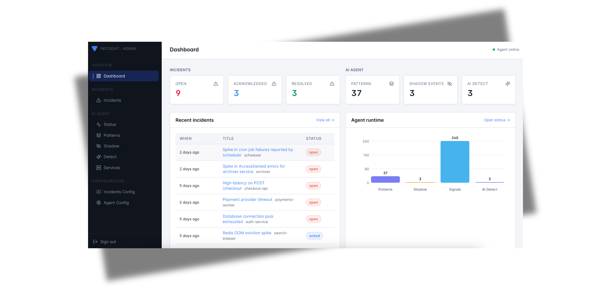
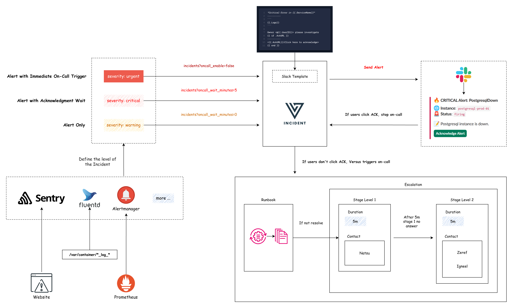
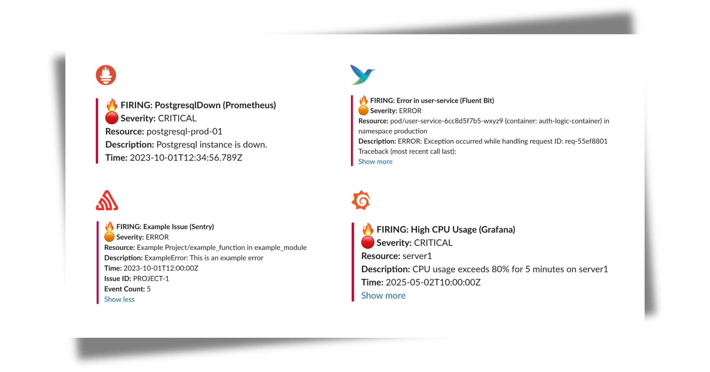

<h1 align="center" style="border-bottom: none">
  
</h1>

<p align="center">
  <a href="https://goreportcard.com/report/github.com/VersusControl/versus-incident"></a>
  <a href="https://opensource.org/licenses/MIT"></a>
  <a href="https://github.com/sponsors/versuscontrol"></a>
</p>

An incident management tool that supports alerting across multiple channels with easy custom messaging and on-call integrations. Compatible with any tool supporting webhook alerts, it's designed for modern DevOps teams to quickly respond to production incidents.

With the built-in **AI SRE Agent**, Versus goes further — continuously observing your logs, metrics, and traces, learning what normal looks like, and alerting you only when something new and unexpected appears.



## Table of Contents
- [Features](#features)
- [Getting Started](#get-started-in-60-seconds)
- [Admin Dashboard](https://versuscontrol.github.io/versus-incident/userguide/admin-ui.html)
- [Development Custom Templates](#development-custom-templates)
- [AI Agent](#ai-agent)
- [On-Call](#on-call)
- [Configuration](#complete-configuration)
- [Roadmap](#roadmap)
- [Contributing](#contributing)
- [License](#license)

## Features

- 🚨 **Multi-channel Alerts**: Send incident notifications to Slack, Microsoft Teams, Telegram, Viber, Email, and Lark (more channels coming!)
- 📝 **Custom Templates**: Define your own alert messages using Go templates
- 🔧 **Easy Configuration**: YAML-based configuration with environment variables support
- 📡 **REST API**: Simple HTTP interface to receive alerts
- 📡 **On-Call**: On-Call integrations with AWS Incident Manager and PagerDuty
- 🤖 **AI Agent** *(Beta)*: An AI SRE agent that reads your logs, metrics and tracing, learns what normal looks like, and only alerts you when something new and unexpected appears.



## Get Started in 60 Seconds

### Easy Installation with Docker

```bash
docker run -p 3000:3000 \
  -e GATEWAY_SECRET=change-me \
  -e SLACK_ENABLE=true \
  -e SLACK_TOKEN=your_token \
  -e SLACK_CHANNEL_ID=your_channel \
  ghcr.io/versuscontrol/versus-incident
```

Versus listens on port 3000 by default and exposes:

- `POST /api/incidents` — webhook endpoint for monitoring tools.
- `GET  /` — the embedded **admin dashboard**, open <http://localhost:3000/> in your browser. For the full UI walkthrough and the build/watch scripts, see [Admin Dashboard](https://versuscontrol.github.io/versus-incident/userguide/admin-ui.html).

### Universal Alert Template Support

Our default template (Slack, Telegram) automatically handles alerts from multiple sources, including:
- Alertmanager (Prometheus)
- Grafana Alerts
- Sentry
- CloudWatch SNS
- FluentBit

#### Example JSON Payload Sent by Alertmanager

```bash
curl -X POST "http://localhost:3000/api/incidents" \
  -H "Content-Type: application/json" \
  -d '{
    "receiver": "webhook-incident",
    "status": "firing",
    "alerts": [ 
      {                
        "status": "firing",                         
        "labels": {                                   
          "alertname": "PostgresqlDown",
          "instance": "postgresql-prod-01",
          "severity": "critical"
        },                        
        "annotations": {                                                
          "summary": "Postgresql down (instance postgresql-prod-01)",
          "description": "Postgresql instance is down."
        },                                     
        "startsAt": "2023-10-01T12:34:56.789Z",                         
        "endsAt": "2023-10-01T12:44:56.789Z",                
        "generatorURL": ""
      }                                  
    ],                                 
    "groupLabels": {                                                                  
      "alertname": "PostgresqlDown"     
    },                                                                    
    "commonLabels": {                                                           
      "alertname": "PostgresqlDown",                                                       
      "severity": "critical",
      "instance": "postgresql-prod-01"
    },  
    "commonAnnotations": {                                                                                  
      "summary": "Postgresql down (instance postgresql-prod-01)",
      "description": "Postgresql instance is down."
    },            
    "externalURL": ""            
  }'
```

#### Example JSON Payload Sent by Sentry

```bash
curl -X POST "http://localhost:3000/api/incidents" \
  -H "Content-Type: application/json" \
  -d '{
    "action": "created",
    "data": {
      "issue": {
        "id": "123456",
        "title": "Example Issue",
        "culprit": "example_function in example_module",
        "shortId": "PROJECT-1",
        "project": {
          "id": "1",
          "name": "Example Project",
          "slug": "example-project"
        },
        "metadata": {
          "type": "ExampleError",
          "value": "This is an example error"
        },
        "status": "unresolved",
        "level": "error",
        "firstSeen": "2023-10-01T12:00:00Z",
        "lastSeen": "2023-10-01T12:05:00Z",
        "count": 5,
        "userCount": 3
      }
    },
    "installation": {
      "uuid": "installation-uuid"
    },
    "actor": {
      "type": "user",
      "id": "789",
      "name": "John Doe"
    }
  }'
```

**Result:**



## Development Custom Templates

For the custom templates, see [Development Custom Templates](https://versus-incident.devopsvn.tech/userguide/getting-started.html#development-custom-templates)

## Kubernetes

For a complete `Deployment` + `Service` + `PersistentVolumeClaim`
manifest (with the persistent data volume the admin dashboard needs),
see [Deploy on Kubernetes](https://versuscontrol.github.io/versus-incident/userguide/kubernetes.html).

## Helm Chart

For the packaged install, see [Helm Chart](https://versuscontrol.github.io/versus-incident/userguide/helm.html)
or the chart source under [helm/versus-incident](https://github.com/VersusControl/versus-incident/blob/main/helm/versus-incident).

## AI Agent

Versus supports an opt-in **AI SRE agent** that reads your logs, metrics and tracing, learns what normal looks like, and only alerts you when something new and unexpected appears.

Configuration example with agent features:

```yaml
name: versus
host: 0.0.0.0
port: 3000

# ... existing alert configurations ...

# Shared secret required for ALL admin endpoints (`/api/admin/*` and
# `/api/agent/*`). Sent by clients in the `X-Gateway-Secret` header.
gateway_secret: ${GATEWAY_SECRET}

# Storage backend for the pattern catalog, shadow log, and incident
# history. Only `file` is implemented today; `redis` and `database`
# are config stubs.
storage:
  type: file              # file | redis | database (env: STORAGE_TYPE)
  file:
    data_dir: ./data
    max_incidents: 1000   # rolling cap on persisted incidents

agent:
  enable: false # Use this to enable or disable the agent for all sources
  mode: training # Valid values: "training", "shadow", or "detect"
  poll_interval: 30s

  # Sources are kept in a separate file so they can be managed independently
  # (e.g. swap fixtures, per-environment lists). Path is resolved relative to
  # this config file. Override via env: AGENT_SOURCES_PATH.
  sources_path: ./agent_sources.yaml

  catalog:
    persist_interval: 30s
    auto_promote_after: 100 # In detect mode, this many sightings = "known"

  redaction:
    enable: true
    redact_ips: false
    extra_patterns: # Optional: extra regex rules to scrub before clustering
      - "(?i)password=\\S+"
      - "Authorization:\\s*Bearer\\s+\\S+"

  miner:
    similarity_threshold: 0.4
    tree_depth: 4
    max_children: 100

  regex:
    # Optional: tag any signal whose message matches this pattern
    # if none of the named rules below hit. Leave empty to disable.
    default_pattern: "(?i)error|exception|fatal|panic"
    # Named rules are tried first, in order. The first match wins.
    rules:
      - name: oom
        pattern: "(?i)out of memory|OOMKilled|java\\.lang\\.OutOfMemoryError"
      - name: db-timeout
        pattern: "(?i)(connection|query) timeout|deadlock detected"
      - name: auth-failure
        pattern: "(?i)401 unauthorized|invalid credentials|permission denied"

redis: # Required for the agent to persist source cursors across restarts
  host: ${REDIS_HOST}
  port: ${REDIS_PORT}
  password: ${REDIS_PASSWORD}
  db: 0
```

**Explanation:**

The `agent` section includes:
1. `enable`: Turn the agent on or off (default: `false`). When disabled, nothing extra runs — no background processes, no extra files written.
2. `mode`: How the agent behaves after it has learned your log patterns:
   - `training`: observation only — the agent learns patterns and saves them, but sends no alerts.
   - `shadow`: same as training, but also logs a note every time it would have sent an alert. Good for reviewing before going live.
   - `detect`: the agent actively sends alerts for any pattern it has never seen before.
3. `poll_interval`: How often the agent checks your log sources for new entries.
4. `catalog`: Where the agent stores the list of known patterns and how often to write updates. `mode` selects the storage backend — only `file` is supported today, which writes to `<storage.file.data_dir>/patterns.json` (the filename is fixed).

> **Admin secret.** All admin endpoints (`/api/admin/*` and
> `/api/agent/*`) are protected by the **root-level** `gateway_secret`
> (env `GATEWAY_SECRET`). Set it to any value you choose; clients send
> the same value in the `X-Gateway-Secret` header. When no secret is
> configured the admin endpoints are not registered and the agent
> refuses to start.

> **Storage.** The agent's catalog and the incident history shown in the
> UI are persisted via the **root-level** `storage:` block (default:
> `type: file`, `data_dir: ./data`). The agent's `data_dir` field has
> been removed.
5. `redaction`: Rules for automatically removing sensitive information (passwords, tokens, emails, etc.) from logs before the agent processes them.
6. `miner`: Controls how aggressively the agent groups similar log lines together. The defaults work well for most setups.
7. `regex`: Acts as a **pre-filter** for the agent. Only signals whose message matches at least one rule (a named entry under `rules` or `default_pattern`) are forwarded to the pattern miner and stored in the catalog. Anything that doesn't match is dropped before clustering, so boring noise (200-OK requests, debug lines, etc.) never bloats `patterns.json`.

   - Named `rules` are tried in order; the first match wins and tags the signal with that `name` (stored as `rule_name` on the pattern).
   - If no named rule hits, `default_pattern` is tried. Matches there are tagged with `name=default`.
   - **To learn from every line, set `default_pattern: ".*"`.** This is useful in early training when you don't yet know what's interesting.
   - **To filter aggressively, set `default_pattern: ""` (empty)** and rely on your named rules — anything that doesn't match an explicit rule is dropped.
8. `sources_path`: Path to a separate YAML file that lists the log sources the agent should read from. Keeping sources in their own file makes it easier to manage per-environment source lists or swap fixtures without touching the rest of the config. The path is resolved relative to the main config file. Override via the `AGENT_SOURCES_PATH` env var.

The sources file (default `./agent_sources.yaml`) has a single top-level `sources:` list. Each entry needs `name`, `type` (`file` or `elasticsearch`), `enable`, plus a matching `file:` or `elasticsearch:` block. Example:

```yaml
sources:
  - name: prod-app
    type: elasticsearch
    enable: true
    elasticsearch:
      addresses:
        - https://es.example.internal:9200
      username: ${ES_USERNAME}
      password: ${ES_PASSWORD}
      index: "logs-app-*"
      time_field: "@timestamp"
      query: 'log.level:(error OR warn)'
      message_field: message
      page_size: 500

  - name: sample-app
    type: file
    enable: true
    file:
      path: ./local/resource/sample-app.log
      format: text
      from_beginning: true
```

The `redis` section is required when `agent.enable` is `true`. Redis is used to remember where the agent left off in each log source, so it picks up from the right place after a restart.

For detailed information on integration, please refer to the document here: [Enable AI Agent](https://versuscontrol.github.io/versus-incident/agent/agent-introduction.html).

## On-Call

Versus supports On-Call integrations with AWS Incident Manager and PagerDuty. Updated configuration example with on-call features:

```yaml
name: versus
host: 0.0.0.0
port: 3000
public_host: https://your-ack-host.example # Required for on-call ack

# ... existing alert configurations ...

oncall:
  ### Enable overriding using query parameters
  # /api/incidents?oncall_enable=false => Set to `true` or `false` to enable or disable on-call for a specific alert
  # /api/incidents?oncall_wait_minutes=0 => Set the number of minutes to wait for acknowledgment before triggering on-call. Set to `0` to trigger immediately
  initialized_only: true  # Initialize on-call feature but don't enable by default; use query param oncall_enable=true to enable for specific requests
  enable: false # Use this to enable or disable on-call for all alerts
  wait_minutes: 3 # If you set it to 0, it means there's no need to check for an acknowledgment, and the on-call will trigger immediately
  provider: aws_incident_manager # Valid values: "aws_incident_manager" or "pagerduty"

  aws_incident_manager: # Used when provider is "aws_incident_manager"
    response_plan_arn: ${AWS_INCIDENT_MANAGER_RESPONSE_PLAN_ARN}
    other_response_plan_arns: # Optional: Enable overriding the default response plan ARN using query parameters, eg /api/incidents?awsim_other_response_plan=prod
      prod: ${AWS_INCIDENT_MANAGER_OTHER_RESPONSE_PLAN_ARN_PROD}
      dev: ${AWS_INCIDENT_MANAGER_OTHER_RESPONSE_PLAN_ARN_DEV}
      staging: ${AWS_INCIDENT_MANAGER_OTHER_RESPONSE_PLAN_ARN_STAGING}

  pagerduty: # Used when provider is "pagerduty"
    routing_key: ${PAGERDUTY_ROUTING_KEY} # Integration/Routing key for Events API v2 (REQUIRED)
    other_routing_keys: # Optional: Enable overriding the default routing key using query parameters, eg /api/incidents?pagerduty_other_routing_key=infra
      infra: ${PAGERDUTY_OTHER_ROUTING_KEY_INFRA}
      app: ${PAGERDUTY_OTHER_ROUTING_KEY_APP}
      db: ${PAGERDUTY_OTHER_ROUTING_KEY_DB}

redis: # Required for on-call functionality
  insecure_skip_verify: true # dev only
  host: ${REDIS_HOST}
  port: ${REDIS_PORT}
  password: ${REDIS_PASSWORD}
  db: 0
```

**Explanation:**

The `oncall` section includes:
1. `enable`: A boolean to toggle on-call functionality for all incidents (default: `false`).
2. `initialized_only`: Initialize on-call feature but keep it disabled by default. When set to `true`, on-call is triggered only for requests that explicitly include `?oncall_enable=true` in the URL. This is useful for having on-call ready but not enabled for all alerts.
3. `wait_minutes`: Time in minutes to wait for an acknowledgment before escalating (default: `3`). Setting it to `0` triggers the on-call immediately.
4. `provider`: Specifies which on-call provider to use ("aws_incident_manager" or "pagerduty").
5. `aws_incident_manager`: Configuration for AWS Incident Manager when it's the selected provider, including `response_plan_arn` and `other_response_plan_arns`.
6. `pagerduty`: Configuration for PagerDuty when it's the selected provider, including routing keys.

The redis section is required when `oncall.enable` or `oncall.initialized_only` is true. It configures the Redis instance used for state management or queuing, with settings like host, port, password, and db.

For detailed information on integration, please refer to the document here: [On-Call setup with Versus](https://versuscontrol.github.io/versus-incident/oncall/on-call-introduction.html).

## Complete Configuration

A sample configuration file is located at `config/config.yaml`:

```yaml
name: versus
host: 0.0.0.0
port: 3000
public_host: https://your-ack-host.example # Required for on-call ack

# Proxy configuration (global settings)
# Use this when your network blocks access to messaging services like Telegram, Viber, or Lark
proxy:
  url: ${PROXY_URL}           # HTTP/HTTPS/SOCKS5 proxy URL (e.g., http://proxy.example.com:8080)
  username: ${PROXY_USERNAME} # Optional proxy username for authenticated proxies
  password: ${PROXY_PASSWORD} # Optional proxy password for authenticated proxies

alert:
  debug_body: true  # Default value, will be overridden by DEBUG_BODY env var

  slack:
    enable: false  # Default value, will be overridden by SLACK_ENABLE env var
    token: ${SLACK_TOKEN}            # From environment
    channel_id: ${SLACK_CHANNEL_ID}  # From environment
    template_path: "config/slack_message.tmpl"
    message_properties:
      button_text: "Acknowledge Alert" # Custom text for the acknowledgment button
      button_style: "primary" # Button style: "primary" (default blue), "danger" (red), or empty for default gray
      disable_button: false # Set to true to disable the button, if you want to handle acknowledgment differently

  telegram:
    enable: false  # Default value, will be overridden by TELEGRAM_ENABLE env var
    bot_token: ${TELEGRAM_BOT_TOKEN} # From environment
    chat_id: ${TELEGRAM_CHAT_ID} # From environment
    template_path: "config/telegram_message.tmpl"
    use_proxy: false # Set to true to use global proxy settings for Telegram API calls

  viber:
    enable: false  # Default value, will be overridden by VIBER_ENABLE env var
    bot_token: ${VIBER_BOT_TOKEN} # From environment (token for bot or channel)
    api_type: ${VIBER_API_TYPE} # From environment - "channel" (default) or "bot"
    # Channel API (recommended for incident management)
    channel_id: ${VIBER_CHANNEL_ID} # From environment (required for channel API)
    # Bot API (for individual user notifications)  
    user_id: ${VIBER_USER_ID} # From environment (required for bot API)
    template_path: "config/viber_message.tmpl"
    use_proxy: false # Set to true to use global proxy settings for Viber API calls

  email:
    enable: false # Default value, will be overridden by EMAIL_ENABLE env var
    smtp_host: ${SMTP_HOST} # From environment
    smtp_port: ${SMTP_PORT} # From environment
    username: ${SMTP_USERNAME} # From environment
    password: ${SMTP_PASSWORD} # From environment
    to: ${EMAIL_TO} # From environment, can contain multiple comma-separated email addresses
    subject: ${EMAIL_SUBJECT} # From environment
    template_path: "config/email_message.tmpl"

  msteams:
    enable: false # Default value, will be overridden by MSTEAMS_ENABLE env var
    power_automate_url: ${MSTEAMS_POWER_AUTOMATE_URL} # Automatically works with both Power Automate workflow URLs and legacy Office 365 webhooks
    template_path: "config/msteams_message.tmpl"
    other_power_urls: # Optional: Define additional Power Automate URLs for multiple MS Teams channels
      qc: ${MSTEAMS_OTHER_POWER_URL_QC} # Power Automate URL for QC team
      ops: ${MSTEAMS_OTHER_POWER_URL_OPS} # Power Automate URL for Ops team
      dev: ${MSTEAMS_OTHER_POWER_URL_DEV} # Power Automate URL for Dev team

  lark:
    enable: false # Default value, will be overridden by LARK_ENABLE env var
    webhook_url: ${LARK_WEBHOOK_URL} # Lark webhook URL (required)
    template_path: "config/lark_message.tmpl"
    use_proxy: false # Set to true to use global proxy settings for Lark API calls
    other_webhook_urls: # Optional: Enable overriding the default webhook URL using query parameters, eg /api/incidents?lark_other_webhook_url=dev
      dev: ${LARK_OTHER_WEBHOOK_URL_DEV}
      prod: ${LARK_OTHER_WEBHOOK_URL_PROD}

  queue:
  enable: true
  debug_body: true

  # AWS SNS
  sns:
    enable: false
    https_endpoint_subscription_path: /sns # URI to receive SNS messages, e.g. ${host}:${port}/sns or ${https_endpoint_subscription}/sns
    # Options If you want to automatically create an sns subscription
    https_endpoint_subscription: ${SNS_HTTPS_ENDPOINT_SUBSCRIPTION} # If the user configures an HTTPS endpoint, then an SNS subscription will be automatically created, e.g. https://your-domain.com
    topic_arn: ${SNS_TOPIC_ARN}
    
  # AWS SQS
  sqs:
    enable: false
    queue_url: ${SQS_QUEUE_URL}
    
  # GCP Pub Sub
  pubsub:
    enable: false
    
  # Azure Event Bus
  azbus:
    enable: false

oncall:
  ### Enable overriding using query parameters
  # /api/incidents?oncall_enable=false => Set to `true` or `false` to enable or disable on-call for a specific alert
  # /api/incidents?oncall_wait_minutes=0 => Set the number of minutes to wait for acknowledgment before triggering on-call. Set to `0` to trigger immediately
  initialized_only: false  # Initialize on-call feature but don't enable by default; use query param oncall_enable=true to enable for specific requests
  enable: false # Use this to enable or disable on-call for all alerts
  wait_minutes: 3 # If you set it to 0, it means there's no need to check for an acknowledgment, and the on-call will trigger immediately
  provider: aws_incident_manager # Valid values: "aws_incident_manager" or "pagerduty"

  aws_incident_manager: # Used when provider is "aws_incident_manager"
    response_plan_arn: ${AWS_INCIDENT_MANAGER_RESPONSE_PLAN_ARN}
    other_response_plan_arns: # Optional: Enable overriding the default response plan ARN using query parameters, eg /api/incidents?awsim_other_response_plan=prod
      prod: ${AWS_INCIDENT_MANAGER_OTHER_RESPONSE_PLAN_ARN_PROD}
      dev: ${AWS_INCIDENT_MANAGER_OTHER_RESPONSE_PLAN_ARN_DEV}
      staging: ${AWS_INCIDENT_MANAGER_OTHER_RESPONSE_PLAN_ARN_STAGING}

  pagerduty: # Used when provider is "pagerduty"
    routing_key: ${PAGERDUTY_ROUTING_KEY} # Integration/Routing key for Events API v2 (REQUIRED)
    other_routing_keys: # Optional: Enable overriding the default routing key using query parameters, eg /api/incidents?pagerduty_other_routing_key=infra
      infra: ${PAGERDUTY_OTHER_ROUTING_KEY_INFRA}
      app: ${PAGERDUTY_OTHER_ROUTING_KEY_APP}
      db: ${PAGERDUTY_OTHER_ROUTING_KEY_DB}

redis: # Required for on-call functionality
  insecure_skip_verify: true # dev only
  host: ${REDIS_HOST}
  port: ${REDIS_PORT}
  password: ${REDIS_PASSWORD}
  db: 0

# -----------------------------------------------------------------------------
# AI agent mode (training | shadow | detect) — opt-in.
#
# When agent.enable=false (the default), nothing changes: no goroutines start,
# no new dependencies are loaded, no Redis keys are created.
#
# Recommended rollout:
#   1: mode=training, review the catalog via /api/agent/patterns
#   2: mode=shadow,   review log lines `agent[shadow]: would alert ...`
#   3: mode=detect    (AI emission ships in a follow-up milestone)
#
# -----------------------------------------------------------------------------
agent:
  enable: false                   # master switch (env: AGENT_ENABLE)
  mode: training                  # training | shadow | detect (env: AGENT_MODE)
  poll_interval: 30s              # how often each source is pulled
  lookback: 5m                    # initial backfill window on startup
  batch_max: 1000                 # safety cap per tick
  signal_max_bytes: 8192          # cap on Signal.Raw

  # Signal sources are kept in a separate file so users can manage them
  # independently of the main config. Path is resolved relative to this
  # config file. Override via env: AGENT_SOURCES_PATH.
  sources_path: ./agent_sources.yaml

  redaction:
    enable: true
    redact_ips: false             # IPs are usually useful context; opt-in
    extra_patterns:
      - "(?i)password=\\S+"
      - "Authorization:\\s*Bearer\\s+\\S+"

  catalog:
    persist_interval: 30s
    auto_promote_after: 100       # in detect mode, this many sightings = "known"

  miner:
    similarity_threshold: 0.4
    tree_depth: 4
    max_children: 100

  regex:
    # Set to ".*" to train on every line; leave empty to require
    # an explicit named rule match.
    default_pattern: "(?i).*error.*"
    rules:
      - name: oom-killer
        pattern: "Out of memory: Killed process"
      - name: panic
        pattern: "(?i)panic:"
      - name: 5xx-burst
        pattern: "HTTP/[0-9.]+\\s+5\\d\\d"
```

**For the detail configuration, see [Detail Configuration](https://versus-incident.devopsvn.tech/userguide/configuration.html)**

## Roadmap

See [ROADMAP.md](ROADMAP.md) for the full list of shipped features, work
in progress, and planned phases (more log sources, metrics, traces,
cross-signal correlation).

## Support The Project

[GitHub Sponsors](https://github.com/sponsors/versuscontrol) · see [SPONSORS.md](SPONSORS.md)

## Contributing

Contributions are welcome. Please read [CONTRIBUTING.md](CONTRIBUTING.md)
for development setup, coding standards, and the PR process, and review
the [Code of Conduct](CODE_OF_CONDUCT.md) and [security policy](SECURITY.md)
before reporting vulnerabilities.

Project governance is documented in [GOVERNANCE.md](GOVERNANCE.md).

## License

Distributed under the MIT License. See `LICENSE` for more information.
