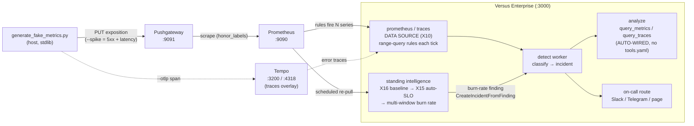

> ### 🏢 Enterprise feature
>
> The standing **`prometheus` / `traces` data source** and the
> **standing-intelligence layer** (learned baselines + auto-SLO) demonstrated
> here are **Versus Enterprise** capabilities (epics **X10**, **X16**, **X15**).
> They require the **enterprise image** and a license carrying the
> **`intelligence`** entitlement. On the OSS image, `type: prometheus` /
> `type: traces` returns *"requires Versus Enterprise"*, and the intelligence
> wedge is a no-op. (OSS keeps only the on-demand `query_metrics` /
> `query_traces` analyze tools — not the standing source, baselines, or SLO.)
>
> **One paid tier — Founding, $199/mo — unlocks this entire flow.**

# Enterprise SRE flow — metric/trace data source → detect → analyze → intelligence → on-call

This is the **end-to-end Versus Enterprise SRE walkthrough**: stand up the
stack, push synthetic traffic with the host-run generator, fire an anomaly, and
watch it travel from a **standing metric data source** all the way to **paging a
human** — with the **standing-intelligence layer** (learned baselines + auto-SLO
+ burn-rate) sitting on top.

Fake data is produced by **`scripts/generate_fake_metrics.py`** (host-run,
stdlib only) pushing series to a **Prometheus Pushgateway** — the *same*
fake-data UX as the OSS metrics example. There is no bespoke loadgen and no
`curl /spike`.

> The generator here is a self-contained copy of the OSS
> `versus-incident/scripts/generate_fake_metrics.py`; the enterprise example
> ships its own copy so it stands alone.

## The flow at a glance



**OSS vs Enterprise, honestly:** in OSS you get the on-demand
`query_metrics` / `query_traces` correlation tools (you ask, the AI pulls).
The **standing data source** that fires incidents on its own, plus the
**learned baselines / auto-SLO / burn-rate**, are **Enterprise** — this example.

## Services

| Service | Port | What |
|---|---|---|
| versus (enterprise) | `3000` | the enterprise agent (license-gated source + intelligence) |
| pushgateway | `9091` | the host generator PUSHes synthetic series here |
| prometheus | `9090` | scrapes the pushgateway (`honor_labels`); queried by Versus |
| tempo | `3200` / `4318` | trace backend (traces overlay only) |
| redis | (internal) | state |

All fake data is produced by the **host-run** `scripts/generate_fake_metrics.py`
— there is no in-compose traffic service.

## License

This example **requires a Versus Enterprise license with the `intelligence`
entitlement.** It is supplied to the binary via the `LICENSE_KEY` environment
variable — an offline-verified Ed25519 JWT (no phone-home). **No license is
committed to this repo**, and `.env` (where you put yours) is gitignored.

1. Obtain a license key with the `intelligence` entitlement from Versus
   (your enterprise dashboard / sales). It is the same offline JWT used by every
   self-hosted enterprise deployment; the org and entitlements live inside the
   token. **Founding ($199/mo) is the single paid tier and unlocks the full
   flow.**
2. Put it in your local `.env`:

   ```bash
   cp .env.example .env
   # then edit .env and paste your key:
   #   LICENSE_KEY=eyJhbGciOiJFZERTQSIsInR5cCI6IkpXVCJ9....
   ```

`docker compose` reads `.env` automatically. Verify the key carries
`intelligence` before running — without that entitlement the source refuses to
build and the agent logs *"requires Versus Enterprise"* on the next tick.

> A license with the wrong entitlements (e.g. `sso`/`rbac` only) authenticates
> as enterprise but will **not** unlock the metric/trace source — the
> `intelligence` feature is the specific gate.

## Run it — the founder's 5-minute path

### 1. Bring up the stack

```bash
cp .env.example .env          # then paste your LICENSE_KEY into .env
docker compose up -d
```

Wait ~15s for Prometheus and Versus to go healthy. On boot the enterprise
binary logs that it constructed the licensed source:

```
enterprise: agent started (mode=detect, sources=1)
```

### 2. Push normal traffic (the source stays quiet)

The generator is **host-run** and needs no extra packages (Python 3 stdlib
only). Point it at the published pushgateway:

```bash
python3 scripts/generate_fake_metrics.py --duration 60
```

You'll see:

```
pushing normal metrics to http://localhost:9091 (service=checkout, job=demo-traffic, 60s)
done — 30 pushes, 612 requests (3 5xx) over 60s to http://localhost:9091/metrics/job/demo-traffic
```

Under normal traffic both anomaly rules evaluate to 0, so the agent stays
quiet. Cross-check in Prometheus (<http://localhost:9090>) — run
`sum by (service) (rate(demo_http_requests_total{code=~"5.."}[1m]))` and watch
it sit near 0.

### 3. Fire the anomaly (the one-liner)

```bash
python3 scripts/generate_fake_metrics.py --spike --duration 90
```

That drives ~45% `500`s and p95 latency past 500ms. Within one or two agent
ticks (`poll_interval: 15s`) the enterprise `prometheus` source's two rules
cross their thresholds. Watch the agent:

```bash
docker compose logs -f versus
```

```
agent: tick prometheus:demo-prom signals=2 matched=2 patterns=2 verdicts=...
agent[detect]: ... pattern=high-error-rate service=checkout verdict=unknown_pattern freq=...
```

That's the **DETECT path**: the standing source range-queried the rules, fired
one signal per firing series, the worker classified them, and an **incident**
was emitted. Inspect what the agent learned — the enterprise data plane has NO
gateway secret, so authenticate with a live session from the built-in default
admin (username `admin`; the password is printed ONCE in the logs on first boot):

```bash
docker compose logs versus | grep -A3 "DEFAULT ADMIN CREDENTIALS"
# log in as the built-in default admin to mint a session cookie:
curl -c cookies.txt -X POST http://localhost:3000/enterprise/api/auth/local/login \
  -H 'Content-Type: application/json' \
  -d '{"username":"admin","password":"PASTE_FROM_LOGS"}'
# then read the learned patterns with that session cookie:
curl -b cookies.txt http://localhost:3000/api/agent/patterns | jq
```

### 4. Auto-revert (hands-off) and cleanup

```bash
# spike for 60s, then auto-revert to normal for the rest of the run:
python3 scripts/generate_fake_metrics.py --spike --spike-duration 60 --duration 120

# clear the pushed series from the pushgateway (the `/calm` analogue):
python3 scripts/generate_fake_metrics.py --clear
```

Use `--list` to print the exact series/labels emitted plus sample PromQL.

## See `query_metrics` during investigation (the ANALYZE path)

The detect path above works with **no API key**. To watch the agent pull the
**auto-wired** `query_metrics` tool while *investigating* an incident, enable the
AI analyzer in `.env`:

```bash
# in .env:
#   AGENT_AI_ENABLE=true
#   AGENT_AI_API_KEY=sk-...
#   AGENT_AI_MODEL=gpt-4o-mini
docker compose up -d --force-recreate versus
python3 scripts/generate_fake_metrics.py --spike --duration 90
docker compose logs -f versus      # watch for the auto-wired query_metrics calls
```

`query_metrics` runs on-demand PromQL while the AI investigates — and it is
**auto-wired** from the *same* source config (there is no `tools.yaml`; see
[Auto-wire](#auto-wire)).

## Standing intelligence (X16 baseline → X15 auto-SLO → burn-rate)

This is the wedge above the rule-based detector: instead of a hand-written
PromQL threshold, the enterprise binary **learns a seasonal baseline per
service (X16)**, **auto-derives an availability SLO (X15)**, and **pages on a
multi-window error-budget burn rate** — emitting a finding through the *same* one
emission path (`services.CreateIncidentFromFinding`) and out to on-call.

**Honest scope — what runs in 5 minutes vs what needs a learning window:**

| Stage | Runs in the quick demo? |
|---|---|
| Rule-based `prometheus` source fires an incident on `--spike` | ✅ Yes — immediate (this is the headline) |
| Auto-wired `query_metrics` / `query_traces` during analyze | ✅ Yes (needs an AI key) |
| **X15 auto-SLO derivation** (first scheduler pass derives + persists an SLO) | ⏳ After ~5m (the SLO job interval) |
| **X16 learned-baseline anomaly** (confident seasonal model) | ⏳ Needs a learning window — tens of minutes to hours of samples |
| **X15 multi-window burn-rate page** (1h + 6h windows, ≥14.4× / 6×) | ⏳ Needs a SUSTAINED spike across the policy windows |

The burn-rate policy is the Google SRE-workbook 2-window page (fast 1h/5m at
14.4×, slow 6h/30m at 6×). A 90s spike will **not** page on burn rate in a fresh
stack — that's by design, and we don't fake it. The wedge is **automatic** with
a valid intelligence `LICENSE_KEY` — there is nothing to configure. To **observe**
it:

1. The wedge registers on the scheduler at boot off the SAME single
   `prometheus` data source — no per-service query list to author:

   ```bash
   docker compose up -d --force-recreate versus
   ```

   On boot you'll see:

   ```
   intel: SLO-burn evaluator registered against the agent metric source (objectives auto-derived from discovered RED signals; targets appear as services are discovered; slo=5m0s); X16 baseline runs on the agent worker tick via the per-type seam
   enterprise: standing-intelligence wedge active (1 scheduler job(s))
   ```

   Until the metric brain discovers a service's availability SLI the evaluator
   logs an explicit, rate-limited idle line — that is expected, not a
   misconfiguration:

   ```
   intel: SLO-burn evaluator idle — no service has a discovered availability SLI (request_rate + error_rate) yet; nothing to evaluate (not a misconfiguration)
   ```

2. Keep traffic flowing so the brain discovers services and the learners have
   samples (run the generator in a loop, or with a long `--duration 0` until
   Ctrl+C). After the first SLO pass over a discovered service:

   ```
   intel: slo derived org=default service=checkout objective=0.99 window_days=30
   ```

3. Sustain a spike across the policy windows and the burn-rate rung fires a
   finding that routes exactly like a detect incident:

   ```
   intel: slo burn org=default service=checkout window=fast long=18.2x short=21.0x
   agent[detect]: ... source=intel:slo category=slo severity=critical
   ```

Run the binary in community mode (no `LICENSE_KEY`) and the wedge is a clean
no-op — the rule-based source still fires incidents on its own.

## On-call — the end of the flow (page a human)

The point of the flow is to **page a human**. The example ships with
notification channels **disabled by default** (no secrets committed), so the
incident is created and the route is logged (a dry route you can see in the
logs). To page for real, enable a channel in `.env`:

```bash
# in .env (Slack shown; Telegram is symmetric):
#   SLACK_ENABLE=true
#   SLACK_TOKEN=xoxb-...
#   SLACK_CHANNEL_ID=C0123456789
docker compose up -d --force-recreate versus
python3 scripts/generate_fake_metrics.py --spike --duration 90
```

Now every emitted incident — whether from the rule-based source or the
intelligence burn-rate finding — is delivered to your channel. The on-call
provider config lives in [config/config.yaml](config/config.yaml) under
`oncall:` (disabled by default; `aws_incident_manager` is the wired provider).

## What you'll see — stage by stage

| Stage | What you run | What you see |
|---|---|---|
| Connect | `docker compose up -d` | `enterprise: agent started (mode=detect, sources=1)` |
| Fire | `generate_fake_metrics.py --spike` | source range-queries rules → fires N signals |
| Detect | (automatic) | `agent: tick prometheus:demo-prom signals=2 matched=2` → incident emitted |
| Analyze | enable AI key, re-spike | auto-wired `query_metrics` / `query_traces` pull PromQL / traces |
| Intelligence | (automatic, with license) wait | SLO derived; (sustained) burn-rate finding emitted |
| On-call | enable a channel | incident delivered to Slack/Telegram (or logged dry route) |

## Auto-wire

**Configuring the data source alone lights up the analyze tools.** Notice this
example ships **no `tools.yaml`** — yet `query_metrics` works.

When the enterprise binary boots, it reads the `prometheus` (and, with the
overlay, `traces`) source from [config/agent_sources.yaml](config/agent_sources.yaml)
and **auto-wires** the matching analyze tool (`query_metrics` →
`query_traces`) against the **same** backend address + auth, before the AI is
built. So you configure the backend once, in the source, and both the
detect path and the investigation path use it.

**Precedence — explicit tool config wins.** If you *do* add a
`tools.yaml` with an explicit `query_metrics.prometheus.address` (resp.
`query_traces.tempo.address`), that explicit address is left untouched and the
source does **not** override it. This lets you point the analyze tool at a
different/aggregated backend when you want to. Omit it (as here) and the
zero-config path "just works".

### Note the new `options:` schema

The source uses the generic **`options:`** block the X10 source reads — not the
legacy nested `prometheus:` block:

```yaml
sources:
  - name: demo-prom
    type: prometheus
    enable: true
    options:                       # <-- generic options block
      address: http://prometheus:9090
      step: 30s
      page_size: 500
      queries:
        - query: '...'
          severity: critical
          service_label: service
```

## The honest framing (no overclaiming)

Detection in the **base** example is **your PromQL rule** — the `prometheus`
source is **rule-based**: each tick it range-queries the rules in
`agent_sources.yaml` and emits a signal for every series with a sample `> 0`.
Your PromQL threshold is the detector; there is no learned model deciding
whether a metric is anomalous *in the base path*.

The **learned baseline / auto-SLO** is the layer above — the
standing-intelligence wedge (epics **X16** learned baseline and **X15**
auto-SLO) consumes this same metric source and decides anomalies from a learned
seasonal model + an error-budget burn rate instead of a hand-written threshold
(see [Standing intelligence](#standing-intelligence-x16-baseline--x15-auto-slo--burn-rate)).
The `intelligence` entitlement unlocks both layers.

## Optional: traces (Tempo)

To also exercise the enterprise `traces` source and the auto-wired
`query_traces` tool, bring up the overlay (adds Tempo and swaps in the source
variant that adds the `traces` source):

```bash
docker compose -f docker-compose.yml -f docker-compose.traces.yml up -d
```

Point the **same** generator at Tempo's OTLP endpoint so each push also emits a
span (error spans during a spike):

```bash
python3 scripts/generate_fake_metrics.py --spike --otlp http://localhost:4318 --duration 90
```

The `traces` source searches Tempo for `{ status = error }` traces and emits a
signal per matching trace; `query_traces` (also auto-wired, no tools.yaml) lets
the AI pull redacted span summaries during investigation. Tempo's API is on
`:3200`, OTLP on `:4318`.

## Layout

```
metrics-source/
├── docker-compose.yml              # enterprise versus + redis + prometheus + pushgateway
├── docker-compose.traces.yml       # optional overlay: + tempo
├── .env.example                    # copy to .env; holds LICENSE_KEY (gitignored)
├── config/
│   ├── config.yaml                 # mode=detect, new_service_grace=0
│   ├── agent_sources.yaml          # enterprise prometheus source (options: schema)
│   └── agent_sources.traces.yaml   # + traces source (overlay only)
│   #  NOTE: no tools.yaml — query_metrics/query_traces are auto-wired
├── prometheus/
│   └── prometheus.yml              # scrapes the pushgateway (honor_labels: true)
├── tempo/
│   └── tempo.yaml                  # single-binary Tempo (overlay only)
└── scripts/
    └── generate_fake_metrics.py    # host-run fake-data generator (copy of the OSS one)
```

## Cleanup

```bash
python3 scripts/generate_fake_metrics.py --clear   # drop the pushed series
docker compose down -v
# or, if you ran the traces overlay:
docker compose -f docker-compose.yml -f docker-compose.traces.yml down -v
```

## Reference

- Enterprise metrics & SRE flow (operator-facing): [../../src/enterprise/metrics.md](../../src/enterprise/metrics.md)
- [Metrics & traces docs](https://docs.versusincident.com/#/agent/data-sources/metrics-traces)

