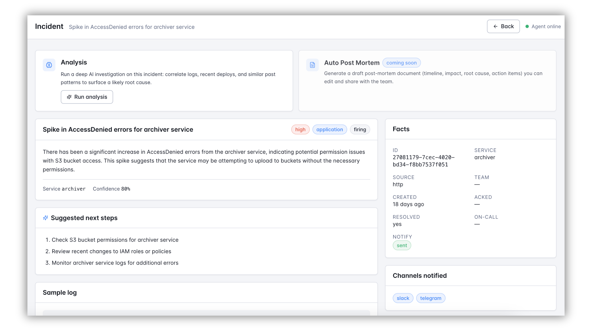

# AI Agent — Analyze Mode

Analyze mode provides a **deep-dive investigation** for incidents. While detect mode identifies patterns and sends notifications, analyze mode helps you understand the root cause of an incident by gathering context and presenting structured insights directly in the dashboard.

Analyze mode is designed to assist on-call engineers, post-incident reviewers, and anyone needing a detailed analysis of an incident.

## When to Use Analyze Mode

Analyze mode is available whenever `agent.ai.enable: true`. If AI is disabled, the **Analysis** card on the incident detail page will show "coming soon."

Typical scenarios for using analyze mode:

- **On-call troubleshooting**: Quickly generate a starting hypothesis for unfamiliar incidents.
- **Correlating patterns**: Investigate incidents that resemble past patterns.
- **Post-incident review**: Add structured AI insights to human-written notes.

## How It Works

1. **Trigger Analysis**: Click **Run analysis** on the incident detail page.
2. **AI Investigation**: The AI gathers context, such as recent incidents, pattern history, and service summaries.
3. **Insights Delivered**: The results are saved and displayed in the dashboard for review.



Analyze mode runs within a 2-minute timeout to ensure responsiveness. Results are always saved, even if the analysis encounters errors.

## Configuration

Analyze mode uses the shared `agent.ai` settings. You can optionally point it at a stronger model for deep dives with the `analyze:` block:

```yaml
agent:
  enable: true
  mode: detect            # detect or shadow; analyze works in both
  ai:
    enable: true
    api_key: ${AGENT_AI_API_KEY}
    model: gpt-4o-mini    # shared default for detect + analyze

    analyze:
      model: gpt-4o         # use a stronger model for deep dives
```

The `analyze:` block only overrides the model. For beta-limited /
reasoning models (`gpt-5.*`, o-series), set `temperature: -1` on the
shared `ai` block to omit the parameter entirely.

## Tool catalog

During an analysis the AI can call read-only tools to pull supporting context
from Versus and your connected data before forming a conclusion. Tools only
read state; they never send notifications, mutate incidents, or run
remediation.

Chat and Analyze share the `versus`, `common`, and planned `k8s` tool groups,
but each agent has an independent policy. Enabling a tool for Chat does not
enable it for Analyze, and a tool is callable only when its data source,
integration, or capability requirement is satisfied. Kubernetes tools are
listed as planned and are not yet implemented.

Each tool returns the same envelope so the AI can reason about results
uniformly:

- `found` — whether the lookup returned anything.
- `data` — the tool-specific payload (only present on a hit).

The full tool-call trail (which tools ran, their arguments, and what
they returned) is recorded with every analysis and shown in the
**Tool calls** section of the analysis result, so you can audit exactly
what the AI looked at.

See the [Tool Reference](./tools/tools.md) for the current catalog,
availability requirements, `tools.yaml` configuration, authentication, and
Docker examples.

## Key Features

- **Non-intrusive**: Analyze mode never sends notifications or modifies systems.
- **Read-only tools**: Analyze can use policy-enabled tools from the shared catalog to gather context.
- **Customizable**: Fine-tune the AI's behavior with optional settings.

Analyze mode empowers you to make informed decisions by providing structured insights when you need them most.
