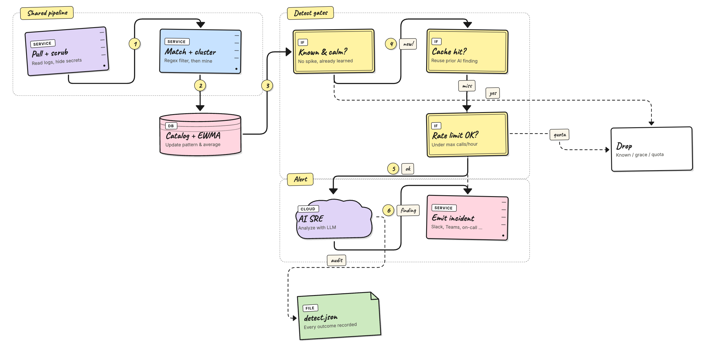
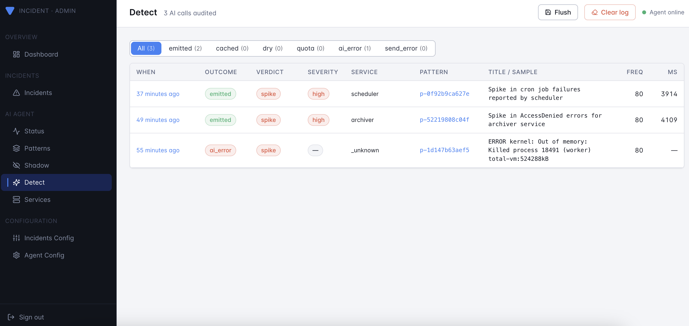

# AI Agent — Detect Mode

Detect mode leverages AI to identify and alert on new or unusual patterns in real-time. It is designed for production environments where timely detection of anomalies is critical. Before enabling detect mode, ensure that your pattern catalog is well-curated and that shadow mode has been used to validate the system's behavior.

Detect mode is the **go-live** step. The agent classifies log patterns the same way it does in [shadow](./shadow-mode.md), and when something new or unexpected issues or anomalous shows up it asks an **AI SRE** to triage it and emits a real incident. Think of it as: "shadow mode, but with a hand on the alert button — and the AI writes the page."

## When to Switch to Detect Mode

Switch to detect mode when:

- The catalog of patterns has stabilized, and new patterns are rare.
- You have spent at least one release cycle in shadow mode and reviewed the results.
- Noisy patterns have been labeled as `known` to prevent unnecessary alerts.
- An OpenAI-compatible API key is configured.

Detect mode is ideal for production environments where real-time alerts for new or unusual patterns are critical.

## How detect mode works

The pipeline is the same as shadow mode for the first few steps:



When a new or anomalous pattern reaches the detect step, the
agent does five things in order:

1. **Dry guard** — if the AI is not configured, it stops here.
   The pattern is still recorded in the catalog.
2. **Cache lookup** — if the same pattern was analyzed recently,
   the previous finding is reused instead of calling the model
   again (saves time and cost).
3. **Rate guard** — `agent.ai.max_calls_per_hour` caps how many
   times the model can be called, so a noisy day doesn't run up
   your bill.
4. **Analyze** — the AI SRE reviews the redacted sample,
   template, frequency, and baseline, then writes a triage
   verdict.
5. **Emit** — the AI's finding (severity, summary, category,
   confidence, suggestions) becomes a real incident. All
   per-channel templates and the on-call workflow trigger
   unchanged.

Each outcome — including skips and failures — is recorded so you
can spot misconfigured keys or channels at a glance on the
**Detect** page.

## Configuration

The detect-specific block lives under `agent.ai` in
`config.yaml`:

```yaml
agent:
  enable: true
  mode: detect

  ai:
    enable: true                       # opt in to live AI calls
    api_key: ${AGENT_AI_API_KEY}       # OpenAI-compatible bearer key
    model: gpt-4o-mini                 # any chat-completions model
    temperature: 0.2
    max_tokens: 800
    max_calls_per_hour: 60             # 0 = unlimited
    cache_ttl: 30m                     # reuse the same finding for this long
```

Use `temperature: -1` with beta-limited / reasoning models such as
`gpt-5.*` and o-series models. Those providers fix temperature at `1`
and reject any explicit value.

Every field is overridable by env var:

| Env var | Maps to |
|---|---|
| `AGENT_AI_ENABLE` | `agent.ai.enable` |
| `AGENT_AI_API_KEY` | `agent.ai.api_key` |
| `AGENT_AI_MODEL` | `agent.ai.model` |

The chat endpoint is hard-coded to
`https://api.openai.com/v1/chat/completions`. If you point
`AGENT_AI_API_KEY` at an OpenAI-compatible provider (Azure
OpenAI, vLLM proxy, etc.), set `model` to a name your provider
accepts.

You almost always want a small **new-service grace** so the agent
doesn't page on the first signal from a freshly-deployed
service:

```yaml
agent:
  new_service_grace: 30m       # silence brand-new services for this long
  service_patterns:            # how to extract a service from a log line
    - 'service[._]name=([\w.-]+)'
    - '"service"\s*:\s*"([^"]+)"'
    - '^\[([\w.-]+)\]'
```

See [`config/config.yaml`](https://github.com/VersusControl/versus-incident/blob/main/config/config.yaml)
for the full set of starter patterns covering Pino, Winston,
Logback, Serilog, zap, slog, syslog, journald, Docker, Envoy,
nginx, and friends.

## What gets recorded

Every AI call (and every cache / dry / quota outcome) is kept as
a rolling history of the **most recent 500 events**; older
entries are dropped automatically.

Each event captures:

- **Pattern context** — source, template, service, verdict,
  frequency, baseline, sample log line.
- **AI call** — model, the prompt sent, the raw response, and how
  long it took.
- **Parsed finding** — severity, summary, category, confidence,
  suggestions.
- **Outcome** — whether the incident was emitted, served from
  cache, skipped (dry / quota), or errored.

Look at it through the admin UI (the **Detect** page in the
sidebar):



## Worked example: end-to-end test

This walks through detect mode end to end on your laptop using the
`generate_noisy_logs.py` helper. The key trick is the new
`--scenario` flag, which emits a **curated cluster of correlated
failures** (e.g. `db-outage` = `db_conn_refused` +
`db_query_slow` + `db_deadlock` + `replication_lag` + …), not just
one repeated line. That gives the AI SRE enough context to write a
useful summary.

### 1. Train the catalog

Start with a clean catalog and a fat baseline of normal traffic so
the agent learns what "boring" looks like.

```bash
# follow the steps in agent/getting-started.md to start the agent
# in training mode reading from ./logs/my-app.log

python3 scripts/generate_noisy_logs.py \
  --output ./logs/my-app.log \
  --lines 3000 --seed 42
```

Wait until the per-tick log stops adding new patterns — usually a
minute or two for 3000 lines.

### 2. Switch to detect mode

Update `config.yaml` (or env vars) and restart the agent:

```yaml
agent:
  enable: true
  mode: detect
  new_service_grace: 0          # disable grace for the demo
  ai:
    enable: true
    api_key: ${AGENT_AI_API_KEY}
    model: gpt-4o-mini
    max_calls_per_hour: 30
    cache_ttl: 30m
```

```bash
export AGENT_AI_API_KEY=sk-...
docker restart versus-agent
```

You should see in stdout:

```
agent: starting worker mode=detect sources=1 ai=enabled model=gpt-4o-mini
```

### 3. Inject a curated incident

Pick a scenario:

```bash
./scripts/run_noisy_logs.sh --list-scenarios
# auth-attack        auth-login-fail, syslog-sshd, security-breach
# cache-meltdown     redis-timeout, circuit-open, 5xx, worker-lag
# db-outage          db-conn-refused, db-query-slow, db-deadlock, …
# disk-full          disk-full, s3-upload-fail, cron-fail, panic
# k8s-imagepull      k8s-kubelet, pod-restart, k8s-event-json
# oom-cascade        kernel-oom-distinct, oom-killer, pod-restart, …
# tls-expired        certificate-expired, tls-handshake-fail, oncall-fail
```

Then inject one — say, a database outage — into the file the
agent is reading:

```bash
./scripts/run_noisy_logs.sh \
  --output ./logs/my-app.log \
  --scenario db-outage \
  --scenario-burst 60
```

Within one poll interval (default 10s) you should see in the
agent's stdout:

```
agent: tick my-app signals=60 matched=60 patterns=4 \
  verdicts=map[learned:0 spike:3 unknown:1 emit_emitted:2 emit_cached:1]
```

`emit_emitted=2` means two AI calls produced a real incident
(other patterns hit the cache).

### 4. See what the AI wrote

Open the admin UI at `http://localhost:3000` and click
**Detect** in the sidebar. You'll see the new events at the top.
Click into one to see:

- The full **Prompt** (system + user) sent to the model.
- The **Raw response** before JSON parsing.
- The parsed **Finding** (severity, summary, category,
  confidence, suggestions).

And the resulting incident lands on the **Incidents** page (and
in Slack / Telegram / wherever you have channels enabled), with
the AI's summary, severity, and suggested next steps rendered by
each channel's template.

### 5. Try the other scenarios

Each scenario stresses a different part of the AI's reasoning:

```bash
./scripts/run_noisy_logs.sh --scenario tls-expired
./scripts/run_noisy_logs.sh --scenario disk-full
./scripts/run_noisy_logs.sh --scenario oom-cascade
```

Watch the `category` and `severity` fields in the parsed finding
move accordingly.

## Cost & safety knobs

- **`max_calls_per_hour`** — hard cap. With the cache TTL set to
  30m and a sane catalog, even a noisy hour rarely calls the
  model more than ~5–10 times.
- **`cache_ttl`** — same `pattern_id` re-fires within this window
  reuses the prior finding for free. Bump it during incident
  storms; lower it if you want fresher analysis on long-running
  issues.
- **`new_service_grace`** — silences a brand-new service for the
  configured duration. The window starts the first time the
  agent sees the service, and is persisted in `patterns.json` so
  it survives restarts.
- **Rotate the key** if it ever appears in a log line you fed the
  agent — the [redactor](./redaction.md) scrubs common secret
  shapes (`sk-…`, `xoxb-…`, AWS keys, JWTs, basic-auth URLs) but
  treat it as defense-in-depth, not a guarantee.

## Common questions

**Q: Can I disable the AI but keep detect mode?**
Yes. Set `agent.ai.enable: false`. The worker still classifies
patterns and records what *would* have been analyzed on the
**Detect** page, with no API spend.

**Q: How do I stop a noisy pattern from being analyzed?**
Open the pattern on the **Patterns** page and set its verdict to
**known**. The worker then drops it before reaching the AI step.
A spike on a known pattern still triggers (that's the whole
point of spike detection); use `cache_ttl` to throttle repeats.

**Q: My channel template renders `Unknown Alert (Unknown)` for
AI incidents.**
Update to the channel templates shipped with the latest release
— they auto-detect the AI payload via the `PatternID` field and
render a dedicated "Versus Agent" block.
