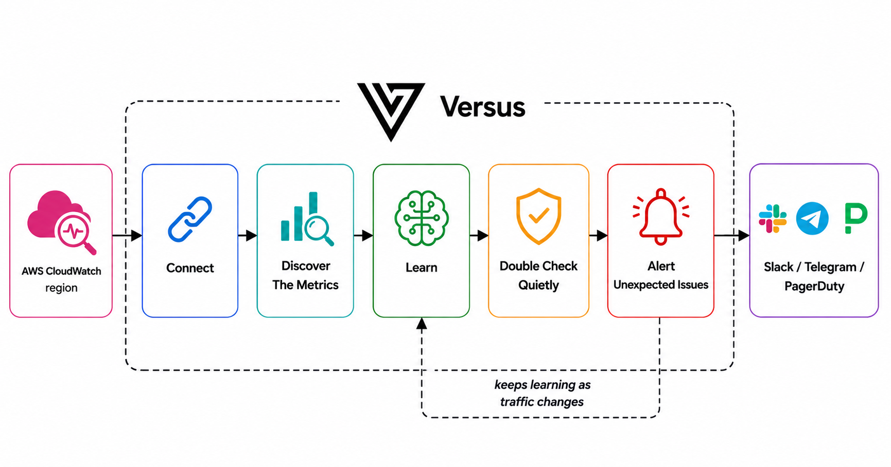

# CloudWatch Metrics

_Enterprise_

Point Versus at an AWS region and it does the rest. It finds the metrics worth watching
for each service, learns what "normal" looks like for each one, and pages you only when
something is genuinely wrong and stays wrong. You don't name a single metric or set a
single threshold.

Think of it as a teammate who watches your AWS dashboards: first they learn your service's
usual rhythm, then they escalates only what is new or unexpected issues.

## How it works



You give it a region. It looks across your AWS services, picks the metrics that matter, and
learns what each one normally does. It watches quietly for a while, then pages you — but
only when a problem is real and lasting, not a one-minute spike.

## What you get

A CloudWatch metric source that **opens incidents on its own** — no CloudWatch alarms to
author, no metric names to enumerate. All you give it is the region. From there it:

1. **Discovers the metrics that matter.** It scans the region on a cadence and picks a
   bounded set of metrics to watch — no per-metric definitions. AWS exposes thousands of
   metrics you don't know by name, so watch-by-discovery (bounded by caps) is the whole
   point.
2. **Learns what's normal.** For each metric it learns the usual pattern by time of week,
   so 2pm Tuesday is compared against past 2pm Tuesdays — not a flat average that ignores
   your daily and weekly rhythm.
3. **Pages only on real problems.** It alerts when a signal moves well outside its normal
   range *and stays there* — not on a single noisy reading, and not against a number you
   had to guess.

## The three modes

Metrics use the same modes as logs. Set the mode with `agent.mode` (or `AGENT_MODE`).

### `training` — learn what's normal

It connects, discovers your metrics, and just watches and learns. **No alerts.** A new
signal stays in training until it has seen enough to actually know what normal looks like —
until then it can't page, which keeps it from crying wolf on day one.

**You:** connect the source and let it run.
**You'll see:** the discovered signals filling in, each with its picture of "normal"
building up. Leave it here until the services you care about have been learned.

### `shadow` — double-check quietly

It keeps learning, but now it also starts scoring. When it thinks something's wrong it
writes a **"would have alerted"** note — but **pages no one**. This is your chance to see
how often it would fire before you trust it with your phone.

**You:** set `agent.mode: shadow` and watch the **Shadow** page in the admin UI.
**You'll see:** one row per service + signal it *would* have paged on, with the normal
range and what it actually saw — just like the [logs shadow flow](../shadow-mode.md), for
metrics.

### `detect` — start paging

Go live. When a signal is clearly off *and stays off* for several checks in a row (a brief
blip won't page), it opens a real incident, routes it to on-call, and the **detect AI**
writes the page. The alert says what's wrong in plain terms, e.g. *"the checkout queue is
far above normal for this time of week, and has stayed there for several minutes."* (The
deeper, tool-using **analyze** investigation is a separate, on-demand step you trigger from
the incident detail page.)

**You:** set `agent.mode: detect` and turn on a channel.
**You'll see:** incidents that fire on real, lasting problems measured against each
service's own normal — no thresholds, no alarms.

> **It keeps learning as you go.** The model updates as your traffic changes, so it follows
> gradual shifts. But it's careful: once it knows a signal's normal, it sets aside readings
> that are way off — so the very outage it's paging you about doesn't get mistaken for the
> new "normal."

## Quickstart

Add the source to **`agent_sources.yaml`**. The **only required field is `region`** —
authentication comes from the standard AWS credential chain (see
[Authentication](#authentication) below), so there are no keys in the config.

```yaml
sources:
  - name: prod-cloudwatch
    type: cloudwatch_metrics
    enable: true
    options:
      region: us-east-1
```

That is the whole operator surface for the auto flow. On boot the source discovers every
AWS-service metric it can attribute to a service, samples it, and starts learning a
baseline for each one.

## Options

All options live under `options:`. Only `region` is required; every other field has a sane
default, so the documented path is region-only.

| Key | Default | Meaning |
|---|---|---|
| `region` | — (required) | AWS region to read metrics from. |
| `poll_interval` | `60s` | Sampling cadence. |
| `query_delay` | `120s` | Offset for CloudWatch ingestion lag — each pull queries a window ending at `now − query_delay`, so the newest datapoint is actually populated. |
| `namespaces` | `["AWS/*"]` | Discovery scope. `AWS/*` = all AWS-service namespaces; supports the `AWS/*` prefix glob. Custom (non-`AWS/`) namespaces are **excluded** unless listed explicitly. |
| `default_statistic` | `Average` | The statistic sampled for every discovered metric. |
| `statistic_overrides` | unset | Per-namespace statistic override, e.g. `AWS/ApplicationELB: p99`, `AWS/SQS: Sum`. Extended stats like `p99` are supported. |
| `max_services` | `200` | Discovery cap on distinct services — bounds cost on large accounts. |
| `max_signals` | `2000` | Discovery cap on total signals. |
| `discovery_interval` | `1h` | How often the set of watched metrics is refreshed (cadence ceiling). |
| `period` | `60` | Sampling period, in seconds. |

### Scoped example

Narrow discovery to a few namespaces and tune the statistic per namespace — coarse tuning
that needs no per-metric knowledge:

```yaml
sources:
  - name: prod-cloudwatch
    type: cloudwatch_metrics
    enable: true
    options:
      region: us-east-1
      namespaces:                      # only these namespaces (custom ones stay excluded)
        - AWS/ApplicationELB
        - AWS/RDS
        - AWS/SQS
      default_statistic: Average
      statistic_overrides:
        AWS/ApplicationELB: p99        # latency — track the slow tail
        AWS/SQS: Sum                   # queue depth — total, not average
      max_services: 100
      max_signals: 1000
      query_delay: 120s
      period: 60
```

## Authentication

The source uses the **standard AWS SDK credential chain** — identical to the OSS
[CloudWatch Logs](./cloudwatch-logs.md#authentication) source. Only `region` is supplied in
config; **no static keys** ever live in the source options. Credentials resolve in order:

1. Environment variables: `AWS_ACCESS_KEY_ID`, `AWS_SECRET_ACCESS_KEY`, `AWS_SESSION_TOKEN`.
2. Shared credentials file: `~/.aws/credentials` (profile from `AWS_PROFILE`, default `"default"`).
3. ECS task role (when running in ECS / Fargate).
4. EC2 instance profile / EKS IRSA (IAM Roles for Service Accounts).

The source needs exactly two least-privilege CloudWatch actions — one to discover metrics,
one to sample them:

```json
{
  "Version": "2012-10-17",
  "Statement": [
    {
      "Effect": "Allow",
      "Action": [
        "cloudwatch:ListMetrics",
        "cloudwatch:GetMetricData"
      ],
      "Resource": "*"
    }
  ]
}
```

Both actions are account-wide reads, so `Resource` is `*` (CloudWatch does not support
resource-level restriction for these). No write or alarm permissions are required.

## Cost and scale

Sampling is **billed per call** and cost scales with **(#watched metrics × frequency)**.
Three controls keep a large account bounded:

- **Discovery caps** — `max_services` (`200`) and `max_signals` (`2000`) bound the set of
  watched metrics so a huge account can't explode into thousands of sampled metrics.
- **Namespace scoping** — `namespaces` limits discovery to the AWS services you care about;
  narrowing from the default `AWS/*` shrinks the watched set directly.
- **Cadence** — `poll_interval` (`60s`) governs sample frequency and `discovery_interval`
  (`1h`) governs how often the watched set is rebuilt.

Start with the defaults, watch your CloudWatch bill, then narrow `namespaces` or lower the
caps if the account is large.

## What it watches

There are no per-metric options — the source applies one naming rule to every discovered
metric:

| Field | Where it comes from |
|---|---|
| **`service`** | The metric's **primary CloudWatch dimension value** — e.g. `DBInstanceIdentifier` for RDS, `InstanceId` for EC2, `LoadBalancer` for an ALB. |
| **`signal`** | The **metric name** — e.g. `CPUUtilization`, `TargetResponseTime`, `ApproximateNumberOfMessagesVisible`. |

CloudWatch has no single value per metric — you must pick a **statistic** — so the source
samples every discovered metric with `default_statistic` (`Average` out of the box). Use
`statistic_overrides` to change the statistic per namespace (e.g. `p99` for latency, `Sum`
for queue depth). Metrics with no dimensions are skipped, because there is no deterministic
service to attribute them to.

## See also

- Full hands-on walkthrough: [CloudWatch Metrics Demo](../../enterprise/metrics/cloudwatch-metrics.md)
- Both metric sources and the licensing model: [Metrics overview](./metrics.md)
- The OSS logs source with the same auth: [CloudWatch Logs](./cloudwatch-logs.md)
