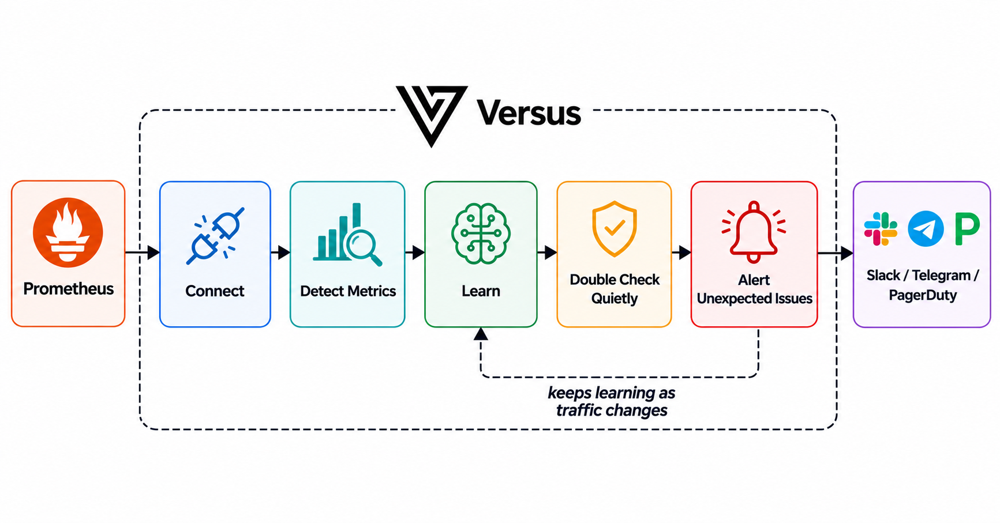

# Prometheus

_Enterprise_

Point Versus at your Prometheus and it does the rest. It finds the signals worth
watching for each service, learns what "normal" looks like, and pages you only when
something is genuinely wrong and stays wrong. You don't write a single query or set a
single threshold.

Think of it as a teammate who watches your dashboards: first they learn your service's
usual rhythm, then they escalates only what is new or unexpected issues.

## How it works



You give it an address. It looks at your services, picks the signals that matter, and
writes the queries for you. It learns what each signal normally does, watches quietly for
a while, then pages you — but only when a problem is real and lasting, not a one-second
spike.

## What you get

A Prometheus source that **opens incidents on its own** — like Alertmanager, but with no
rules to write. All you give it is the connection. From there it:

1. **Finds the signals that matter.** For each service it picks four kinds of signal —
   **traffic** (request rate), **errors**, **latency**, and **resource use** (memory,
   CPU, and the like) — and writes the PromQL for them automatically. (These are the
   classic RED + USE signals, if you've met the term.)
2. **Learns what's normal.** It learns each signal's usual pattern by time of week, so
   2pm Tuesday is compared against past 2pm Tuesdays — not a flat average that ignores
   your daily and weekly rhythm.
3. **Pages only on real problems.** It alerts when a signal moves well outside its normal
   range *and stays there* — not on a single noisy reading, and not against a number you
   had to guess.

## The three modes

Metrics use the same modes as logs. Set the mode with `agent.mode` (or `AGENT_MODE`).

### `training` — learn what's normal

It connects, finds each service's signals, and just watches and learns. **No alerts.** A
new signal stays in training until it has seen enough to actually know what normal looks
like — until then it can't page, which keeps it from crying wolf on day one.

**You:** connect the source and let it run.
**You'll see:** a short report in the logs (how many services and signals it found, and
whether the data was thin), and its picture of "normal" filling in. Leave it here until
the services you care about have been learned.

### `shadow` — double-check quietly

It keeps learning, but now it also starts scoring. When it thinks something's wrong it
writes a **"would have alerted"** note — but **pages no one**. This is your chance to see
how often it would fire before you trust it with your phone.

**You:** set `agent.mode: shadow` and watch the **Shadow** page in the admin UI.
**You'll see:** one row per service + signal it *would* have paged on, with the normal
range and what it actually saw — just like the [logs shadow flow](../shadow-mode.md), for
metrics.

### `detect` — start paging

Go live. When a signal is clearly off *and stays off* for several checks in a row (a brief
blip won't page), it opens a real incident, routes it to on-call, and the **detect AI**
writes the page. The alert says what's wrong in plain
terms, e.g. *"checkout
latency is far above normal for this time of week (about 180ms), and has stayed there for
several minutes."* (The deeper, tool-using **analyze** investigation is a separate,
on-demand step you trigger from the incident detail page.)

**You:** set `agent.mode: detect` and turn on a channel.
**You'll see:** incidents that fire on real, lasting problems measured against each
service's own normal — no thresholds, no PromQL.

> **It keeps learning as you go.** The model updates as your traffic changes, so it
> follows gradual shifts. But it's careful: once it knows a signal's normal, it sets aside
> readings that are way off — so the very outage it's paging you about doesn't get
> mistaken for the new "normal."

## Quickstart

Add the source to **`agent_sources.yaml`**. This discovery picks the signals and the brain learns the baseline.

```yaml
sources:
  - name: prod-metrics
    type: prometheus
    enable: true
    options:
      address: http://prometheus:9090
```

With auth and TLS:

```yaml
sources:
  - name: prod-metrics
    type: prometheus
    enable: true
    options:
      address: https://prometheus.internal:9090
      bearer_token: ${PROM_TOKEN}          # Authorization: Bearer <token>
      # username: ${PROM_USERNAME}         # fallback HTTP Basic
      # password: ${PROM_PASSWORD}
      insecure_skip_verify: false          # default false; dev only — never prod
```

| Key | Default | Meaning |
|---|---|---|
| `address` | — (required) | Prometheus base URL the source reads (GET-only). |
| `bearer_token` / `username` / `password` | unset | Bearer auth, else HTTP Basic. |
| `insecure_skip_verify` | `false` | Skip TLS verification — **local dev only**, never production. |
| `step` | `60s` | Sampling resolution. |

That is the whole operator surface for the auto flow.

### What it watches

It finds your services automatically — using the first label it recognizes (`service`,
`service_name`, `app_kubernetes_io_name`, `app`, or `job`) — then picks the signals worth
watching for each one and writes the queries itself:

| Signal | Where it comes from | What it watches |
|---|---|---|
| **Traffic** (request rate) | request counters like `*_requests_total` | how busy the service is |
| **Errors** | the error / 5xx share of those requests | how often requests fail |
| **Latency** | duration histograms like `*_duration_seconds*` | the p99 (slowest 1%) response time |
| **Resource use** (saturation) | memory / CPU / queue / pool / goroutine gauges | one watch per resource gauge |

Traffic, errors, and latency give **one signal each** per service. Resource use is
different: it watches **each resource gauge on its own** (memory, CPU, and so on), so a
service can have several of these on top of the first three. To keep things sane it caps
the signals per service (default 6) and per tenant (default 200).

If a service exposes none of these, it still gets a basic traffic watch so nothing slips
through unwatched. If the data is sparse, it falls back to common metric names and tells
you coverage is **thin** rather than inventing signals. It watches the signals that
matter, not every metric (which would just be noise) — and the `queries:` option below
covers anything special it can't find on its own.

## Advanced: custom signals

If you have something specific to watch that the agent won't find on its own (say a
bespoke business metric), you can add your own PromQL alongside the auto-discovered
signals. **Custom queries are appended — they don't turn off the auto-learning.** The
agent still discovers and learns all the usual signals; your custom rules run on top.

```yaml
sources:
  - name: prod-metrics
    type: prometheus
    enable: true
    options:
      address: http://prometheus:9090
      queries:                              # added alongside auto-discovered signals
        - query: 'rate(orders_failed_total[5m]) > 0.1'
          severity: critical
          service_label: service            # series label copied to the incident's service
```

| Key | Meaning |
|---|---|
| `queries[].query` | PromQL expression — fires when it returns a result. |
| `queries[].severity` | Severity stamped on the incident. |
| `queries[].service_label` | Series label copied into the incident's `service` attribution. |

## See also

- Full hands-on walkthrough: [Prometheus Metrics Demo](../../enterprise/metrics/prometheus.md)
- Both metric sources and the licensing model: [Metrics overview](./metrics.md)

