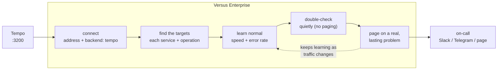

# Traces / Tempo

_Enterprise_

Point Versus at your Tempo and it does the rest. It finds your services and their
operations, learns how each one normally behaves — how fast it is and how often it errors
— and pages you only when one clearly slows down or starts failing and stays that way. You
don't write a single query or set a single threshold.

Think of it as a teammate who knows how long each endpoint usually takes: they only call
you when something is clearly off, not at every blip.

> **Same idea as the logs agent, tuned for traces.** Every data source follows the same
> three steps: **learn what's normal (`training`) → double-check quietly (`shadow`) →
> start paging (`detect`)**. Logs learn your common log patterns; metrics learn your
> normal traffic, errors, and latency; traces learn how each operation usually behaves.
> If you know the [logs flow](../ai-detect-mode.md), you already know this one.

## How it works



You give it an address. It finds your services and the operations inside them, and writes
the trace queries for you. It learns how fast each operation usually is and how often it
errors, watches quietly for a while, then pages you — but only when something is really
wrong and stays wrong, not a one-off slow request.

## What you get

A Tempo source that **opens incidents on its own** — like an SLO alert on latency or
errors, but with no rules to write. All you give it is the connection. From there it:

1. **Finds what to watch.** It lists your services and the operations inside each one
   (every service + operation pair becomes a watch target) and writes the trace queries
   itself.
2. **Learns what's normal.** For each target it learns two things — its usual **speed**
   (p99 latency, the slowest 1%) and its usual **error rate** — by time of week, so 2pm
   Tuesday is compared against past 2pm Tuesdays rather than a flat average.
3. **Pages only on real problems.** It alerts when an operation gets clearly slower or
   starts failing more *and stays that way* — not on a single slow request, and not
   against a number you had to guess.

## The three modes

Traces use the same modes as logs. Set the mode with `agent.mode` (or `AGENT_MODE`).

### `training` — learn what's normal

It connects, finds each service + operation, and just watches and learns. **No alerts.** A
new target stays in training until it has seen enough to know what normal looks like —
until then it can't page, which keeps it from crying wolf on day one.

**You:** connect the source and let it run.
**You'll see:** a short report in the logs (how many services and operations it found, and
whether the data was thin), and its picture of "normal" filling in. Leave it here until
the operations you care about have been learned.

### `shadow` — double-check quietly

It keeps learning, but now it also starts scoring. When it thinks something's wrong it
writes a **"would have alerted"** note — but **pages no one**. This is your chance to see
how often it would fire before trusting it with your phone.

**You:** set `agent.mode: shadow` and watch the **Shadow** page in the admin UI.
**You'll see:** one row per service + operation it *would* have paged on — just like the
[logs shadow flow](../shadow-mode.md), for traces.

### `detect` — start paging

Go live. When an operation is clearly slower or failing more *and stays that way* for
several checks in a row (a brief blip won't page), it opens a real incident, routes it to
on-call, and the **detect AI** writes the page. The alert says what's wrong in plain
terms, e.g. *"GET /checkout is far slower than normal for this time of week (about 210ms),
and has stayed there for several minutes."* (The deeper, tool-using **analyze**
investigation is a separate, on-demand step you trigger from the incident detail page.)

**You:** set `agent.mode: detect` and turn on a channel.
**You'll see:** incidents that fire on real, lasting slowdowns or error spikes measured
against each operation's own normal — no thresholds, no TraceQL.

> **It keeps learning as you go.** The model updates as your traffic changes, so it
> follows gradual shifts. But it's careful: once it knows a target's normal, it sets aside
> readings that are way off — so the very outage it's paging you about doesn't get
> mistaken for the new "normal."

## Quickstart

Add the source to **`agent_sources.yaml`**. Discovery enumerates the targets and the brain learns each one's baseline.

```yaml
sources:
  - name: prod-traces
    type: traces
    enable: true
    options:
      address: http://tempo:3200
      backend: tempo
```

With auth and TLS:

```yaml
sources:
  - name: prod-traces
    type: traces
    enable: true
    options:
      address: https://tempo.internal:3200
      backend: tempo
      bearer_token: ${TEMPO_TOKEN}          # Authorization: Bearer <token>
      # username: ${TEMPO_USERNAME}         # fallback HTTP Basic
      # password: ${TEMPO_PASSWORD}
      insecure_skip_verify: false           # default false; dev only — never prod
```

| Key | Default | Meaning |
|---|---|---|
| `address` | — (required) | Tempo base URL the source reads (GET-only). |
| `backend` | `tempo` | Trace backend; only `tempo` is supported today. |
| `bearer_token` / `username` / `password` | unset | Bearer auth, else HTTP Basic. |
| `insecure_skip_verify` | `false` | Skip TLS verification — **local dev only**, never production. |

That is the whole operator surface for the auto flow. **No `query:`, no TraceQL.**

### What it watches

It finds your services automatically (using the first trace tag it recognizes:
`resource.service.name`, `service.name`, or `service`), then the operations inside them
(from the span `name`). Every service + operation pair becomes a watch target, and it
writes the trace query for it (anything it discovered is safely quoted). For each target
it learns two signals:

| Signal | Learned from | What it watches |
|---|---|---|
| **Speed** (p99 latency) | how long the operation's traces take | the slowest 1% response time |
| **Error rate** | the share of the operation's traces that errored | how often it fails |

If an operation tag isn't available, it falls back to watching each service as a whole. It
caps the operations per service and the total targets per tenant so it stays affordable,
and reports **thin** coverage rather than inventing targets.

## License gate

The source and its learned baselines require a Versus Enterprise license, supplied via the `LICENSE_KEY` environment variable. On an **OSS build**, a source with `type: traces` returns **"requires Versus Enterprise"** and refuses to build.

## OSS vs Enterprise

| Capability | OSS | Enterprise |
|---|---|---|
| On-demand `query_traces` correlation during an investigation | ✅ | ✅ |
| Standing `traces` source that **starts incidents itself** | ❌ | ✅ |
| **Auto-discovered** `(service, operation)` targets (no TraceQL) | ❌ | ✅ |
| **Learned** p99/error-rate baseline + sustained-deviation paging | ❌ | ✅ |

The **standing, auto-learned** source on this page is the Enterprise wedge.

## Advanced: custom signal

If you have a specific trace condition to watch that the agent won't find on its own, you
can add your own TraceQL alongside the auto-discovered targets. **A custom query is
appended — it doesn't turn off the auto-learning.** The agent still discovers and learns
all the usual operations; your custom search runs on top.

```yaml
sources:
  - name: prod-traces
    type: traces
    enable: true
    options:
      address: http://tempo:3200
      backend: tempo
      query: '{ status = error }'           # added alongside auto-discovered targets
```

| Key | Meaning |
|---|---|
| `query` | TraceQL search — each matching trace becomes an additional signal. |

## See also

- OSS on-demand correlation tools: [Analyze Tools](../analyze-tools/tools.md)
- The metrics twin of this flow: [Prometheus / Metrics (Enterprise)](./prometheus.md)
- The logs lifecycle this mirrors: [Shadow Mode](../shadow-mode.md) · [AI Detect Mode](../ai-detect-mode.md) · [AI Analyze Mode](../ai-analyze-mode.md)
