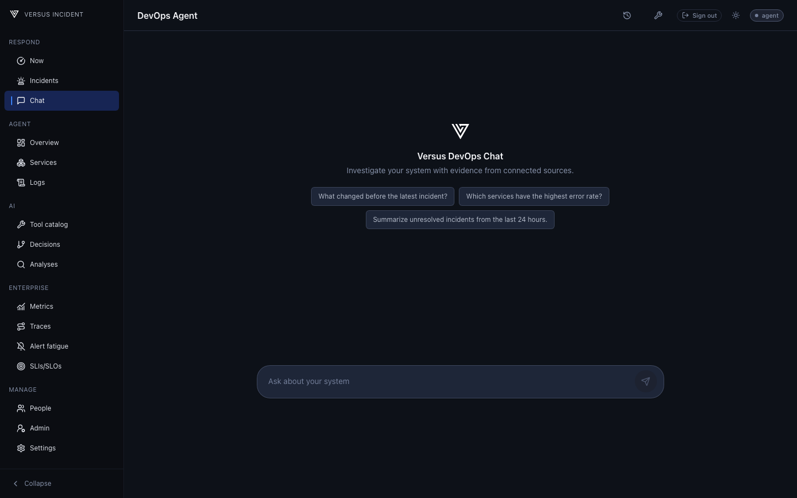

# DevOps Agent

The DevOps Agent's shipped web experience is **Chat** in the Versus UI. This agent is designed to effectively enhance your understanding of your connection system. It empowers you to investigate incidents using read-only tools, allowing you to thoroughly examine the evidence that supports your findings. It does not execute remediation or make changes to your cluster.

## Investigate in Chat

1. Sign in to the Versus UI and open **Respond > Chat**.
2. Start a conversation, or open an existing thread from chat history. Ask a
	specific question, such as which signals changed for a service after a deploy.
3. Review the answer and its cited evidence. Open an evidence item to inspect
	the tool result; use **Stop** to cancel a running response.
4. Return to a thread from history when you need to continue the investigation.
	Delete a thread when you no longer need it.

Chat can be unavailable when the agent or its AI configuration is disabled.
Available evidence also depends on configured data sources, connected tools,
permissions, and the **Chat** tool policy.

The [Tool Reference](./tools/tools.md)
explains what each read-only tool provides; the [Kubernetes Connector](./tools/kubernetes.md)
explains its separate access and RBAC requirements. Tool policies for Chat and
Analyze are independent.

Tool results are bounded, and some tools scrub selected fields, but there is no
general post-result redaction pass for every successful tool response. Do not
paste secrets into Chat or assume arbitrary provider output is fully redacted.
Review source access and tool configuration before enabling a connector.
