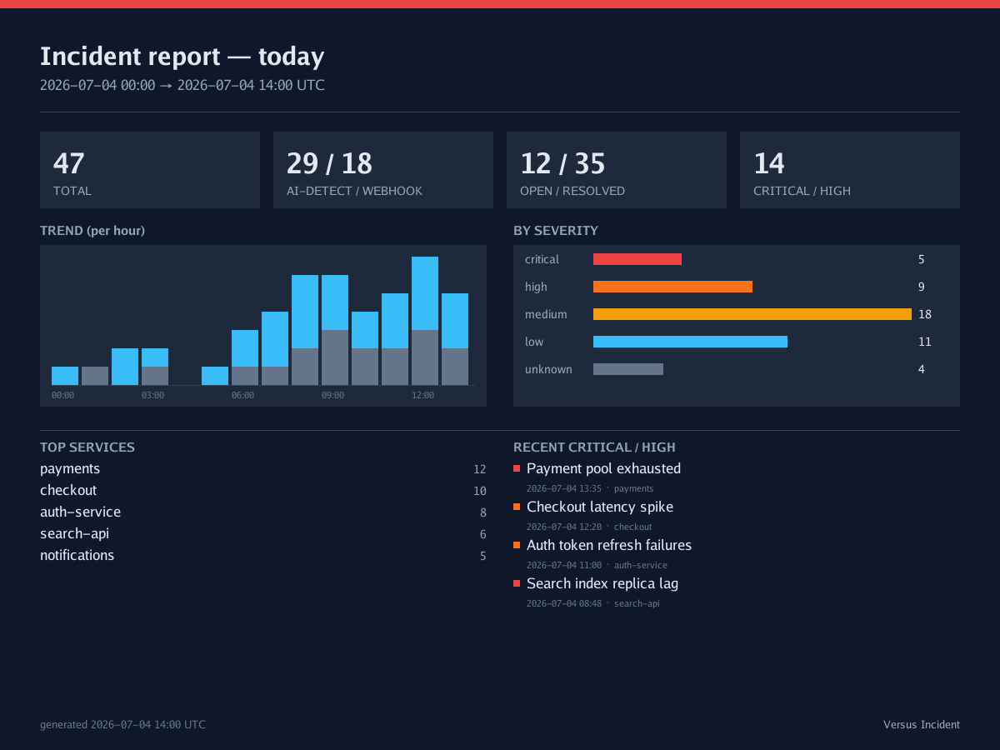

# AI Agent — Incidents Report

At the end of a noisy week someone always asks the same question: *"So how many incidents did we actually have, and where?"* The **Incidents Report** answers it with one picture. It's a shareable, at-a-glance summary card for a time window — total incidents, how they broke down, which services got hit hardest, and the shape of the trend — rendered as an image and posted to a channel your team already reads.

It's built for the people who ask that question: an on-call engineer writing a handover, a team lead running a Monday standup, an SRE closing out an incident review. Instead of screenshotting a dashboard or pasting a wall of numbers, you pick a window, hit **Report**, and drop a clean card into Slack.

This is an OSS feature. It's **off by default** and turned on at runtime from the admin UI.

## What's on the report

The card is an aggregate over every incident in the window you pick — it spans both origins, so an AI-detected anomaly and a webhook alert both count. One card shows:

| Section | What it tells you |
|---|---|
| **Totals** | Total incidents in the window, plus open / resolved and critical-high counts. |
| **By origin** | The split between **AI-detected** incidents (the agent found them) and **webhook** incidents (something paged in). |
| **By severity** | How many were critical, high, and so on. |
| **Top services** | Which services saw the most incidents — where to look first. |
| **Trend** | Incidents over time across the window, so you can see a spike or a quiet stretch at a glance. |

The window is one of three:

| Window | Covers | Trend buckets |
|---|---|---|
| `today` | Since midnight UTC | Hourly |
| `24h` | The last 24 hours | Hourly |
| `7d` | The last 7 days | Daily |

An unknown or missing window falls back to `today`.

> **Note:** The card is **redacted before it's drawn**. Every text field on the report — service names, captions, everything — passes through the same [redaction](./redaction.md) rules the agent uses everywhere else, *before* a single pixel is rendered.

### Example report

## How to configure it

Open the admin UI and go to **Settings → Incidents report**. A fresh install has the whole feature off until you enable it here.

| Setting | Type | Default | What it does |
|---|---|---|---|
| **Enable** | toggle | `off` | Master switch. Off means no Report action, no rendering, no sending. |
| **Default channel** | channel | *(none)* | The channel the report goes to when you don't pick one. With no default set, you must choose a channel each time. |
| **Include chart** | toggle | `on` | Whether the trend chart is drawn on the card. Off gives a text-only summary card. |
| **Rate limit** | number/min | `6` | How many renders/sends are allowed per window, per minute. A guard so a repeated click can't hammer the full-window scan. |
| **Default window** | `today` / `24h` / `7d` | `today` | The window pre-selected in the Report picker, and the window used for the daily schedule. |
| **Daily schedule** | toggle | `off` | Turns on automatic daily delivery. See [Scheduled daily delivery](#scheduled-daily-delivery) below. |
| **Send time** | `HH:MM`, 24h | `09:00` | The wall-clock time the daily report is sent, read in the chosen timezone. |
| **Timezone** | `UTC` or IANA name | `UTC` | The timezone for the send time **and** the report's printed timestamps. |

## Scheduled daily delivery

By default the report is something you send by hand from the Incidents page. Turn on **Daily schedule** and Versus also delivers it automatically, once a day, unattended — the same card, dropped into your channel every morning without anyone clicking **Send**.

When the schedule is on, every day at send time (a 24-hour `"HH:MM"` wall-clock time) in the chosen timezone, Versus renders the report over the existing **Default window** and sends it to the **Default channel**. The window is measured *ending at the send time*, so:

| Default window | A daily send at send time covers |
|---|---|
| `today` | Since midnight (in your timezone) |
| `24h` | The last 24 hours ending at the send time |
| `7d` | The last 7 days ending at the send time |

Nothing new to configure for delivery — the schedule reuses the channel, window, chart, and rate-limit settings you already set above.

> **The report must be enabled too.** The schedule only runs when the report itself is on. With **Enable** off, daily schedule has no effect — turn on the master switch first, then the daily schedule.

### Which channels get the image

How a channel receives the report depends on what that channel can do:

| Channel | Delivery |
|---|---|
| **Slack**, **Telegram**, **Email** | Upload the **PNG image** directly. |
| **Microsoft Teams**, **Viber**, **Lark** | Get a **redacted text summary** (a short caption) plus a note. These channels don't take an image upload, so they fall back to text. |

Either way the render itself is identical — the difference is only how it travels. And one channel failing never mutes another: if you send to several channels and one errors, the rest still get their report, and the PNG stays downloadable.

> **Note:** For the text-summary channels, the fallback note can include a link back to the rendered PNG. That link only appears if you've set the top-level `public_host` field (see [Configuration](./configuration.md)); in an air-gapped setup with no `public_host`, the note points you back to the UI instead of inventing a URL.

## How to send or preview a report

From the **Incidents** page in the admin UI:

1. Click the **Report** action.
2. Pick a **window** — today, last 24 hours, or last 7 days. It starts on your configured default window.
3. Optionally pick a **channel**, or leave it to send to the default channel.
4. **Preview** renders the card right there so you can see it before it goes anywhere.
5. **Send** renders and delivers it to the resolved channel(s).

Channel precedence when sending is simple: the channel you pick wins; if you don't pick one, the **default channel** is used; if there's no default and you didn't pick one, you'll get an error asking you to choose.

The report is **read-only** — it only reads stored incidents to tally them up. Previewing or sending never changes an incident, and never creates one.

## Behavior and edge cases

- **Feature off → nothing happens.** With Enable off, the Report action isn't available, the render endpoints refuse, and the daily schedule never fires.
- **Schedule on, report off → no send.** The daily schedule is gated on the report being enabled; `schedule_enabled` alone does nothing.
- **No storage backend → the report can't run.** The report reads stored incidents; with no storage configured it returns an error rather than an empty card.
- **Rate limited.** Past the per-minute cap for a window, further renders/sends are refused until the bucket refills — the guard against a repeated click driving a full-window scan.
- **Empty window.** A window with no incidents still renders — a valid card showing zeros — so a quiet week reads as "quiet," not "broken."
- **Partial send failure.** If one target channel fails, the others still succeed and the PNG remains downloadable; the send reports which channels got it, which fell back to text, and which failed.

## See also

- [Redaction](./redaction.md) — what gets scrubbed off the card before it's drawn.
- [Notification Channels](./channels.md) — which channels upload images and which fall back to text.
- [Configuration](./configuration.md) — the agent config, and the top-level `public_host` used for the fallback link.
- [AI Detect Mode](./ai-detect-mode.md) — where AI-detected incidents (one of the two origins on the report) come from.
