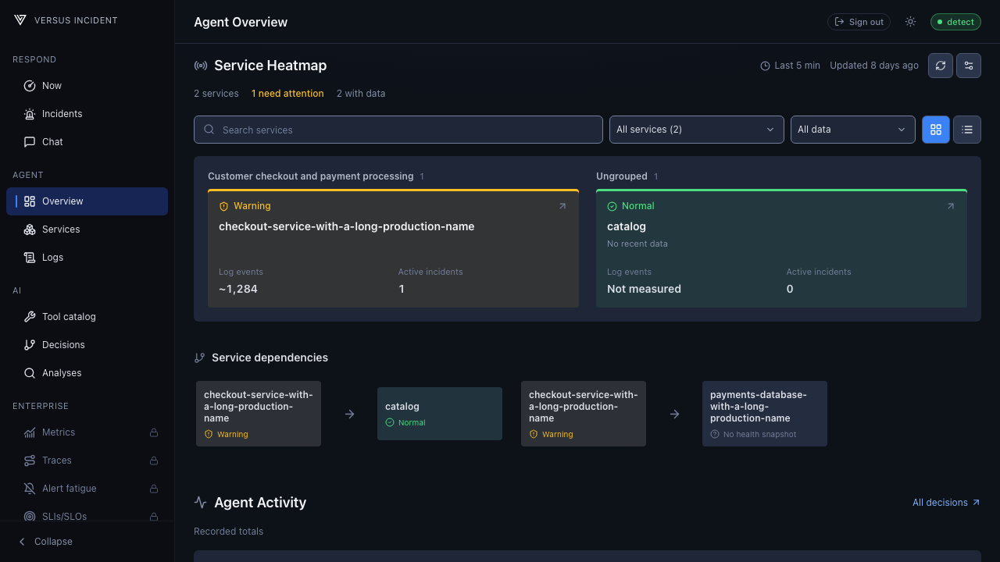
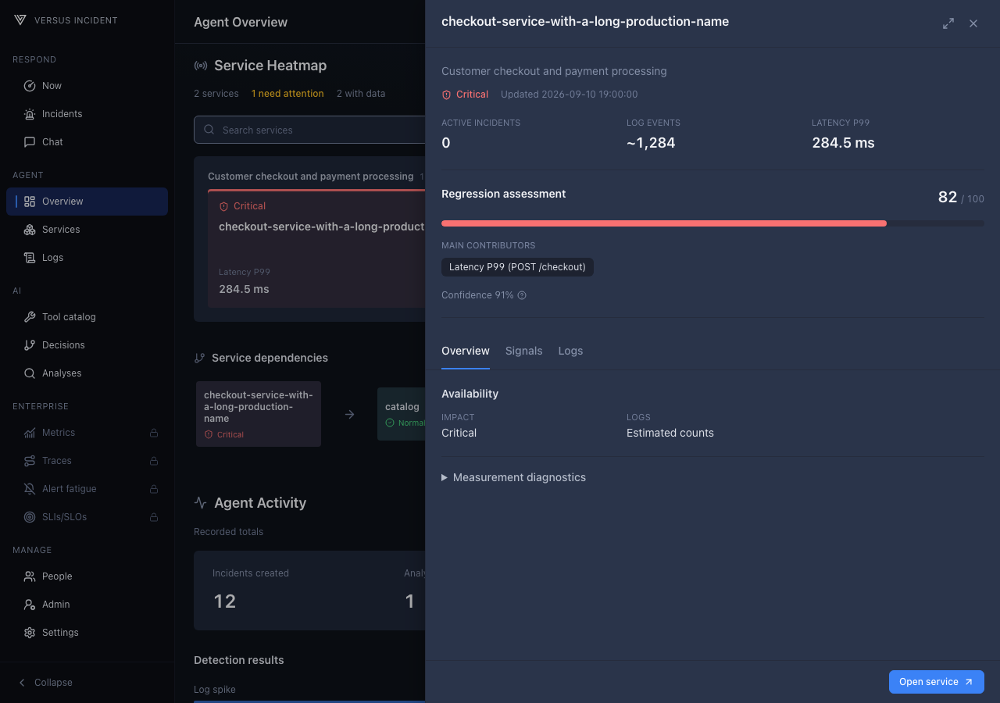
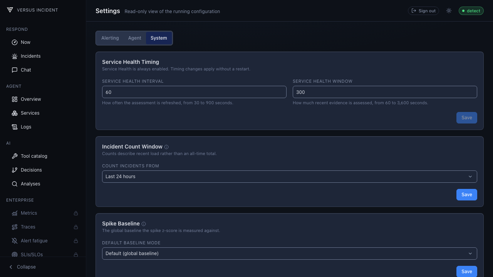

# Service Heatmap

Service Heatmap brings recent service evidence together without starting
another source collection. Logs and Incidents provide a complete OSS
view. Versus Enterprise can add supported metric and trace evidence.

## Open Service Heatmap

1. Select **Agent Overview** in the app navigation.
2. On mobile, select the **Services** tab.
3. Find **Service Heatmap** immediately after the Agent runtime status.

Service Heatmap is always enabled while the AI Agent runs.

## Find a service

- Use **Find a service** to search by service or domain.
- Use **Health state** to focus on services that need attention or have unknown
  or stale evidence.
- Use **Show data** to switch between **All data**, **Logs**, **Incidents**, and
  any supported Enterprise measures available to you.
- Use **Grid view** or **List view** without changing the underlying result.

Select a service to open its investigation drawer. **Overview** summarizes
impact, evidence availability, observation times, logs, and incidents.
**Signals** appears when supported metric or trace evidence is available.
It lists the measure, source, operation when available, observation time, and
freshness.
**Logs** shows estimated event and pattern counts, new or unrecognized patterns,
spikes, and the latest log observation.

When Versus can assess a regression, the drawer shows its score, heuristic
confidence, and contributing evidence. A missing or withheld score is not zero
and does not mean the service is healthy.

## Evidence by edition

OSS uses already-ingested logs, learned internal patterns, and Incidents.
That log and internal result is complete and useful without metrics or traces.
Counts marked with `~` are estimates for the selected evidence window, not
lifetime totals.

Connect a supported log source once by following its UI guide:
[File](./data-sources/file.md),
[Elasticsearch](./data-sources/elasticsearch.md),
[Loki](./data-sources/loki.md),
[CloudWatch Logs](./data-sources/cloudwatch-logs.md),
[Graylog](./data-sources/graylog.md),
[Splunk](./data-sources/splunk.md), or
[SigNoz Logs](./data-sources/signoz.md).

When logs are not connected, select **Connect a log source** to open the
[Data Sources guide](https://docs.versusincident.com/#/agent/data-sources).

With Versus Enterprise, the **Intelligence** entitlement, and a supported
connected source, Service Heatmap can add:

| Measure | What it shows |
|---|---|
| **Latency P99** | Exact learned 99th-percentile latency, shown in milliseconds. |
| **Request error rate** | The latest learned request error ratio. |
| **Throughput** | The latest learned request rate in requests per second. |
| **Regression** | An adverse learned-baseline assessment based on supported latency or error-rate evidence. |

Service Heatmap withholds a measure when its meaning cannot be supported. It
does not relabel P95 as P99, turn sampled traces into population rates or
quantiles, fabricate Apdex, guess units, or show a healthy zero for missing
evidence. Increased throughput alone is not an adverse regression.

## Change collection timing

Select **Settings**, select **System**, then find **Service Health Timing**.

| Setting | Default | Allowed values |
|---|---:|---:|
| **Service Health Interval** | 60 seconds | 30-900 seconds |
| **Service Health Window** | 300 seconds | 60-3600 seconds |

The window must be greater than or equal to the interval. Select **Save** to
apply changes on the next collection without restarting Versus. Read-only users
can view the values but cannot save them.

## Troubleshoot

| Visible symptom | Action in the UI |
|---|---|
| **Not connected** | Open **Settings** and connect a supported source if that evidence is needed. |
| **Collecting** does not clear | Check source activity, then review **Service Health Timing**. |
| **No data** or **No observations** | Confirm the source has traffic and the service is attributed correctly; widen **Service Health Window** when appropriate. |
| **Partial** | Open the service drawer and inspect the unavailable source or measure while using the reported evidence. |
| **Stale** | Check the last observation and source connection, then refresh. Treat the retained result as history. |
| **Source error** | Review the source connection and select **Retry** where offered. |
| **Restricted** | Ask an administrator to review access or continue with the evidence available to you. |
| A measure is absent from **Show data** | Confirm the Enterprise **Intelligence** entitlement, source connection, and measure support. |
| **Service topology is unavailable for this session.** | Ask an administrator to review access. |
| **Showing saved topology. Refresh failed.** | Continue using the saved graph and select **Retry**. |
| **No service dependencies are configured.** | Configure the static dependency graph through the existing Agent dependency tool. |