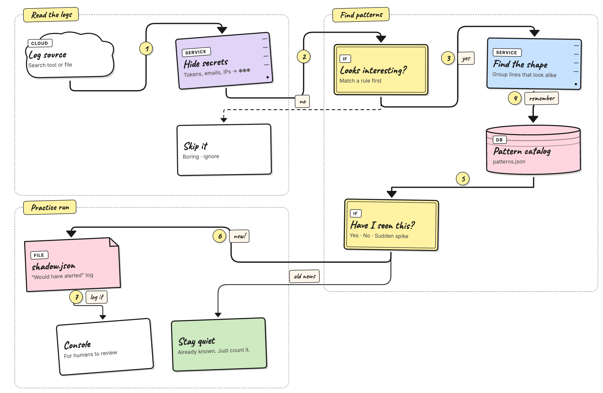

# AI Agent — Shadow Mode

Shadow mode is the **practice run** between training and detect.
The agent keeps learning, and on top of that it decides what it
*would* have alerted on — and writes those decisions to a file you
can read later. **It does not send any alerts.**

Think of it as: "show me what you would have woken me up for, so I
can decide if I trust you."

## When to switch to shadow

Stay in `training` until new patterns stop showing up often —
usually a few days for a small service, longer for a large setup.
Then switch the mode:

```bash
docker stop versus-agent
docker run -d \
  --name versus-agent \
  ... \
  -e AGENT_MODE=shadow \
  ghcr.io/versuscontrol/versus-incident:latest
```

Or change `agent.mode` in `config.yaml` and restart.

The catalog and the shadow log live next to each other in the file
backend's fixed `./data` directory (`/app/data` in the container image):

```
data/
├── patterns.json     # learned templates (kept growing in shadow)
└── shadow.json       # would-have-alerted entries (only written in shadow)
```

## How shadow mode works

Shadow mode runs the same steps as training (read → hide secrets →
filter → group → save) and adds **one extra step at the end**:
look at the result and, if it isn't already known, write a row to
`shadow.json`.



Three things to remember:

- **The catalog still grows.** Every line that passes the secret
  hider and the filter rules is added to the catalog, just like in
  training. Switching to shadow doesn't pause learning.
- **The new step is just a check.** A pattern is "known" when
  either (a) you labeled it `known` through the admin API, or (b)
  it has been seen at least `auto_promote_after` times. Anything
  else is "unknown" and ends up in the shadow log.
- **No real alerts.** Would-have-alerted entries land in
  `shadow.json` (saved on disk, read through the API) and also
  print a green line in stdout.

## What gets recorded

Every time the agent checks for new logs, each line that survives
the earlier steps falls into one of three buckets:

1. **Known** — quietly update the catalog and move on. This is
   what most lines do once the agent has trained.
2. **Unknown** — write a row to the shadow log. This happens for a
   brand-new template, or for a rare template that hasn't been
   seen `auto_promote_after` times yet.
3. **Spike** — a known pattern that is suddenly firing way more
   often than usual. The agent keeps an average rate (an EWMA) for
   every pattern; when one tick blows past that average by a
   configurable factor, the row is written to the shadow log with
   `verdict: spike`. Useful for spotting sudden surges that the
   "known" check would otherwise hide.

A pattern is "known" when **either** of these is true:

- You've labeled it as known through
  `POST /api/agent/patterns/<id>` with body `{"verdict":"known"}`.
  This takes effect right away and stays until you change it.
- It has been seen at least `agent.catalog.auto_promote_after`
  times (default `100`). The agent saves this auto-promotion to
  `patterns.json` so you can check which patterns it considers
  baseline.

### When a known pattern can still fire (spike)

"Known" usually means "ignore". But there's one case where you
probably still want to know: a pattern that has been quiet
suddenly going loud. The agent keeps an average rate (an EWMA) of
how often each pattern fires per tick, and compares the current
tick to that average. If the current tick is way above the
average, the row is written to the shadow log with
`verdict: spike` instead of being silenced.

Three settings control this:

- **`agent.catalog.spike_multiplier`** (default `5.0`) — how many
  times above the baseline a tick must be. Set to `0` to disable
  spike detection.
- **`agent.catalog.spike_min_frequency`** (default `5`) — the
  current tick must have at least this many matches. Stops the
  agent from screaming when the baseline is `0.5` and one tick has
  3 matches (technically 6× but not interesting).
- **`agent.catalog.spike_min_baseline_count`** (default `20`) —
  the pattern must have been seen this many times overall before
  it's eligible for a spike. Stops a barely-seen pattern's first
  big tick from looking like a spike before any real baseline has
  been built.

In practice: with the defaults, a pattern that normally fires once
or twice per tick suddenly producing 10+ matches in a single tick
will land in the shadow log as a spike, even if you previously
labeled it `known`.

### One row per pattern, not per line

If the agent wrote one row for every flagged line, a busy cluster
would drown the shadow log. Instead, the log keeps **one row per
pattern**. When the same pattern is hit again, its row is updated:
the count grows, the occurrence counter ticks up, and the
last-seen time is refreshed.

So if 200 NTP-skew lines arrive across 4 ticks, you don't get 200
rows — you get **one** row with a count of 200 across 4
occurrences.

### What each row shows

Every row on the **Shadow** page carries:

- **template** — the learned shape, `<*>` marks the parts that
  change.
- **source** — which log source it came from, so you can tell prod
  from staging at a glance.
- **rule** — the filter rule that matched (`default` means the
  catch-all matched but no named rule did).
- **verdict** — `unknown` for first sightings, `spike` for a known
  pattern firing far more than usual.
- **sample message** — one example line, with secrets already
  hidden.
- **count** / **occurrences** — raw lines matched, and how many
  distinct ticks they arrived in.
- **first seen** / **last seen** — when the pattern first and most
  recently appeared.

### Size limit and cleanup

The shadow log holds at most **1000 different patterns**. When it's
full, the oldest entry is dropped to make room. You shouldn't hit
this on a normal-sized service: 1000 different anomalies in a single
review window means something is *very* wrong (or the filter rules
are too loose — see [Filter rules](./regex.md)).

## Try it locally with the noisy-logs script

If you went through [Getting Started](./getting-started.md), you
already have the agent running against `./logs/my-app.log` with
`from_beginning: true`. The repo has a
[`scripts/generate_noisy_logs.py`][gen] script that mixes about 30
common templates with a few rare, production-style oddities (kernel
OOM with score, segfaults, expired TLS certs, NTP clock skew, lost
Raft quorum, replication lag, unexpected `SIGTERM`, …). Those rare
lines are exactly what shadow mode is meant to catch.

[gen]: https://github.com/VersusControl/versus-incident/blob/main/scripts/generate_noisy_logs.py

**Step 1 — train on the boring baseline.** With the agent in
`training`, point the live script at the log file and let it run
for a few minutes:

```bash
./scripts/run_noisy_logs.sh \
  --output ./logs/my-app.log \
  --interval 1 --batch 50
```

Watch the agent logs: the `agent: new pattern` lines should slow
down within a minute or two. That's your baseline.

**Step 2 — switch to shadow mode.** Stop the container, start it
again with `AGENT_MODE=shadow`. The catalog you just built is
saved to disk (`data/patterns.json`), so the agent already knows
what "normal" looks like.

**Step 3 — keep generating logs.** Restart the live script (or
just leave it running). Most of what comes through is now the
boring baseline, which the agent treats as known. The rare lines
end up in the shadow log:

```
agent[shadow]: would alert pattern=p-9c2f01 tag=default verdict=unknown freq=1
agent[shadow]: would alert pattern=p-7e1a44 tag=default verdict=unknown freq=2
```

**Step 4 — review.** After a minute or two, open the admin UI and
click **Shadow** in the sidebar. Each row is a pattern the agent
*would* have alerted on, with its template, sample line, counts,
and verdict. Click a row to see the full detail.

This is the "what you would have been alerted about" version. Use
the loop in [A typical review loop](#a-typical-review-loop) below
to triage them.

> **Tip.** Want a forced demo? Append a single batch of mostly
> baseline + anomalies to the file the agent is reading while in
> shadow mode:
>
> ```bash
> python3 scripts/generate_noisy_logs.py \
>   --append --start-time now \
>   --output ./logs/my-app.log --lines 500
> ```
>
> 500 lines at default weights gives about 25 anomaly lines across
> ~10 different templates — a tidy worked example.

## Reading the shadow log

The **Shadow** page in the admin UI is where you review what the
agent would have alerted on. Everything below is available there —
no command line needed.

### List every entry (most recent first)

The Shadow page lists every distinct pattern the agent flagged in
the current window, sorted so the freshest noise is on top. Each
row shows:

- **template** — the learned shape, with `<*>` marking the parts
  that change.
- **sample message** — one example line, with secrets already
  hidden.
- **source** and **rule** — where the line came from and which
  filter rule matched.
- **verdict** — `unknown` for first sightings, `spike` for a known
  pattern firing far more than usual.
- **count** / **occurrences** — how many raw lines matched, and how
  many distinct ticks they arrived in.

The two numbers to watch:

- **count** — high count with low occurrences means a brief flurry;
  high in both means a steady drip you should look at.
- **occurrences** — how many distinct polling cycles the pattern
  fired in.

Click any row to open its detail view with the full sample and
timestamps.

### Summary stats

The top of the Shadow page shows aggregate counts for a quick "is
this getting better?" check between review rounds:

- **events** — distinct patterns in the log.
- **total signals** — raw volume across every entry.
- **total occurrences** — roughly "how many ticks would have paged
  me?".
- **unknown** / **spike** — breakdown by verdict.

A healthy review cycle drives events and total occurrences down
over time, even as total signals stays flat (because you're
labeling the boring patterns as known).

### Force-save to disk

The agent only saves the shadow log to disk periodically so it
doesn't hammer the disk. If you need a snapshot **right now**, use
the **Flush** action on the Shadow page to save immediately.

### Clear the log

Once you've reviewed a batch and either labeled the patterns as
known or fixed the underlying bug, use the **Clear** action on the
Shadow page so the next round starts from zero. This also empties
the saved file so a restart doesn't bring the old entries back.
**The catalog is left alone** — every learned pattern stays exactly
where it was. You're only emptying the "would have alerted" inbox.

### Status at a glance

The **Status** page in the sidebar shows both stores at once:

- **patterns** — number of entries in the catalog.
- **shadow events** — distinct entries in the shadow log right now.

If the shadow event count stops growing for many ticks, the agent
has nothing new to flag — a good sign you're getting close to ready
for `detect` mode.

## A typical review loop

This is the pattern you'll repeat for as long as the agent is in
shadow mode. Each pass should make the next one quieter.

1. **Run shadow mode for about 24 hours.** Long enough to cover at
   least one full traffic cycle (peak hours, off-peak, any nightly
   cron jobs).
2. **Review the entries** on the **Shadow** page. Sort them in your
   head into three groups: real anomalies you'd want to be paged
   about, noise that should have been silenced, and "new but
   legitimate" patterns (fresh deploys, new endpoints, etc.).
3. **For things you _would_ want to be paged about:**
   - Add or improve a rule under `agent.regex.rules` in
     `config.yaml` so the pattern gets the right `name` next time.
   - Example: a `quorum lost` line that landed with rule `default`
     deserves its own rule:

     ```yaml
     agent:
       regex:
         rules:
           - name: quorum-lost
             pattern: "(?i)quorum lost"
     ```
4. **For things that are just noise:**
   - Either raise `agent.catalog.auto_promote_after` (default 100)
     so the pattern becomes "known" sooner, **or** open the pattern
     on the **Patterns** page and set its verdict to **known**.

     Once a pattern is marked known, it will never appear in the
     shadow log again, no matter how often it shows up.
5. **Clear the log** with the **Clear** action on the Shadow page.
   The next round starts clean.
6. **Repeat** until the shadow log is mostly empty over a full
   release cycle (one or two weeks).
7. **Switch to detect.** Set `AGENT_MODE=detect` and you're live.

## Common questions

**Q: Will shadow mode send any alerts?**
No. Not Slack, Telegram, email, on-call — nothing. It only records
would-have-alerted entries you review on the Shadow page.

**Q: Does shadow mode keep adding patterns to the catalog?**
Yes. Every line that passes the secret hider and filter rules is
grouped and saved, exactly like in training. This is on purpose:
shadow is "training plus a check" so you don't lose ground while
reviewing.

**Q: What happens if I switch back to training?**
The shadow log is kept; the worker just stops adding to it. Switch
back to `shadow` later and it picks up where it left off.

**Q: Can the shadow log fill up forever?**
No. It holds at most 1000 distinct patterns. When full, the oldest
entry is dropped to make room.

## What's next

- [Configuration](./configuration.md) — every setting and
  environment variable.
- [Catalog](./catalog.md) — labeling patterns from the shadow log.
- [Filter rules](./regex.md) — tuning what reaches the grouper so
  shadow noise stays manageable.
