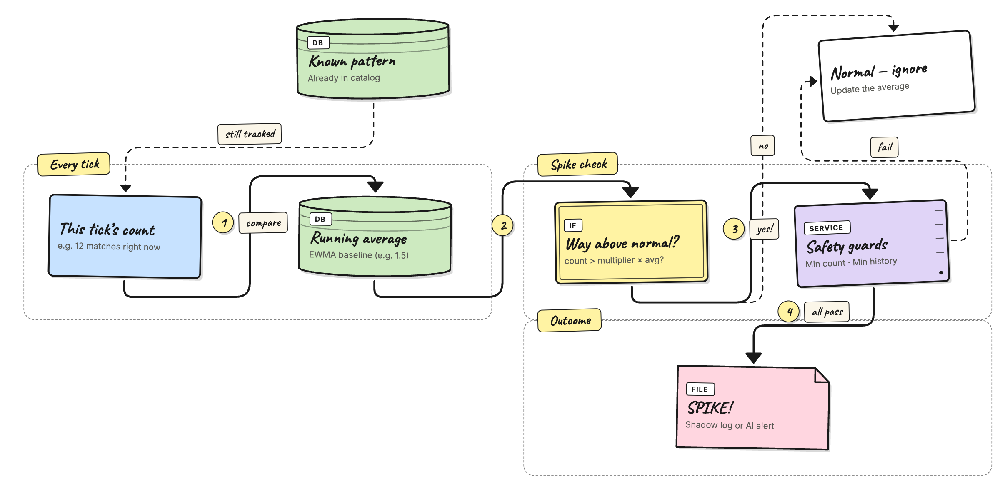

# AI Agent — Spike Detection

Spike detection answers a question that the normal "known/unknown"
check cannot: **"This error is normal — but why is it happening 50
times a minute instead of the usual 2?"**

Once a pattern is labeled `known` (either automatically after enough
sightings, or by you through the API), the agent stops writing it to
the shadow log. Spike detection brings it back when the volume
suddenly jumps well above the pattern's normal rate.



## How it works

For each pattern the agent learns two things from history, updated every
time it polls (a "tick"):

- **A normal rate** — how many matches per second this pattern usually
  produces. It is an **EWMA** (Exponentially Weighted Moving Average), so
  recent ticks weigh more than old ones. Scoring a *rate* (matches ÷ poll
  seconds) instead of a raw per-tick count means the baseline reads
  intuitively (e.g. `~38/s`) and does not change when you change
  `poll_interval`.
- **A normal spread** — how much that rate naturally wobbles (its standard
  deviation), folded alongside the mean.

Before folding a tick, the agent snapshots the current mean and spread and
asks: **how many standard deviations above normal is this tick's rate?**
That number is the **z-score**:

```
z = (this tick's rate − normal rate) / normal spread
```

A pattern is flagged as a **spike** — even if it was previously `known` —
when either of these is true:

- **`z ≥ spike_z`** — the rate is far enough above its own learned normal
  (the bar self-scales to each pattern's volatility, so a `+1000` burst on a
  busy, high-volume pattern trips even though its average is large), **or**
- **the tick crosses `spike_abs_ceiling`** — a hard "always page above N
  matches" safety net that fires regardless of the baseline or warmup.

Two guards keep noise out:

1. **A raw minimum (`spike_min_frequency`)** — a tick must have at least this
   many matches, so a near-silent pattern can't page on a couple of lines.
2. **A warmup gate (`spike_min_baseline_count`)** — the pattern must have been
   seen enough times overall before the z-score is trusted. During warmup only
   the absolute ceiling can fire.

Two refinements make the baseline robust:

- **Outlier-resistant learning.** Once the baseline is confident, a burst tick
  is *held out* of the average, so one spike can't drag "normal" up and blind
  the detector to the next one.
- **Time-of-day awareness (always on).** The agent always keeps a separate
  normal for each hour of the day (24 UTC buckets), so a 2 a.m. batch job can be
  treated as normal-for-2 a.m. while the same rate at 2 p.m. still pages. You
  choose whether the spike score is measured against that hour-of-day baseline,
  the global baseline, or the running average with `spike_baseline_mode` —
  because all three baselines are always learned, switching between them takes
  effect immediately, with no re-learn.

## Configuration

These keys live under `agent.catalog` in `config.yaml`:

```yaml
agent:
  catalog:
    spike_z: 3.0                 # fire when the rate is this many σ above normal
    spike_abs_ceiling: 0         # hard "always page above N matches" net (0 = off)
    spike_sustain_ticks: 1       # consecutive spiking ticks before firing (1 = no debounce)
    spike_baseline_mode: default # which baseline to score against: default | average | time_of_day
    spike_min_frequency: 5       # tick must have at least this many matches
    spike_min_baseline_count: 20 # pattern must have been seen this many times overall
```

### Spike Z

**Default:** `3.0`

The sensitivity dial. It answers: *"How far above its own normal does a
burst have to be before I care?"* — measured in standard deviations (σ), so
it means the same thing for a quiet pattern and a chatty one.

- **Set it higher** (e.g. `4.0`) if you get too many false alarms — only
  extreme jumps count.
- **Set it lower** (e.g. `2.5`) to catch smaller surges earlier.

**Examples:**

| Normal rate | Normal spread | This tick's rate | z | Spike at `spike_z: 3.0`? |
|---|---|---|---|---|
| 38.4/s | ± 1.0 | 47.3/s | 8.9σ | Yes |
| 38.4/s | ± 5.0 | 47.3/s | 1.8σ | No — within its normal wobble |
| 1.5/s | ± 0.3 | 6.0/s | 15σ | Yes (if past the min-frequency floor) |

### Spike Absolute Ceiling

**Default:** `0` (disabled)

A deterministic safety net independent of the learned baseline: a tick with
at least this many matches always surfaces, even while the pattern is still
warming up. Leave it at `0` to rely purely on the z-score, or set a hard line
(e.g. `1000`) for "no matter what, page me if a single tick sees this many".

### Spike Sustain Ticks

**Default:** `1`

How many **consecutive** spiking ticks are required before firing — a
debounce against a single noisy tick. The default of `1` fires on the first
spiking tick (no debounce). Raise it (e.g. `3`) to page only on a sustained
surge; an absolute-ceiling hit always fires immediately, bypassing the
debounce.

### Spike Baseline Mode

**Default:** `default`

Picks **which learned baseline** the z-score is measured against. All three
baselines are always learned, so you can switch modes at any time without a
re-learn:

- `"default"` — the **global** rate baseline (the pattern's overall normal rate
  and spread).
- `"average"` — the **cumulative arithmetic mean** of the rate as the center,
  reusing the global spread as the scale. Useful when you want the center to be
  a plain running average rather than the recency-weighted EWMA.
- `"time_of_day"` — the **current hour-of-day** bucket (24 buckets, UTC), so a
  nightly batch job is normal-for-that-hour. A sparse hour (not enough samples
  yet) falls back to the global baseline, so turning this on never causes a
  cold-bucket false-alarm flood. Bucketing is in UTC.

The explanation in the audit log names the baseline that fired, e.g.
`"47.3/s = 1.5σ above the 02:00 baseline 44.0/s ± 2.0"` (time-of-day) or
`"47.3/s = 13.5σ above the average baseline 20.0/s ± 2.0"` (average).

### Spike Min Frequency

**Default:** `5`

A minimum count. Even if the z-score says "spike!", the agent ignores it
unless there are at least this many matches in one tick — so a near-silent
pattern (say `0.02/s`) can't page on a coincidental handful of lines.

- **Set it higher** (e.g. `10`) if your logs are noisy and you only want
  genuinely large bursts.
- **Set it to `1`** to let the z-score decide alone.

### Spike Min Baseline Count

**Default:** `20`

The warmup gate: the agent won't trust the z-score until it has seen the
pattern at least this many times total. Like a new employee learning what a
busy day looks like before judging one. During warmup the absolute ceiling is
the only thing that can fire.

- **Set it higher** (e.g. `50`) to learn longer before judging.
- **Set it lower** (e.g. `5`) for low-traffic services.

## Example

Say `db-conn-refused` normally runs about `1.5/s`, wobbling by about
`± 0.3/s`, and the agent has seen it well over 20 times.

With the defaults, a tick that jumps to `6.0/s` scores
`(6.0 − 1.5) / 0.3 = 15σ` — far past `spike_z: 3.0` — and (assuming the tick
has at least `spike_min_frequency` matches) is flagged as a spike, even though
the pattern is `known`. The audit log records the exact math:
`"6.0/s = 15.0σ above 1.5/s ± 0.3"`.

## What the shadow log shows

A spike entry appears on the **Shadow** page (or, in detect mode,
is forwarded to the AI analyzer and shows up on the **Detect**
page and as an incident) with:

- **verdict: spike** — tells you this is a volume event, not a new
  unknown pattern.
- **frequency** — how many times the pattern fired in that one
  tick.
- **template** — the learned template for the pattern (with
  variable parts replaced by `<*>`).

Filter the Shadow page by the `spike` verdict to see only volume
events, and watch the summary counts at the top to track how often
they fire.

## Testing spike detection with the log generator

The repo ships a script that generates realistic test logs. It has a
`--spike` flag designed for this exact workflow.

### Step 1 — Build a baseline

Generate enough logs for the agent to train a stable average.
The default is 2000 lines spread over several hours, which is enough
for most patterns to pass `spike_min_baseline_count`.

```bash
python3 scripts/generate_noisy_logs.py \
  --output data/logs/app.log \
  --lines 2000
```

Point the file source at `data/logs/app.log` and let the agent run in
`training` mode until the source is fully consumed. Check the
**Status** page to confirm the catalog is growing.

### Step 2 — Switch to shadow mode

```bash
docker stop versus-agent
docker run -d \
  --name versus-agent \
  ... \
  -e AGENT_MODE=shadow \
  ghcr.io/versuscontrol/versus-incident:latest
```

Wait for the agent to catch up.

### Step 3 — Inject a spike

Append a tight burst of one specific template to the same log file.
The agent will read it on the next tick and compare it against the
baseline it built in step 1.

```bash
# 80 db-conn-refused lines packed into ~16 seconds
python3 scripts/generate_noisy_logs.py \
  --append \
  --start-time now \
  --spike db-conn-refused \
  --spike-burst 80
```

What `--spike` does differently from a normal run:

- Ignores `--lines` and emits exactly `--spike-burst` lines.
- Uses `--spike-interval-min` / `--spike-interval-max` (default
  0.0–0.2 s) instead of the normal 1–5 s spacing so all the lines
  land in one or two poll ticks.
- Optionally emits `--spike-context N` regular noisy lines first
  so the burst doesn't appear in an empty file.

### Step 4 — Check the shadow log

Open the **Shadow** page and filter by the `spike` verdict. You
should see one or more entries with a frequency equal to (or close
to) your `--spike-burst` value.

### Useful flags

| Flag | Default | What it does |
|---|---|---|
| `--spike NAME` | — | Name of the template to burst. Use `--list-templates` to see all options. |
| `--spike-burst N` | `50` | Number of lines in the burst. |
| `--spike-interval-min S` | `0.0` | Minimum seconds between burst lines. |
| `--spike-interval-max S` | `0.2` | Maximum seconds between burst lines. |
| `--spike-context N` | `0` | Regular noisy lines to emit before the burst. |
| `--list-templates` | — | Print all template names and exit. |

```bash
# See all available template names
python3 scripts/generate_noisy_logs.py --list-templates

# Inject an auto-picked random template
python3 scripts/generate_noisy_logs.py --append --start-time now \
  --spike auto --spike-burst 60

# Add 20 normal lines before the burst so there's some context
python3 scripts/generate_noisy_logs.py --append --start-time now \
  --spike panic --spike-burst 40 --spike-context 20
```

## Tuning tips

- **Too many spike alerts?** Raise `spike_multiplier` (e.g. `8.0`) or
  `spike_min_frequency` (e.g. `10`).
- **Missing real surges?** Lower `spike_multiplier` (e.g. `3.0`) or
  `spike_min_frequency` (e.g. `3`).
- **Spikes on new patterns?** Raise `spike_min_baseline_count` so the
  agent waits longer before it starts comparing.
- **Want to disable entirely?** Set `spike_multiplier: 0`.
