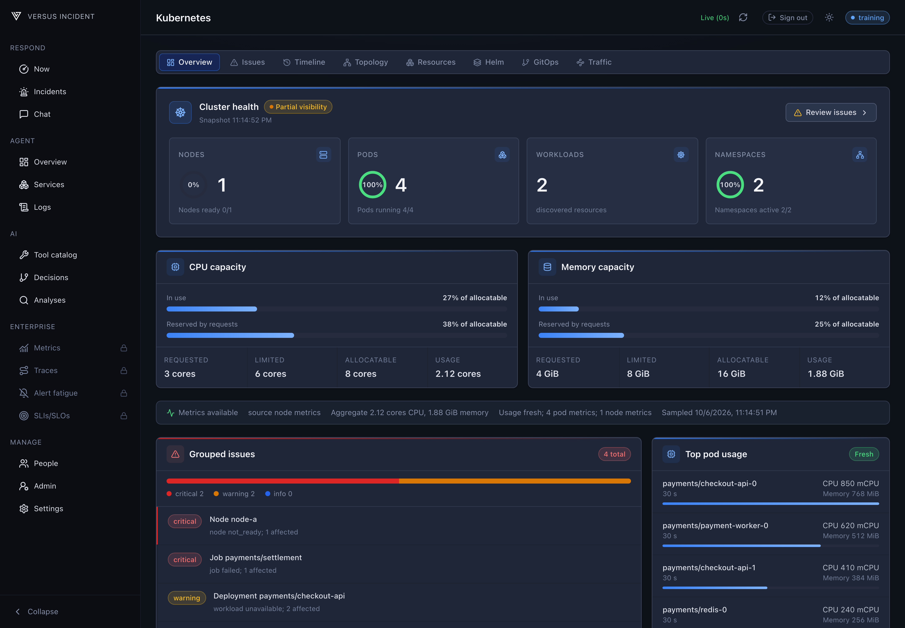
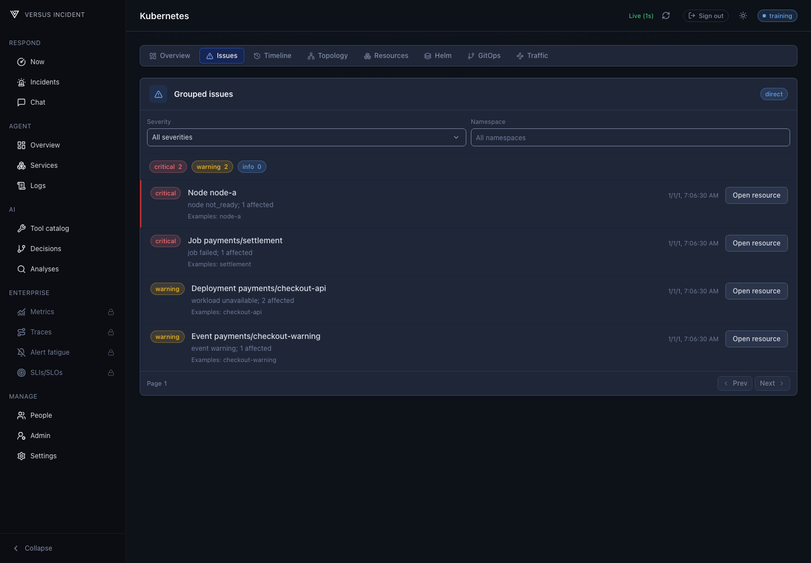
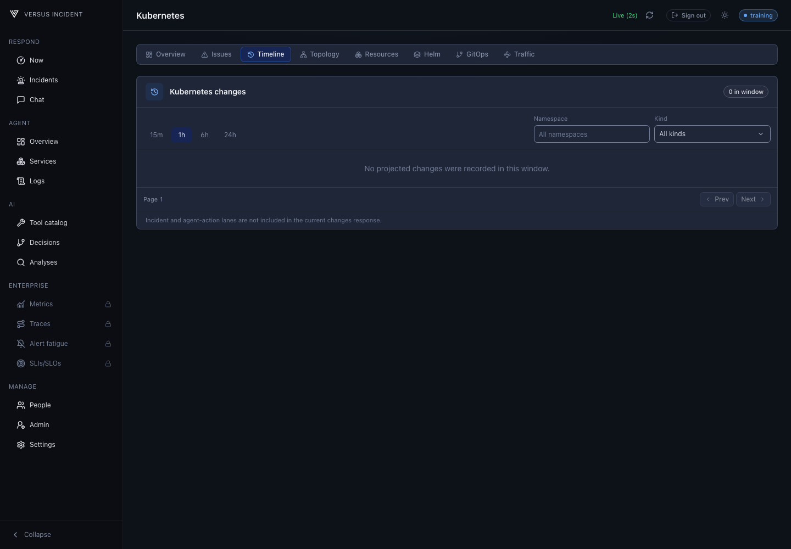
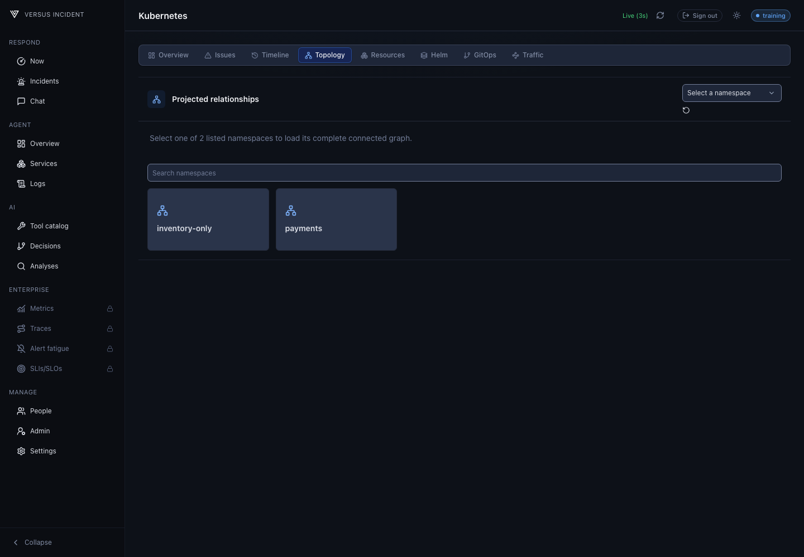
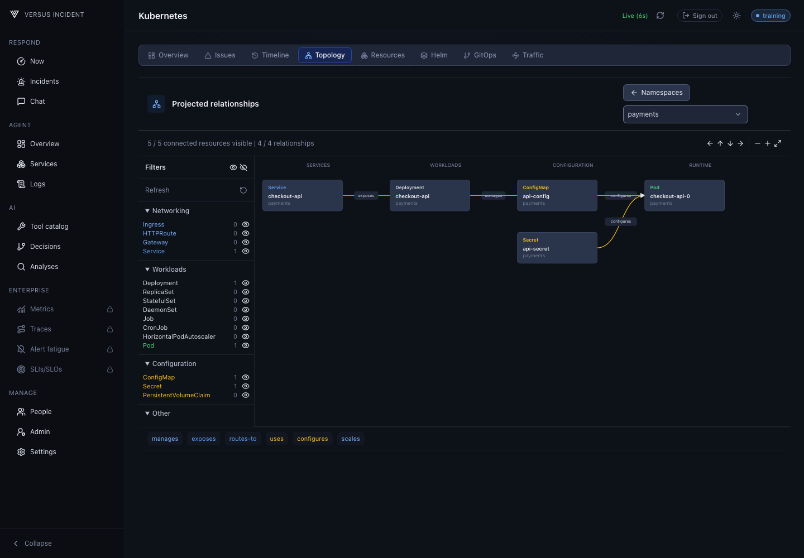
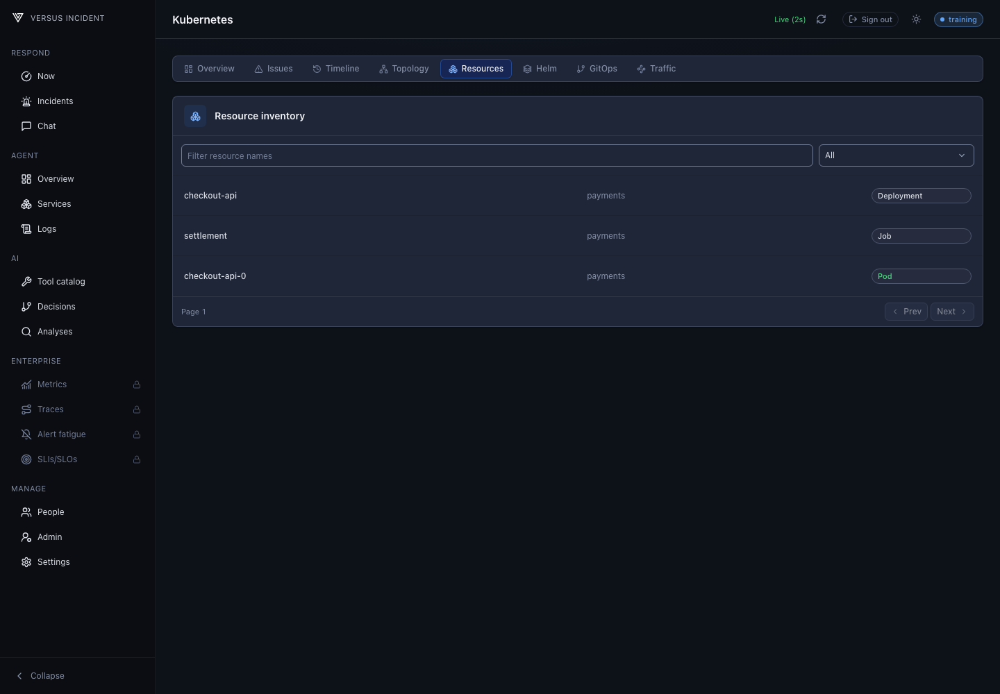
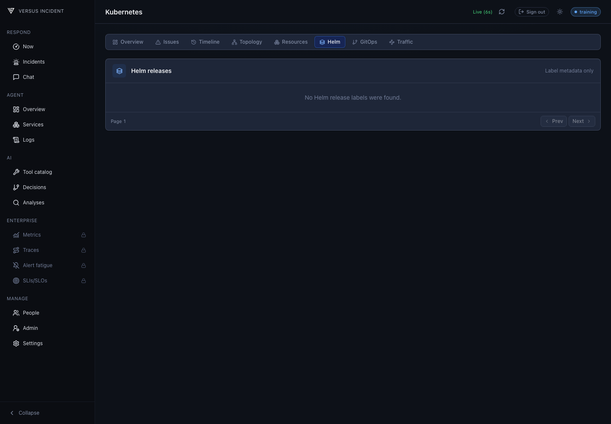
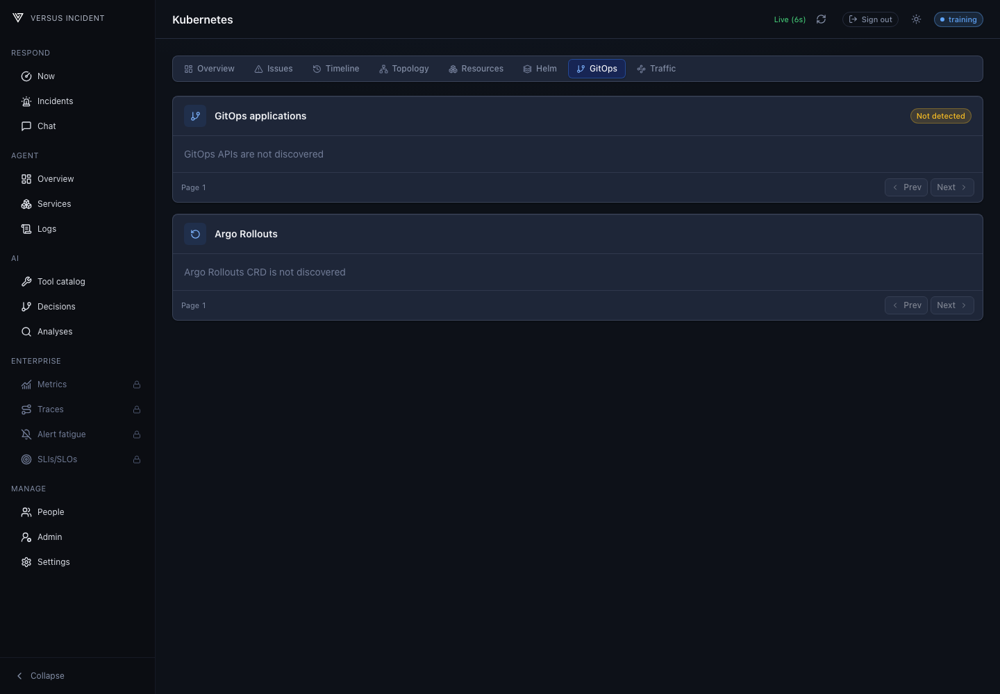
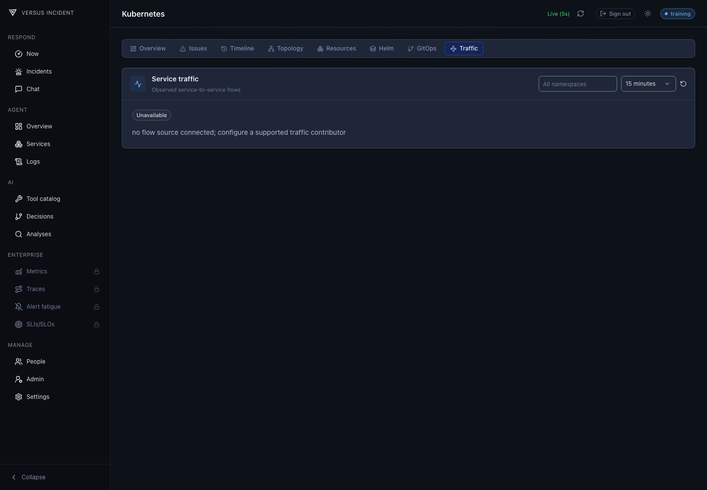

# Kubernetes Connector and Dashboard

Explore your Kubernetes environment in one place: cluster health and capacity,
workloads, resource relationships, recent changes, Helm releases, and GitOps
status. Open a resource to inspect its events, logs, metrics, and deployment
context without switching between tools.

The AI SRE can use the same cluster context in Chat and Analyze. Start with the
dashboard to understand a workload, then investigate it in chat with the
resource already attached.

## Kubernetes Harness Dashboard

Open **Tools > Kubernetes** after connecting your cluster. The dashboard has
eight tabs; screenshots below use a synthetic cluster.

### Overview

See ready nodes, running pods, workload and namespace counts, and CPU and memory
capacity. Usage and resource requests are shown separately, with the metrics
source and sample time beside them. Missing metrics are labelled **Unavailable**
rather than shown as zero.

Grouped issues, top pod usage, recent changes, and release and traffic summaries
help you choose what to inspect next. The topology preview loads independently
across namespaces. **Full topology** opens the namespace explorer.

The full-width **Workloads** list supports name, namespace, and kind filters.
Select a node to inspect its scheduled pods.



### Issues

Problems are grouped by resource and severity. Filter by severity or namespace,
then select **Open resource** to inspect the affected workload. Pagination loads
the next page without expanding the whole dashboard.



### Timeline

Follow resource creation and deletion, image updates, replica changes, and spec
changes. Choose a time window and filter by namespace or resource kind. Select
a change to open the resource's timeline in the details panel. Recorded history
gaps remain visible so missing evidence is not mistaken for no activity.



### Topology

Start with the namespace blocks. Search for a namespace and select it to explore
its connected resources; this graph is not paginated.



The filter sidebar groups resource kinds and shows their counts. Ingress,
Service, Deployment, and Pod are visible by default. Use the eye icons to show
or hide other kinds, or reveal all kinds at once. Refresh the graph from the
sidebar, and use pan, zoom, and **Fit to view** to navigate it.

Connections show which resources manage, expose, route to, or configure others.
Select a resource to open its details. Resources without relationships are not
shown; use **Resources** to browse workloads outside the graph. If permissions
or collection limits prevent a complete graph, the dashboard shows an error
instead of presenting partial results as complete.



### Resources

Search workloads and filter by kind, including Deployments, StatefulSets,
DaemonSets, Jobs, CronJobs, and Pods. Select a row to open its details. The list
scrolls within the panel and loads additional pages as requested.



### Helm

Inspect release status, health, namespace, and revision. Expand a release to
view its revision history. This view shows release metadata, not chart values
or rendered manifests, and does not run Helm operations.



### GitOps

Review discovered Argo CD and Flux applications, including sync state, health,
and revision. The **Argo Rollouts** section automatically lists detected
Rollouts and their strategy, progress, and canary weight.

If the relevant APIs are not installed or cannot be read, the page explains
what is unavailable instead of showing an empty successful result.



### Traffic

> **Enterprise**

See observed service-to-service request rates, error rates, latency, and
bytes per second where the source provides them. Filter by namespace and time
window; check the source and freshness before interpreting a flow. Without
supported telemetry, the page shows an unavailable state rather than inventing
connections.



## Configuration

Configure in `tools.yaml` file.

### In-cluster ServiceAccount

```yaml
tools:
  kubernetes:
    auth:
      mode: in_cluster
```

The projected ServiceAccount token is read for every request, so rotation does
not require a restart. The projected cluster CA is used automatically.

### Rotating token file

```yaml
tools:
  kubernetes:
    endpoint: https://api.example
    ca_data: ${KUBERNETES_CA_DATA}
    auth:
      mode: token_file
      token_file: /run/secrets/kubernetes-token
```

The bounded token file is read on every request.

### Static token

```yaml
tools:
  kubernetes:
    endpoint: https://api.example
    ca_data: ${KUBERNETES_CA_DATA}
    auth:
      mode: token
      token: ${KUBERNETES_TOKEN}
```

Keep static tokens in an environment-backed Secret.

### Client certificate

```yaml
tools:
  kubernetes:
    endpoint: https://api.example
    ca_data: ${KUBERNETES_CA_DATA}
    auth:
      mode: client_certificate
      client_certificate:
        certificate_file: /run/certs/client.crt
        key_file: /run/certs/client.key
```

Certificate files rotate without restart. Bounded base64 `certificate_data`
and `key_data` are also supported; do not combine file and inline forms.

### Safe kubeconfig

```yaml
tools:
  kubernetes:
    auth:
      mode: kubeconfig
      kubeconfig:
        path: /run/kube/config
        context: production
```

The bounded parser accepts only static token, `tokenFile`, or client
certificate/key users. Relative paths resolve beside the kubeconfig.
Kubeconfig `exec` and legacy `auth-provider` entries are rejected with
instructions to use native `eks`, `aks`, or `gke` mode.

### EKS IAM

```yaml
tools:
  kubernetes:
    endpoint: https://API_ID.eks.us-east-1.amazonaws.com
    ca_data: ${KUBERNETES_CA_DATA}
    auth:
      mode: eks
      eks:
        cluster_name: production
        region: us-east-1
        role_arn: arn:aws:iam::123456789012:role/versus-kubernetes-reader
        profile: ""
```

Create an EKS access entry (preferred) or compatible `aws-auth` mapping for the
IAM principal, then bind least-privilege Kubernetes RBAC.

For a complete setup showing the IRSA trust, EKS access-entry group mapping,
Kubernetes ClusterRole, and Helm values together, see
[Read EKS with IRSA](/examples/eks-irsa-kubernetes-reader).

### AKS workload identity

```yaml
tools:
  kubernetes:
    endpoint: https://cluster.example.azmk8s.io
    ca_data: ${KUBERNETES_CA_DATA}
    auth:
      mode: aks
      aks:
        credential_mode: workload_identity
        environment: public
        server_id: api://AKS_SERVER_APP_ID
        tenant_id: TENANT_ID
        client_id: CLIENT_ID
        federated_token_file: /var/run/secrets/azure/tokens/azure-identity-token
```

`environment` is a closed enum: `public`, `government`, or `china`.
The federated token file is reopened, bounded, and permission-checked on every
refresh so projected-file rotation is observed. Projected read-only mode
`0644` is accepted; group/world write bits fail closed.

### AKS client secret

```yaml
tools:
  kubernetes:
    endpoint: https://cluster.example.azmk8s.io
    ca_data: ${KUBERNETES_CA_DATA}
    auth:
      mode: aks
      aks:
        credential_mode: client_secret
        environment: public
        server_id: api://AKS_SERVER_APP_ID
        tenant_id: TENANT_ID
        client_id: CLIENT_ID
        client_secret: ${KUBERNETES_AKS_CLIENT_SECRET}
```

### AKS managed identity

```yaml
tools:
  kubernetes:
    endpoint: https://cluster.example.azmk8s.io
    ca_data: ${KUBERNETES_CA_DATA}
    auth:
      mode: aks
      aks:
        credential_mode: managed_identity
        environment: public
        server_id: api://AKS_SERVER_APP_ID
        client_id: OPTIONAL_USER_ASSIGNED_IDENTITY_CLIENT_ID
```

Managed identity calls only Azure's fixed link-local IMDS endpoint. There is no
configurable token URL, device code, browser, refresh-token persistence, or
Azure CLI flow. The cluster must use Entra integration with the configured
server audience. Grant the identity cluster access and Kubernetes RBAC.

### GKE credentials

```yaml
tools:
  kubernetes:
    endpoint: https://api.gke.example
    ca_data: ${KUBERNETES_CA_DATA}
    auth:
      mode: gke
      gke:
        credentials_file: /run/secrets/google/credentials.json
```

Leave `credentials_file` empty for Google Workload Identity through the fixed
metadata IP only. Versus does not read the well-known gcloud ADC file;
`GOOGLE_APPLICATION_CREDENTIALS` and operator-controlled `GCE_METADATA_HOST`
are rejected even when an explicit credentials file is configured.
Explicit credential files accept only Google `service_account` JSON or a
file-backed `external_account` using Google STS. Executable, URL, AWS, nested,
authorized-user, and impersonated-service-account credential sources are
rejected. External-account service account impersonation, when present, must
use the fixed `https://iamcredentials.googleapis.com/` API.
The provider requests only the `https://www.googleapis.com/auth/cloud-platform`
scope. Credential and external subject-token files are reopened, bounded, and
permission-checked on every refresh so projected-file rotation is observed;
projected read-only mode `0644` is accepted and group/world write bits fail
closed. Provide endpoint and CA separately;
this mode does not perform cluster discovery. Grant only the Google IAM needed
to access the cluster endpoint, then bind the principal through Kubernetes
RBAC.

## Kubernetes RBAC

Versus Enterprise `infrastructure:view` controls access to the Versus UI/API.
It does not grant Kubernetes permissions. Bind the connector identity inside
Kubernetes separately. For `in_cluster`, that identity is the pod
ServiceAccount. For `eks`, it is normally the Kubernetes group assigned by the
EKS access entry. This cluster-wide example covers discovery, resources, logs,
and metrics with read verbs only:

When `auth.mode: eks` is used with an IAM role, the binding subject is normally
the Kubernetes group configured on the EKS access entry, not the pod
ServiceAccount. The [EKS with IRSA example](/examples/eks-irsa-kubernetes-reader)
shows that mapping. The ServiceAccount binding below is for `in_cluster` mode.

```yaml
apiVersion: rbac.authorization.k8s.io/v1
kind: ClusterRole
metadata: {name: versus-kubernetes-reader}
rules:
- apiGroups: [""]
  resources: [nodes, namespaces, pods, services, events, configmaps, persistentvolumeclaims, persistentvolumes]
  verbs: [get, list]
- apiGroups: [""]
  resources: [pods/log]
  verbs: [get]
- apiGroups: [apps]
  resources: [deployments, statefulsets, daemonsets, replicasets]
  verbs: [get, list]
- apiGroups: [batch]
  resources: [jobs, cronjobs]
  verbs: [get, list]
- apiGroups: [discovery.k8s.io]
  resources: [endpointslices]
  verbs: [get, list]
- apiGroups: [networking.k8s.io]
  resources: [ingresses, networkpolicies]
  verbs: [get, list]
- apiGroups: [autoscaling]
  resources: [horizontalpodautoscalers]
  verbs: [get, list]
- apiGroups: [policy]
  resources: [poddisruptionbudgets]
  verbs: [get, list]
- apiGroups: [storage.k8s.io]
  resources: [storageclasses]
  verbs: [get, list]
- apiGroups: [apiextensions.k8s.io]
  resources: [customresourcedefinitions]
  verbs: [get, list]
- apiGroups: [metrics.k8s.io]
  resources: [nodes, pods]
  verbs: [get, list]
---
apiVersion: rbac.authorization.k8s.io/v1
kind: ClusterRoleBinding
metadata:
  name: versus-kubernetes-reader
subjects:
  - kind: ServiceAccount
    name: versus-incident
    namespace: versus
roleRef:
  apiGroup: rbac.authorization.k8s.io
  kind: ClusterRole
  name: versus-kubernetes-reader
```

Secrets are deliberately omitted by default. Resource reports project only
referenced Secret key names; grant `get,list` on core `secrets` separately only
when that projection is required. Gateway API reads are also optional: add
`get,list` for `gateway.networking.k8s.io` `gateways` and `httproutes`, or set
`kubernetesReaderRBAC.gatewayAPI=true` in the chart, only on clusters where
those CRDs are installed.

For least privilege, replace `ClusterRole`/`ClusterRoleBinding` with a `Role`
and `RoleBinding` in each observed namespace, remove nodes/namespaces and node
metrics, and accept a partial cluster overview. API discovery itself may
still be visible, while forbidden resource reads are reported as partial.

## Network and TLS policy

Production endpoints must use HTTPS. Public addresses are allowed by default.
Private managed APIs require `allow_private_networks: true` or narrowly scoped
`endpoint_cidrs`. DNS is resolved and every address checked at connect time;
loopback is test-only, while metadata, link-local, multicast, unspecified,
redirect, proxy, userinfo, query, and non-root base endpoints are rejected.
Use the cluster CA. TLS verification defaults to the endpoint hostname; set
`server_name` only when the certificate uses a different trusted DNS name.

## Security and troubleshooting

Kubeconfig supports server, CA file/data, token/tokenFile, client certificate/key
file/data, and context selection. It rejects insecure TLS, proxy URLs, basic
auth, impersonation, every exec command, and legacy auth-provider credentials.
Cloud credential HTTP clients have deadlines, bounded bodies, no redirects or
proxy inheritance, TLS verification, and fixed production endpoints.

The admin API and Kubernetes page return a safe error code, explanation, and
next action:

| Code | What to check |
| --- | --- |
| `credential_unavailable` | Configure the selected auth mode. For EKS, provide IRSA, Pod Identity, environment credentials, or an explicitly selected static profile. |
| `cluster_authentication_failed` | Verify cloud identity, cluster access mapping, token audience, and credential expiry. |
| `cluster_permission_denied` | Grant the connector identity the required read-only Kubernetes RBAC. |
| `tls_verification_failed` | Verify `ca_data` or `ca_file` and `server_name` against the API-server certificate. |
| `dns_resolution_failed` | Resolve the configured endpoint from the Versus container. |
| `connection_failed` | Check endpoint CIDRs, private-network access, routes, firewall rules, and security groups. |
| `request_timeout` | Check API-server reachability and control-plane latency before increasing the timeout. |
| `response_too_large` or `operation_budget_exhausted` | Narrow the namespace, resource category, selectors, search query, or result limit. |
| `connector_configuration_invalid` | Check the endpoint, network policy, CA selection, and auth-mode fields, then restart Versus. |