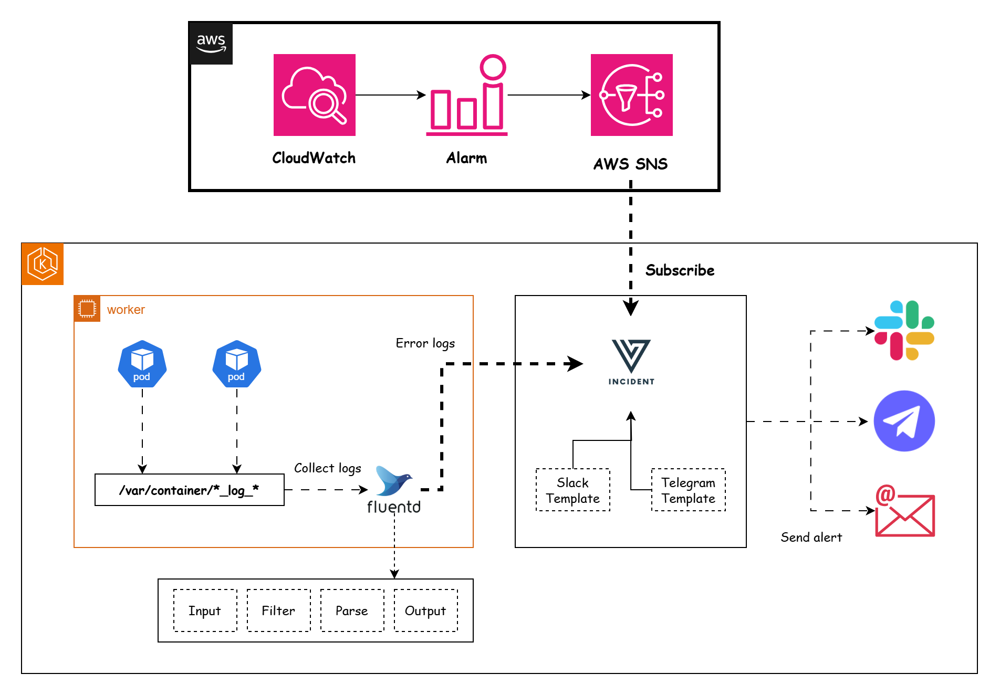

## Configuring CloudWatch to send Alert to Versus Incident



In this guide, you’ll learn how to set up a CloudWatch alarm to trigger when RDS CPU usage exceeds 80% and send an alert to Slack and Telegram.

**Prerequisites**

AWS account with access to RDS, CloudWatch, and SNS.
An RDS instance running (replace my-rds-instance with your instance ID).
Slack and Telegram API Token.

**Steps**

1. Create SNS Topic and Subscription.

2. Create CloudWatch Alarm.

3. Deploy Versus Incident with Slack and Telegram configurations.

4. Subscribe Versus to the SNS Topic.

### Create an SNS Topic

Create an SNS topic to route CloudWatch Alarms to Versus:

```bash
aws sns create-topic --name RDS-CPU-Alarm-Topic
```

### Create a CloudWatch Alarm for RDS CPU

Set up an alarm to trigger when RDS CPU exceeds 80% for 5 minutes.

```bash
aws cloudwatch put-metric-alarm \
  --alarm-name "RDS_CPU_High" \
  --alarm-description "RDS CPU utilization over 80%" \
  --namespace AWS/RDS \
  --metric-name CPUUtilization \
  --dimensions Name=DBInstanceIdentifier,Value=my-rds-instance \
  --statistic Average \
  --period 300 \
  --threshold 80 \
  --comparison-operator GreaterThanThreshold \
  --evaluation-periods 1 \
  --alarm-actions arn:aws:sns:us-east-1:123456789012:RDS-CPU-Alarm-Topic
```

Explanation:

+ `--namespace AWS/RDS`: Specifies RDS metrics.
+ `--metric-name CPUUtilization`: Tracks CPU usage.
+ `--dimensions`: Identifies your RDS instance.
+ `--alarm-actions`: The SNS topic ARN where alerts are sent.

### Versus Incident

Next, we will deploy Versus Incident and configure it with a custom template to send alerts to both Slack and Telegram. Enable SNS support in `config/config.yaml`:

```yaml
name: versus
host: 0.0.0.0
port: 3000

alert:
  debug_body: true

  slack:
    enable: true
    token: ${SLACK_TOKEN}
    channel_id: ${SLACK_CHANNEL_ID}
    template_path: "/app/config/slack_message.tmpl"
  
  telegram:
    enable: true
    bot_token: ${TELEGRAM_BOT_TOKEN}
    chat_id: ${TELEGRAM_CHAT_ID}
    template_path: "/app/config/telegram_message.tmpl"

queue:
  enable: true
  sns:
    enable: true
    https_endpoint_subscription_path: /sns
```

Create Slack and Telegram templates, e.g. config/slack_message.tmpl:

```tmpl
*🚨 CloudWatch Alarm: {{.AlarmName}}*
----------  
Description: {{.AlarmDescription}}
Current State: {{.NewStateValue}}
Timestamp: {{.StateChangeTime}}
----------  
Owner <@${USERID}>: Investigate immediately!
```

config/telegram_message.tmpl:

```tmpl
🚨 <b>{{.AlarmName}}</b>
📌 <b>Status:</b> {{.NewStateValue}}
⚠️ <b>Description:</b> {{.AlarmDescription}}
🕒 <b>Time:</b> {{.StateChangeTime}}
```

Deploy with Docker:

```bash
docker run -d \
  -p 3000:3000 \
  -v $(pwd)/config:/app/config \
  -e SLACK_ENABLE=true \
  -e SLACK_TOKEN=your_slack_token \
  -e SLACK_CHANNEL_ID=your_channel_id \
  -e TELEGRAM_ENABLE=true \
  -e TELEGRAM_BOT_TOKEN=your_token \
  -e TELEGRAM_CHAT_ID=your_channel \
  --name versus \
  ghcr.io/versuscontrol/versus-incident
```

Versus Incident is running and accessible at:

```bash
http://localhost:3000/sns
```

For testing purposes, we can use ngrok to enable the Versus on localhost that can be accessed via the internet.

```bash
ngrok http 3000 --url your-versus-https-url.ngrok-free.app
```

This URL is available to anyone on the internet.

### Subscribe Versus to the SNS Topic

Subscribe Versus’s /sns endpoint to the topic. Replace versus-host with your deployment URL:

```bash
aws sns subscribe \
  --topic-arn arn:aws:sns:us-east-1:123456789012:RDS-CPU-Alarm-Topic \
  --protocol https \
  --notification-endpoint https://your-versus-https-url.ngrok-free.app/sns
```

### Test the Integration

1. Simulate high CPU load on your RDS instance (e.g., run intensive queries).
2. Check the CloudWatch console to confirm the alarm triggers.
3. Verify Versus Incident receives the SNS payload and sends alerts to Slack and Telegram.

## Conclusion

By integrating CloudWatch Alarms with Versus Incident via SNS, you centralize alert management and ensure critical infrastructure issues are promptly routed to Slack, Telegram, or Email.

If you encounter any issues or have further questions, feel free to reach out!