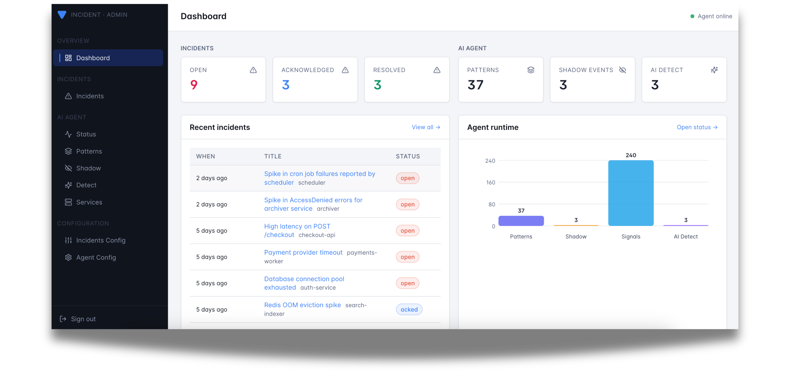

# Admin Dashboard

Versus Incident ships with a built-in **admin dashboard** — a single-page
React app embedded directly into the Go binary. There is no separate UI
process to run; once the server is up, the dashboard is available at the
root path.



## Quick start

```bash
docker run -p 3000:3000 \
  -e GATEWAY_SECRET=change-me \
  -e SLACK_ENABLE=true \
  -e SLACK_TOKEN=$SLACK_TOKEN \
  -e SLACK_CHANNEL_ID=$SLACK_CHANNEL_ID \
  ghcr.io/versuscontrol/versus-incident
```

Then open <http://localhost:3000/> in your browser.

> **Public URL.** When running behind a reverse proxy or in
> Kubernetes, set `public_host` (e.g.
> `public_host: https://versus.example.com`) in `config.yaml` so the
> startup banner and acknowledgement links use the externally-reachable
> address. With `public_host` empty, Versus falls back to
> `http://<host>:<port>`.


> **OSS vs Enterprise auth.** The `X-Gateway-Secret` credential is the
> **OSS/community** admin auth. The browser presents it once to
> `POST /api/auth/gateway-session` and receives an opaque HttpOnly,
> SameSite=Strict cookie with a fixed eight-hour absolute expiry. The cookie
> contains no gateway secret, and rotating the configured secret invalidates
> all existing OSS sessions. Direct API clients may continue sending the
> header on each request. The **Enterprise** binary retires the
> gateway secret and instead authenticates the **signed-in admin
> session** (SSO or the default-admin login).
>
> If a TLS-terminating or Host-rewriting proxy fronts the console, configure
> `public_host` with the exact browser-visible HTTP(S) origin. It controls
> external links, secure cookies, and exact-origin checks. Versus does not
> implicitly trust forwarded host/protocol headers; direct deployments may
> leave it empty.

## What you can do

The dashboard surfaces every persisted incident plus, when the AI agent
is enabled, the full agent-runtime state. It is meant for day-to-day
operations: triaging fresh alerts, acknowledging on-call pages, and
curating the agent's pattern catalog.

### Pages

| Page | Path | What it shows |
|------|------|----------------|
| Dashboard | `/dashboard` | At-a-glance metrics + Agent runtime bar chart, recent incidents, top patterns, recent shadow events. |
| Incidents | `/incidents` | Full incident history (newest first) with filters for open / acked / resolved and a free-text search. |
| Incident detail | `/incidents/:id` | Single incident: title, service, channels notified, on-call status, notify outcome, raw payload. |
| Agent status | `/status` | Worker mode, source count, catalog size, dirty flag. |
| Patterns | `/patterns` | Every pattern the miner has learned (count, verdict, service, rule, last seen). |
| Pattern detail | `/patterns/:id` | One pattern: full template, sample message, edit verdict / tags, delete. |
| Shadow | `/shadow` | NDJSON log of "would-have-alerted" events recorded in shadow mode. |
| Shadow detail | `/shadow/:patternId` | Drill into one shadow event with the matching catalog entry side-by-side. |
| Services | `/services` | Every service the agent has discovered, with first-seen timestamps and grace controls. |
| Tool catalog | `/agent/tools` | The complete tool catalog, grouped by domain, with availability reasons and separate Chat/Analyze enablement toggles. Remains readable when the agent is disabled. |
| Runbooks | `/runbooks` | The runbook corpus that backs the `find_runbook` tool. Upload `.md` files, view a runbook's contents, or delete one. |

### Incident lifecycle

Every incident received via `POST /api/incidents` (or the SNS / SQS
listeners) is persisted to the configured storage backend immediately —
**before** the alert fan-out — so a downstream channel failure never
loses the record. Each incident carries:

- `notify_status` — `pending`, `sent`, or `failed` (with `notify_error`
  on failure). Visible as a coloured pill in the incidents table.
- `acked_at` — set when an operator clicks the acknowledge button in
  Slack/Telegram or hits `GET /api/ack/:incidentID`. The dashboard
  reflects the new state on the next poll.
- `resolved` — true when the original payload's `status` / `state` /
  `alertState` field equals `"resolved"`. Resolved alerts skip on-call
  escalation and the `AckURL` injection.

### Agent management

When `agent.enable: true`, the dashboard exposes the agent's full admin
surface without you needing `curl`:

- Browse the **pattern catalog** and assign verdicts (`known`, `spike`,
  custom) or tags so detect-mode emissions stay quiet for the things
  you've already triaged.
- Inspect every **shadow event** — one click takes you from the recent
  feed to a detail page that shows the exact log line, the cluster
  template, and the catalog entry it would have matched.
- Force the worker to **flush** the catalog or shadow log to disk for
  immediate persistence (the worker also flushes periodically — see
  `agent.catalog.persist_interval`).
- See **services** the agent has discovered; end or restart a service's
  grace period without restarting the binary.
- Manage the **runbook corpus** that powers the `find_runbook` tool:
  upload one or more `.md` files at once, view a runbook's contents, or
  delete it. Uploads share the same corpus as the `runbooks/` source
  folder, and re-uploading a file with the same name replaces it. When
  an embedding model is configured (`tools.find_runbook.embedding_model`)
  uploads are embedded and searchable immediately; otherwise they are
  stored but flagged as not yet searchable.

#### Agent Tool Catalog

The Tool catalog at `/agent/tools` is an availability and policy view for the
Chat and Analyze agents. It remains readable when `agent.enable` is false so
operators can inspect requirements and prepare tool policy before enabling the
runtime.

`GET /api/admin/agent/tools?agent=chat|analyze` returns an ordered JSON array.
Each item contains `group`, `name`, `display_name`, `description`, `state`,
`reason`, `action`, `action_label`, `enabled`, `requirement`, and optional
`docs_url`, `ui_path`, and `health`. `docs_url` is an absolute HTTPS link to the
public tool documentation. `ui_path` is a same-application route shown as
**Open tool** only when the product has a useful matching view. Availability
`action` remains a separate server-owned link that explains or fixes the tool's
current unavailable state. Requirement details identify the requirement `kind` and, where
applicable, `signal_kind`, `integration`, or `capabilities`. Reasons, actions,
and health values are bounded server-owned summaries; connection details,
credentials, and raw backend errors are never returned.

Tool state is one of:

- `available` — every runtime requirement is satisfied and the tool is enabled
  for the selected agent.
- `disabled_by_operator` — requirements are satisfied, but an operator disabled
  the tool for the selected agent.
- `needs_license` — the configured capability requires an Enterprise
  entitlement that is not active.
- `needs_datasource` — no configured data source provides the required signal.
- `needs_integration` — the required integration is not configured.
- `needs_capability` — the active provider does not expose every required
  capability.
- `unhealthy` — a configured dependency is unavailable or failed its bounded
  health assessment.

Every visible card links to **Documentation** and may also link to an existing
product surface with **Open tool**. Default-enabled, available Versus cards are
hidden because they require no setup or recovery action. Operator-disabled or
otherwise abnormal Versus cards reappear with their reason and recovery state.
An operator-disabled card has an interactive checkbox so the tool can be
enabled again. Unavailable cards retain a visible, unchecked, disabled
checkbox. Group headings, counts, and the empty state use only cards visible
under these rules.

Runbooks is not a sidebar item. Open the `find_runbook` card's **Open tool** link
to reach `/agent/runbooks`; the route and corpus-management page remain
available.

`PUT /api/admin/agent/tools/:agent/:name` accepts exactly an enablement body:

```json
{ "enabled": true }
```

Use `false` to disable the named tool. This PUT API is also how an operator
disables a default Versus tool whose available, enabled card is hidden from the
catalog; the card reappears afterward for recovery. Chat and Analyze settings
are independent: changing one agent never changes the other. A disabled tool is
absent from that agent's model tool list, not merely hidden in the UI. Enabling
a tool whose requirements are not currently satisfied returns HTTP `409` with
the bounded availability reason. A concurrent settings update also returns
`409` and asks the caller to retry. A successful response contains `agent`,
`name`, `enabled`, and `changed`.

In Enterprise, PUT requires the `runtime:manage` permission and emits the
`agent.tool.changed` admin audit action for allowed and denied attempts. Audit
targets and outcomes are bounded and contain no secrets. GET remains the
read-only inspection surface.

This catalog does not create, edit, test, or bind data sources. Its actions link
to existing setup screens or documentation; source binding remains a separate
future workflow.

## Where the data lives

Everything the dashboard reads is durable. The default backend writes
JSON to a directory on disk:

```yaml
storage:
  type: file              # file | redis | database (env: STORAGE_TYPE)
  file:
    max_incidents: 1000   # rolling cap on persisted incidents
```

Files inside the `./data` directory (`/app/data` in the container image):

| File | Purpose |
|------|---------|
| `incidents.json` | All persisted incidents (most recent `max_incidents`). |
| `patterns.json` | The agent's pattern catalog and the services map. |
| `shadow.json` | Append-only NDJSON log of shadow events. |

> **Heads-up.** Setting `storage.type: redis` or `database` is currently
> a **config stub** — the provider returns `storage: backend not
> implemented`. Stick with `file` (the default) in production until
> these land.

## Running without the UI

If you only need the API surface (for example, in a tightly-scoped CI
fixture), simply leave `GATEWAY_SECRET` unset. The admin endpoints stay
unregistered and the root path serves a small "UI not built" landing
page that links to `/api/incidents` and `/healthz`. The notification
fan-out is unaffected.
