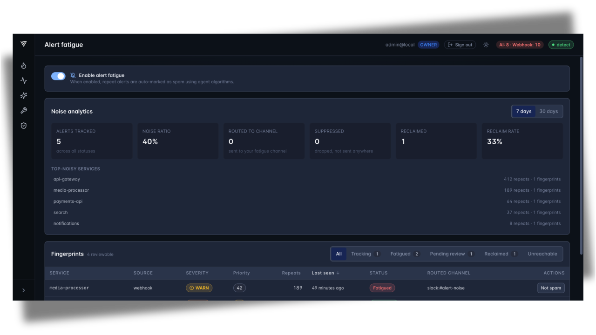

# Alert fatigue

_Enterprise_

When the same low-signal alert fires over and over, it hides the important notifications. **Alert fatigue** keeps your on-call channel clean: once an
alert has repeated several times in a short window, Versus treats it as
&ldquo;spam&rdquo; and quietly sends the repeats to a separate **fatigue
channel** instead of the channel your on-call watches. The noise is still
recorded and still reachable — it just stops interrupting the people on call.

It is **Enterprise** and **off by default**. Nothing is quietened until you
turn it on, and turning it on is a deliberate choice you make from the admin UI.

> **First time running Enterprise?** Start with
> [Getting Started — Running the Enterprise Agent](./getting-started.md). It
> covers signing in as the default admin — the same admin role that unlocks the
> controls on this page.

## What each setting means

Open **Alert fatigue** in the admin UI. As an admin you'll see one master
switch; the rest of the controls only appear once it's on.

| Setting | What it does |
|---|---|
| **Enable alert fatigue** | Turns the feature on or off for your org. Off by default — while it's off, every alert reaches your normal channels untouched. |
| **Fatigue channel** | The channel where quietened (&ldquo;spam&rdquo;) alerts are sent instead of your on-call channel. Pick any of your configured [notification channels](../agent/channels.md). If you later disable that channel, the page warns you so the diverted alerts don't go nowhere. |
| **Require review before spam** | Decides whether repeats are quietened automatically or only after you approve them. See below. |

### Require review before spam

This toggle controls whether Versus quietens repeats on its own or waits for
your sign-off:

- **Off (the default)** — once an alert repeats enough, its repeats are
  **auto-quietened** to the fatigue channel. No action needed from you.
- **On** — nothing is quietened until **you** approve it. Repeat alerts land in
  the review list marked **Pending review**, and they keep reaching your normal
  channel until you confirm they really are spam.

The page shows this note next to the toggle:

> Alerts are auto-marked as spam by default — some alerts may stop being sent.
> If you notice alerts missing and want to approve them before they're marked as
> spam, enable pending review.

## How to use it

1. **Turn it on.** Flip **Enable alert fatigue**. The channel picker and the
   review controls appear below the switch.
2. **Pick the fatigue channel.** Choose where quietened alerts should go. Use a
   channel your on-call *doesn't* watch — a `#noise` or `#alert-fatigue` room is
   ideal.
3. **Choose auto or review.** Leave **Require review before spam** off to let
   Versus quieten repeats automatically, or turn it on if you'd rather approve
   each one first.
4. **Open the review list.** Below the settings you'll find a list of the repeat
   alerts Versus has recorded. Use the **Status** filter to switch between:
   - **Fatigued** — repeats currently being sent to the fatigue channel.
   - **Pending review** — repeats waiting for your approval (only when review is
     on).
   - **Reclaimed** — alerts you sent back to the on-call channel.
5. **Act on an alert.** Each row offers the actions that fit its state:
   - **Confirm spam** — approve a pending item so its repeats start going to the
     fatigue channel.
   - **Not spam** — pull an alert back to your on-call channel. Use this the
     moment you spot something that was never really noise.
   - **Mark as spam** — re-quieten an alert you'd previously reclaimed.

Every row shows the service, source, severity, how many times it has repeated,
and when it was last seen, so you can tell real noise from a signal at a glance.

## What alert fatigue will never do

Quietening noise should never cost you a real page. Alert fatigue is built so
that the worst it can do is send you *more* alerts, never fewer than you need:

- **Critical and high alerts always reach you.** No matter how often they
  repeat, critical- and high-severity alerts are never quietened — they always
  page on your normal channel.
- **When in doubt, it pages you.** If anything is uncertain — the feature is
  off, a lookup fails, or the fatigue channel is unavailable — the alert is sent
  to your on-call channel, not swallowed.
- **Nothing is ever deleted.** Quietened alerts aren't dropped; they're recorded
  and always visible in the review list, and any of them can be brought back
  with **Not spam** at any time.

## See also

- New here? [Getting Started — Running the Enterprise Agent](./getting-started.md)
- Where quietened alerts are sent: [Notification Channels](../agent/channels.md)
- The other Enterprise tuning surface: [SLI/SLO auto-define](./slo.md)
