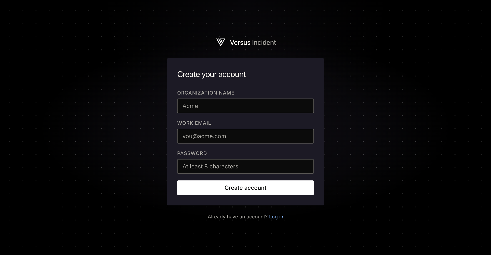
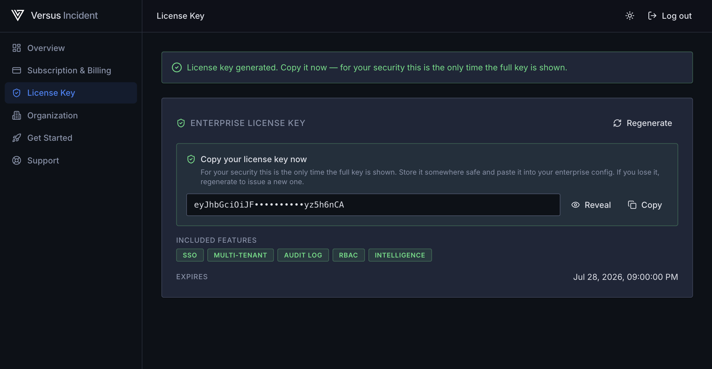
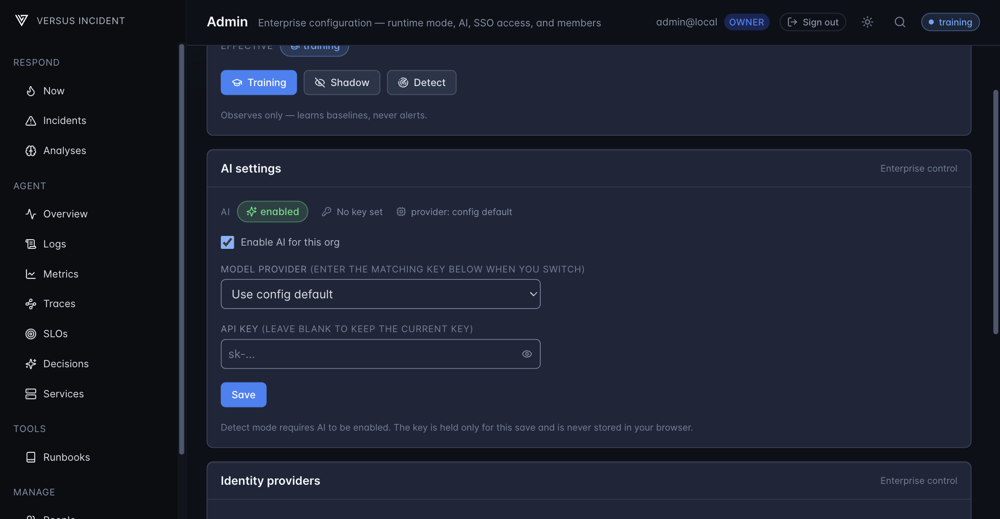
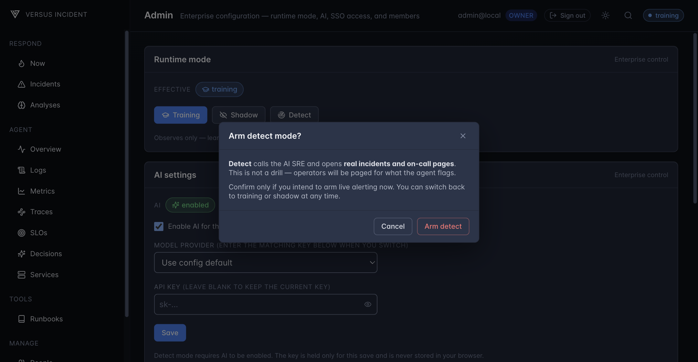

# Getting Started — Running the Enterprise Agent

_Enterprise_

This guide walks you from a fresh start to a **live Enterprise SRE Agent**,
entirely from the admin UI. You'll start the agent, log in as the built-in
default admin, turn on AI, and move the agent through its three modes —
**training → shadow → detect** — without editing a single config file.

By the end you'll have an agent that has **learned what "normal" looks
like** for your services and is ready to flag anomalies.

## Before you start

| You need | Why |
|---|---|
| A **Versus Enterprise license** with the **`intelligence`** entitlement, supplied via the `LICENSE_KEY` environment variable ([generate one below](#get-your-license-key-from-the-management-platform)) | The standing metric/trace sources and the runtime admin controls are gated on it. Without it the agent runs in community mode and these controls stay locked. |
| **Postgres** (plus the usual infra the agent already uses, e.g. Redis) | The agent persists what it learns — baselines, settings, audit trail — to Postgres so it survives restarts. |
| The **built-in default admin password** printed once in the boot log | The privileged controls are gated on your RBAC role. The built-in default admin is a root account (owner) you log into directly to configure SSO — no env, no token. See [Single Sign-On](./sso/overview.md). |

## Get your license key from the management platform

_Enterprise_

Everything below needs a `LICENSE_KEY` first — it is what unlocks the admin
controls and the AI features used in the later steps. You don't write this key
by hand; you generate it on the [Versus management platform](https://versusincident.com), the hosted
control plane that owns your account, plan, and licensing. The platform is a
separate web console from the agent you run.

### 1. Sign up or log in

Open the platform in your browser and create an account with your **email and
a password** (the form also asks for a workspace / organization name). If your
platform has Google sign-in enabled, you can **Continue with Google** instead.



### 2. Subscribe to the Founding plan

A license key is only issued to a **paid (Founding) plan** with an active
subscription. If your account is on the free OSS tier, open the dashboard and
click **Upgrade to Founding** to start checkout; once payment is confirmed the
dashboard shows your plan as **Founding** and licensing unlocks.

> The Founding plan carries the full enterprise feature set — including the
> **`intelligence`** entitlement that the [Metrics](./metrics.md) and
> [Traces](./traces.md) walkthroughs in this guide depend on. Without it the
> agent stays in community mode and the admin controls stay locked.

### 3. Generate your license key

On the dashboard, open the **License Key** tab and click **Generate license
key**. The platform mints a fresh, signed key for your org and shows the
**full key exactly once** — copy it right away. For your security the
dashboard only ever shows a masked preview afterward; if you lose it, click
**Regenerate** to mint a new one.

The key is a long, signed token made of three dot-separated segments (e.g.
`eyJhbGciOi….<payload>.<signature>`). Check the **Included features** shown
next to it and confirm they list **Intelligence** — that's the entitlement the
rest of this guide relies on.



### 4. Copy the key into the agent

Copy the full key and hand it to the enterprise agent as its **`LICENSE_KEY`**
environment variable — this is the value the agent boots with in
[step 1](#1-start-the-enterprise-agent) (the [Metrics](./metrics.md#1-bring-up-the-stack)
and [Traces](./traces.md#1-bring-up-the-stack) walkthroughs show the exact
`docker run` line that passes it in). On a successful boot the logs show the
license unlocked the agent with **no** *requires Versus Enterprise* warning,
and you can continue with the steps below.

## Start the enterprise agent

Launch the Versus Enterprise image with your license. The agent boots in
the mode set by its YAML floor (`training` by default) — exactly where you
want to begin.

The [Metrics](./metrics.md#1-bring-up-the-stack) and
[Traces](./traces.md#1-bring-up-the-stack) walkthroughs show the full
`docker run` command (license, data source, data volume). For this guide
the only thing that matters is: **the container is up and reachable at
<http://localhost:3000>**, and the boot logs show the license unlocked the
agent (a `mode=training, sources=…` line and **no** `requires Versus
Enterprise` warning).

### 1. Log in as the built-in default admin

The privileged controls (AI settings, mode switching) are gated on your **RBAC
role** — there is no token to paste and **no bootstrap env to set**. A fresh
licensed deployment ships with a built-in **default admin**: a root account you
log into **directly** (not through SSO). On first boot the agent generates a
random password and prints it **once** to the container log:

```
================================================================================
  DEFAULT ADMIN CREDENTIALS (shown once — copy them now)
--------------------------------------------------------------------------------
  Username: admin
  Password: <random>
--------------------------------------------------------------------------------
  Change or disable this account after your first login.
================================================================================
```

Copy that password and open the console. Log in at the local login with username
**`admin`** and that password — you land in the console as **owner**, which holds
every permission. This solves the SSO chicken-and-egg: the admin UI that manages
SSO connections is itself gated on a session, and a brand-new deployment has no
SSO connection yet, so the built-in admin is the pre-SSO principal that creates
the first one.

From there:

1. **Add your first SSO connection** (Google / Azure / OIDC) — follow
   [Single Sign-On](./sso/overview.md).
2. **Sign your team in over SSO.** New SSO users default to the read-only
   **viewer** role.
3. **Promote one of them** to **admin** or **owner** from the **Members** panel.
4. **Disable the built-in default admin** from the **Members** panel. This is
   allowed only once another owner/admin exists (a no-lockout guard), and it
   immediately invalidates the built-in admin's session. You can re-enable it
   later for break-glass recovery.

> The password is generated with `crypto/rand`, stored only as a bcrypt hash,
> and **never re-printed or regenerated** on reboot. Repeated bad logins lock
> the account out with an increasing backoff.

### 2. Open the UI and go to the Agent page

Open <http://localhost:3000/> and click into the **Agent** page. You'll see:

- a **runtime banner** summarising the agent's current mode and AI state,
- a **Runtime mode** control (Training / Shadow / Detect),
- an **AI settings** control.

On a fresh deployment the mode and AI-settings controls are read-only until you
sign in; signed out (or with a read-only role) they show a **Sign in to manage**
notice.

### 3. The controls unlock with your owner role

After you log in as the built-in default admin (owner) — or as any SSO member
you've promoted to owner/admin — the Runtime mode and AI settings controls
become live automatically. Your session carries the owner role, so there is
nothing to paste or unlock.

A signed-out caller, or one whose role is read-only (`viewer`/`responder`), sees
the **Sign in to manage** / **Requires the admin role** notice instead. Privileges
are carried by your role, granted from the **Members** panel by an owner.

### 4. Activate the AI key (Optional)

Find the **AI settings** card (titled *AI settings*, marked *Enterprise
control*). This is where you give the agent its AI provider key and turn AI
on for your org.

1. Tick **Enable AI for this org**.
2. In the **API key** field, paste your AI provider key (e.g. `sk-…`).
3. Click **Save**.



What happens on save:

- Your key is **stored encrypted** using the auto-generated master key —
  there is nothing for you to configure.
- The key is **write-only**: the UI only ever shows it back **masked**, as
  the **last four characters** — the full value is never returned or logged.
- The key field is transient: it is sent on that one save and immediately
  cleared. It is **never** written to your browser storage.

> Behind the scenes this is a single `PUT /enterprise/api/agent/ai-settings`
> call authenticated by your SSO session and authorized by your owner role. To
> turn AI off later, untick the toggle and save; to drop back to the YAML
> default, use **Clear override**.

### 5. Use the key to run — switch the agent mode

With AI enabled, you can drive the agent through its modes from the
**Runtime mode** control. The card shows the **effective** mode and lets an
admin switch it live:

| Mode | What it does |
|---|---|
| **Training** | Observes only — learns baselines, never alerts. |
| **Shadow** | Classifies and logs *would-have-alerted* events, but stays silent. |
| **Detect** | Calls the AI SRE and opens real incidents / on-call pages. |

Click a mode to switch to it. The change takes effect at runtime — no
restart needed — and overrides the YAML floor (use **Revert to YAML** to
clear the override).

**Detect is guarded.** Because detect opens real incidents, choosing it
asks you to confirm (*"Arm detect mode?"* → **Arm detect**), and it
**requires AI to be enabled** — which is exactly why you activated the key
in [step 5](#5-activate-the-ai-key). If AI is still off, the control points
you back to the AI settings card.



The recommended path on a new deployment is to **stay in training** until
the agent has learned a baseline, move to **shadow** to sanity-check what it
would have flagged, then **arm detect** when you trust it.

## Where to go next

You now have a running, AI-enabled agent and know how to move it between
modes. Next, drive real data through it and watch the learning flow happen:

- [Metrics (Prometheus)](./metrics.md) — generate synthetic metrics, watch
  the agent learn per-service baselines, then flag an anomaly in shadow.
- [Traces](./traces.md) — the same flow for slow/erroring spans.
