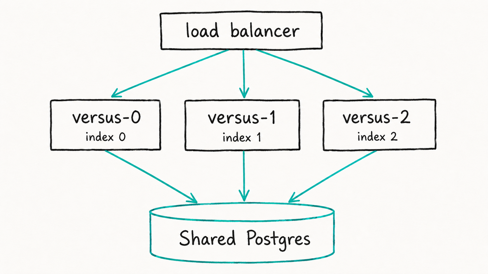

# High Availability (HA)

_Enterprise_

Run the Enterprise SRE Agent as **multi-instance**. HA is the same binary you already run, just configured for more than one replica.

> Pick the guide that matches how you deploy:
>
> | Guide | Use it to | Entrypoint |
> |---|---|---|
> | [Docker Compose](./docker.md) | See HA on your laptop in ~2 minutes — 2 replicas + 1 Postgres + an nginx load balancer. | `docker compose up -d` |
> | [Kubernetes](./kubernetes.md) | Apply raw manifests (StatefulSet, headless Service, PDB, NetworkPolicy) you can read top to bottom. | `kubectl apply -k .` |
> | [Helm](./helm.md) | Install the production chart and flip HA on with one values file. | `helm install … -f values-ha.yaml` |

## Before you start

| You need | Why |
|---|---|
| A **Versus Enterprise license** (`LICENSE_KEY`) | HA is an enterprise capability. The stack still boots without a key (community mode) so you can see the topology, but session/secret convergence needs a real key. |
| The **enterprise image** | HA runs `ghcr.io/versuscontrol/versus-enterprise` (private). The OSS image does not include the HA path. |
| **One shared Postgres** | Every replica reads and writes the SAME Postgres. `STORAGE_TYPE=postgres` is **required** for more than one replica (see below). |

## How HA works

The binary expects exactly four things — every guide here satisfies them:

### 1. Shared Postgres

All replicas point at the **same** `POSTGRES_DSN`. Postgres is the single source
of truth for incidents, sessions, and managed secrets.

`STORAGE_TYPE=postgres` is **mandatory with more than one replica**. The file
backend is single-node only, so the binary **refuses to start** when it sees a
`file` store with `INSTANCE_COUNT` greater than 1 — it fails fast rather than let
two replicas silently diverge.

### 2. Instance identity

Each replica needs a stable identity so the binary can divide work between them:

| Variable | What it is |
|---|---|
| `INSTANCE_COUNT` | The total number of replicas (e.g. `3`). |
| `POD_NAME` | This replica's name; its **trailing ordinal** is the instance index — `versus-0` → 0, `versus-1` → 1, `versus-2` → 2. |

On **Kubernetes** the StatefulSet supplies `POD_NAME` automatically through the
Downward API. On **Docker Compose** you set it explicitly per replica
(`POD_NAME: versus-0`, `POD_NAME: versus-1`). Either way the result is the same:
each replica knows its own index out of `INSTANCE_COUNT`.

### 3. No duplicate pages

The binary partitions **signal sources** and the **SLO scheduler job** across
replicas by hash-ownership: each unit of work is owned by exactly one replica,
chosen by hashing its key over `INSTANCE_COUNT`. So three replicas split the
sources between them and **never double-page** on the same incident.

The agent's **learned log-pattern catalog** is HA-safe in the same spirit:
Enterprise keeps each replica's learning separated so replicas **never overwrite
each other's learned log patterns**. You get the agent's learning across every
replica without clobbering.

### 4. Sessions and secrets converge through Postgres

The managed secrets — the **SSO session key**, the **AI master key**, and the
**break-glass admin-token hash** — are generated **once** by whichever replica
wins the race, then shared with the others through Postgres. Because every
replica reads the same keys:

- A login (SSO or the built-in admin) on **one** replica is valid on **all** of
  them — the load balancer can round-robin freely, no sticky sessions needed.
- The default-admin password is printed **once**, by the replica that generated
  it (see [Getting Started](../getting-started.md) for the bootstrap flow).

The only secret env each replica needs is `LICENSE_KEY` (plus the optional
[bring-your-own-key](#bring-your-own-encryption-key-optional) `VERSUS_ENTERPRISE_SECRET_KEY`).

## The tradeoff

HA spreads work across replicas; it does **not** auto-failover an individual
scheduler job the instant its owner dies. A hash-owned job (for example the SLO
evaluation) **pauses while its owning pod is down** and resumes once the pod is
rescheduled and re-claims its partition. Incidents, sessions, and the console
stay available throughout (they live in Postgres and any replica serves them);
only that one owned job waits for its pod to come back. This is the accepted
tradeoff for a simple, split-brain-free partitioning model.

## Community / OSS behavior

> **HA needs the enterprise image.** Instance partitioning — source ownership,
> the single-owner SLO job, secret convergence, and the HA-safe log-pattern
> catalog — only runs on `ghcr.io/versuscontrol/versus-enterprise` with a
> `LICENSE_KEY`.

The open-source / community binary has **no instance partitioning**, so running
more than one OSS instance against the same store is **not supported for the
agent**:

- Every instance would poll **every** source, so you'd get duplicate work and
  duplicate emits on the same incident.
- The log-pattern catalog is written **last-writer-wins**, so the instances would
  **clobber each other's learned log patterns**.

This is expected community behavior, not a bug. Run the **OSS agent as a single
instance**; use **Enterprise** when you need HA. Enterprise makes the agent's
learning HA-safe across replicas, while OSS stays single-instance.

## Bring-your-own encryption key (optional)

By default the enterprise encryption key is generated automatically on first
licensed boot and converges through Postgres. If your policy requires you to
supply it, set `VERSUS_ENTERPRISE_SECRET_KEY` on every replica to the same value.
Leave it unset to let Versus manage the key for you.

## Secret handling

- **Never commit a real `LICENSE_KEY` or DSN.** Every guide keeps them in a
  gitignored `.env` (Compose / Kubernetes) or a Helm `--set` / existing Secret,
  with a committed `.env.example` placeholder.
- The license is mounted as an **env var from a Secret**. It is an offline-
  verified JWT — never phoned home.
- The Postgres password in the examples is a clearly-labelled **local dev
  default**. For production, use a managed Postgres (e.g. RDS) and set
  `sslmode=require` in the DSN.

## See also

- [Docker Compose](./docker.md) — the fastest way to see HA work end to end.
- [Kubernetes](./kubernetes.md) — raw manifests that mirror the chart.
- [Helm](./helm.md) — the production install.
- [Getting Started](../getting-started.md) — first-boot bootstrap and the
  default admin.
- [Single Sign-On (SSO)](../sso/overview.md) — the sessions that converge across
  replicas.
