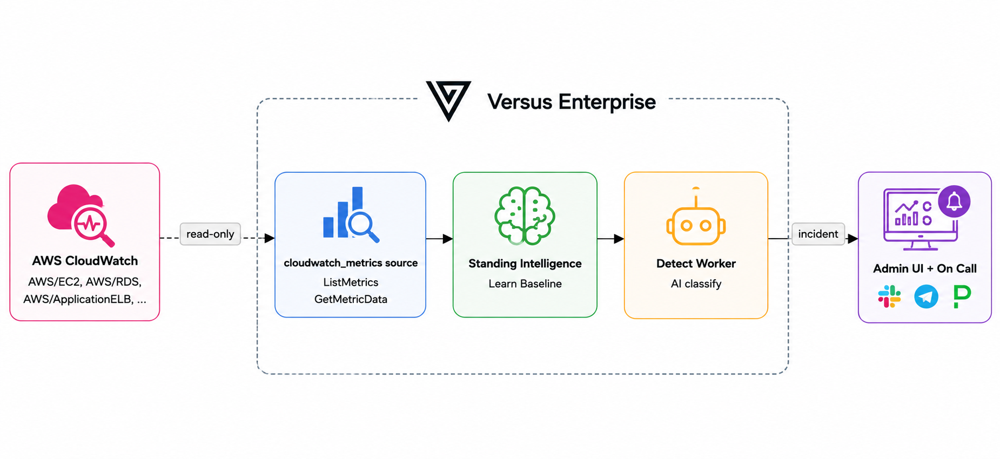

# CloudWatch Metrics Guide

_Enterprise_

A hands-on walkthrough: point the `cloudwatch_metrics` data source at a real AWS
region, let Versus **auto-discover** your AWS metrics, **learn each one's
baseline**, and open a real incident when only what is new or unexpected issues.

Unlike the [Prometheus guide](./prometheus.md), CloudWatch reads from your live AWS account, so this
walkthrough is about connecting safely (read-only IAM), learning your real
baseline, and moving through the three modes.

## What you'll build



You give the source a **region**. It scans CloudWatch on a cadence, picks a
bounded set of metrics to watch, learns what each
one normally does, and — in `detect` mode — pages you on a real, unexpected issues.

## Prerequisites

| Need | Why |
|---|---|
| **Docker** (Compose v2) | run the enterprise agent + Redis; the CloudWatch source runs from your **Versus Enterprise distribution** |
| An **AWS account** with CloudWatch metrics that have **recent datapoints** in the region you pick (e.g. a running EC2 instance, an RDS database, an ALB) | the source can only learn a baseline for metrics that are actually reporting data |
| **Read-only CloudWatch access** for the agent (IAM — [step 1](#1-grant-read-only-cloudwatch-access)) | discovery + sampling |
| A **Versus Enterprise license** with the **`intelligence`** entitlement, supplied via `LICENSE_KEY` | the standing `cloudwatch_metrics` source is gated on this feature |
| An **AI API key** (e.g. OpenAI) | the detect AI that triages the deviation and writes the incident summary |

> **First time running Enterprise?** Start with
> [Getting Started — Running the Enterprise Agent](../getting-started.md). It
> covers signing in as the default admin, turning on AI, and switching modes
> from the UI — the controls this walkthrough uses.

## 1. Grant read-only CloudWatch access

The source uses the **standard AWS SDK credential chain** — the same as the OSS
[CloudWatch Logs](../../agent/data-sources/cloudwatch-logs.md) source. You supply
only a **region** in config; **no static keys ever live in the source options**.
Credentials resolve from (in order) environment variables, `~/.aws/credentials`,
an ECS task role, or an EC2/EKS instance role.

The agent needs exactly **two least-privilege, read-only** CloudWatch actions —
one to discover metrics, one to sample them:

```json
{
  "Version": "2012-10-17",
  "Statement": [
    {
      "Effect": "Allow",
      "Action": [
        "cloudwatch:ListMetrics",
        "cloudwatch:GetMetricData"
      ],
      "Resource": "*"
    }
  ]
}
```

Both actions are account-wide reads, so `Resource` is `*` (CloudWatch does not
support resource-level restriction for these).

## 2. Bring up the example

The example lives at
[examples/metrics-source/](../../../examples/metrics-source/). Copy the env
template, paste your license, and set your region + credentials:

```bash
cd examples/metrics-source
cp .env.example .env
```

Edit `.env`:

```bash
# Enterprise license — MUST carry the `intelligence` entitlement
LICENSE_KEY=eyJhbGciOiJFZERTQSIsInR5cCI6IkpXVCJ9....

# AWS — standard SDK chain. AWS_REGION is REQUIRED. Do NOT wrap values in quotes.
AWS_REGION=us-east-1
AWS_ACCESS_KEY_ID=AKIA...
AWS_SECRET_ACCESS_KEY=...
# AWS_SESSION_TOKEN=...   # only for temporary credentials

# AI (required for detect mode)
AGENT_AI_ENABLE=true
AGENT_AI_API_KEY=sk-...
AGENT_AI_MODEL=gpt-4o-mini
```

Then start the **standalone CloudWatch variant** — it runs just Redis and the
enterprise agent (no Prometheus, no generator):

```bash
docker compose -f docker-compose.cloudwatch.yml up -d
```

> **Leave the key/secret empty** in `.env` to use an EC2/ECS **instance role**
> instead — the standard chain picks it up automatically.

On boot the agent discovers the licensed source and starts sampling. Follow the
logs:

```bash
docker compose -f docker-compose.cloudwatch.yml logs -f versus
```

You should see the discovery line and a clean start:

```text
cloudwatch metric source "demo-cloudwatch" discovered 201 signal(s) across 200 service(s) ...
enterprise: agent started (mode=training, sources=1)
```

`sources=1` and **no** `requires Versus Enterprise` line confirm the license
unlocked the source. (`200 service(s)` here means it hit the default
`max_services: 200` cap — see [cost and scale](#cost-and-scale).)

## 3. Configure the source

The source is declared in
[config/agent_sources.cloudwatch.yaml](../../../examples/metrics-source/config/agent_sources.cloudwatch.yaml).
The **only required field is `region`** — everything else defaults:

```yaml
sources:
  - name: demo-cloudwatch
    type: cloudwatch_metrics
    enable: true
    options:
      region: ${AWS_REGION}   # REQUIRED — the only required field
      namespaces:
        - AWS/*               # discover every AWS-service namespace
```

That's the whole operator surface for the auto flow. On boot the source
discovers every AWS-service metric it can attribute to a service, samples it, and
starts learning a baseline for each one. To narrow scope or tune statistics, see
[Going further](#going-further-scope-and-statistics-optional) and the
[CloudWatch Metrics reference](../../agent/data-sources/cloudwatch-metrics.md).

## 4. Understand the three modes

Versus Enterprise runs in one of three **agent modes**. You pick the mode with
`AGENT_MODE` in `.env` (or switch it live from the UI). CloudWatch is a
**standing baseline** source, so the sequence matters — always learn first:

| Mode | What it does | Use when |
|---|---|---|
| `training` | Discovers metrics and **learns their baseline** (normal behavior). No alerts, no incidents — pure observation. | First run — let it watch real traffic and build a model of "normal." |
| `shadow` | Scores every signal against the learned baseline. Writes **"would have alerted"** verdicts to the UI — but **pages no one**. | Validating that the learned baseline is accurate before going live. |
| `detect` | Opens a **real incident automatically** when a signal deviates from its baseline and stays deviated. A lightweight **AI classification** writes the incident's title, severity, and summary. | Production — the payoff mode. |

Think of the agent like a new on-call engineer learning your AWS estate: first it
*watches* and learns each service's normal rhythm, then it *double-checks*
quietly, then it *acts*.

## 5. Run through the modes

### Step A — Training (learn the baseline)

The example starts in `training` by default. Let it run against your real AWS
metrics. A signal stays in training until it has seen **enough samples** to know
what normal looks like — until then it can't page, which keeps it from crying
wolf on day one.

Give it time: CloudWatch datapoints arrive on a delay (the source offsets by
`query_delay`, default 120s) and a baseline needs several samples. Plan for the
source to watch **healthy traffic for a while** — the busier and more regular the
service, the faster its baseline stabilizes.

### Step B — See what it learned

Open <http://localhost:3000/> (log in as the built-in default admin — the
password is printed **once** in the boot log; see
[Getting Started](../getting-started.md)) and find the agent's
**learned-signals** page (*"What the agent knows right now"*). Each
`(service, signal)` shows a status pill:

- **Still learning** — gathering samples; it won't flag this signal yet.
- **Ready to detect** — it has seen enough to catch unusual behaviour.

`service` is the metric's **primary CloudWatch dimension** (e.g. an
`InstanceId`, a `DBInstanceIdentifier`, a `LoadBalancer`) and `signal` is the
**metric name** (e.g. `CPUUtilization`, `TargetResponseTime`). So you'll see your
real EC2 instances, RDS databases, and load balancers, each learning their own
baselines in isolation.

### Step C — Shadow (flag without paging)

Switch the agent to `shadow` so it scores live metrics against those baselines
and records what it *would* have alerted on — without paging anyone. Switch from
the **Agent** page in the UI, or edit `.env` (`AGENT_MODE=shadow`) and re-run
`docker compose -f docker-compose.cloudwatch.yml up -d`. Either way the baselines
you learned are **persisted** (file storage) and reload automatically — the agent
does not start over.

On the **Shadow** page you'll see a *would-have-alerted* row for any signal that
drifts clearly out of its normal range — and silence for everything behaving
normally. This is your dress rehearsal.

### Step D — Detect (fire the incident)

Happy with what shadow flagged? Switch to `detect`. Detect **requires AI to be
enabled** (you set `AGENT_AI_ENABLE=true` and a key in
[step 2](#2-bring-up-the-example)). Now, when a signal clearly breaks from its
baseline **and stays broken** for several checks in a row (a one-minute blip
won't page), Versus opens a real incident and the detect AI writes its title,
severity, and summary.

Because CloudWatch reflects real infrastructure, you don't inject a fake spike —
the source pages when something on your account genuinely misbehaves. To see it
fire on demand, drive a real change on a watched resource (for example, put CPU
load on an EC2 instance you're watching, or send load through an ALB) and let the
deviation sustain.

## 6. Watch the results

- **Incidents page** (<http://localhost:3000/>) — the new incident appears with
  the AI classification from detect mode: source `demo-cloudwatch`, a title, a
  severity, a confidence, and status *firing*.
- **Shadow page** — what the source scored for each discovered signal.
- **Deep AI analysis (on demand)** — detect opens the incident with a
  lightweight classification. The full **AI analysis** — the tool-using
  root-cause investigation — runs **only when you open the incident and click
  *Analyze*** on its detail page, keeping every firing signal cheap and reserving
  the expensive investigation for the incidents you choose to dig into.

## Going further: scope and statistics (optional)

On a large account, discovering **all** `AWS/*` namespaces can watch a lot of
metrics. Narrow the scope and tune the statistic per namespace — coarse tuning
that needs no per-metric knowledge:

```yaml
sources:
  - name: demo-cloudwatch
    type: cloudwatch_metrics
    enable: true
    options:
      region: ${AWS_REGION}
      namespaces:                 # only these (custom, non-AWS/ namespaces stay excluded)
        - AWS/ApplicationELB
        - AWS/RDS
        - AWS/SQS
      default_statistic: Average
      statistic_overrides:
        AWS/ApplicationELB: p99   # latency — track the slow tail
        AWS/SQS: Sum              # queue depth — total, not average
      max_services: 100
      max_signals: 1000
```

See the full option table in the
[CloudWatch Metrics reference](../../agent/data-sources/cloudwatch-metrics.md#options).

### Cost and scale

CloudWatch sampling is **billed per call**, and cost scales with
**(#watched metrics × frequency)**. Three controls keep a large account bounded:

- **Discovery caps** — `max_services` (`200`) and `max_signals` (`2000`) bound the
  watched set so a huge account can't explode into thousands of sampled metrics.
- **Namespace scoping** — `namespaces` limits discovery to the AWS services you
  care about; narrowing from the default `AWS/*` shrinks the set directly.
- **Cadence** — `poll_interval` (`60s`) governs sample frequency and
  `discovery_interval` (`1h`) governs how often the watched set is rebuilt.

Start with the defaults, watch your CloudWatch bill, then narrow `namespaces` or
lower the caps if the account is large.

## 7. Tear down

```bash
cd examples/metrics-source
docker compose -f docker-compose.cloudwatch.yml down -v
```

## Troubleshooting

| Symptom | Cause / fix |
|---|---|
| `requires Versus Enterprise` on every tick, `sources=0`, `mode=community` | The license is missing the **`intelligence`** feature (or you're on an OSS build). Mint a key that includes `intelligence`. This is the open-core line: OSS keeps only the on-demand `query_metrics` tool, not the standing source. |
| Boot fails with an invalid-region / credential error | `AWS_REGION` must be set and **unquoted** in `.env` (a quoted value like `"us-east-1"` is treated as an invalid region). Confirm the credentials resolve — `aws sts get-caller-identity` in the same shell — and that the IAM principal has `cloudwatch:ListMetrics` + `cloudwatch:GetMetricData`. |
| `discovered 0 signal(s)` | The region has no CloudWatch metrics the source can attribute to a service, or your IAM lacks `ListMetrics`. Pick a region with live resources; metrics with **no dimensions are skipped** (no deterministic service). |
| Signals discovered, but baselines never reach **Ready to detect** | The discovered metrics have **no recent datapoints** (common on idle accounts). Point at a region/service with live traffic, or verify with `aws cloudwatch get-metric-data` for one discovered service. |
| `AccessDenied` on `GetMetricData` | The IAM policy grants `ListMetrics` but not `GetMetricData` — add both (see [step 1](#1-grant-read-only-cloudwatch-access)). |
| Boot fails to connect to Redis | Ensure the `versus-cw-metrics-redis` container is healthy and `REDIS_PASSWORD` matches. The example Redis is **plaintext** and the compose sets `REDIS_TLS=false` — leave it as is. |
| `analyze agent enabled` never appears, no AI summary | `AGENT_AI_ENABLE=true` and a real `AGENT_AI_API_KEY` are both required for `detect` — set both in `.env`. |

## See also

- The Prometheus twin of this guide: [Prometheus Guide](./prometheus.md)
- Enterprise metrics overview & licensing: [Overview](./overview.md)
- Option reference & authentication detail: [CloudWatch Metrics](../../agent/data-sources/cloudwatch-metrics.md)
- New here? [Getting Started — Running the Enterprise Agent](../getting-started.md)