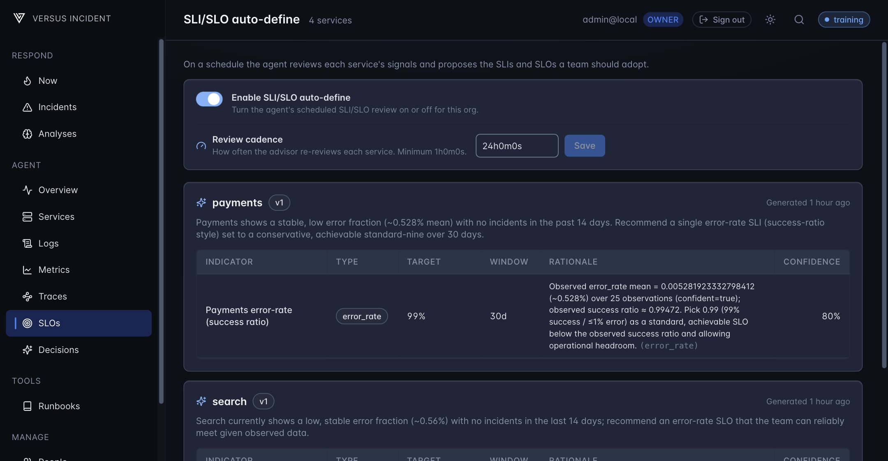
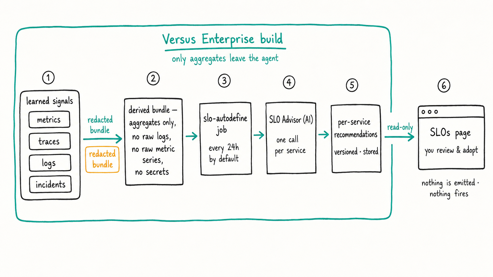

# SLI/SLO auto-define

_Enterprise_

Versus watches each of your services and **proposes the SLIs and SLOs you
should adopt** — automatically, on a schedule you control. It reads the signals
the agent has already learned (metrics, traces, logs, recent incidents) and
hands you a short, ranked list of targets per service, each with a plain reason.

It is **advisory only**: the agent suggests, you decide. It never opens an
incident and never changes anything on its own — adopting an objective is always
a human action.

> **Not familiar with the terms?**
> - An **SLI** (Service Level Indicator) is a single number that says how
>   healthy a service is right now — e.g. *the share of requests that succeed*,
>   or *how fast they respond*.
> - An **SLO** (Service Level Objective) is the **target** you promise for that
>   number — e.g. *"99.9% of requests succeed over 30 days"*.

## What this looks like

Open **SLOs** in the admin UI (`/agent/slo`). Each service gets a card with the
SLIs/SLOs the advisor recommends, when they were last generated, and — for
admins — a control to turn the feature on and set how often it re-reviews.

## How it works

On its cadence, for every service the agent has seen, it gathers a **redacted,
derived** bundle of that service's signals — no raw logs, no raw metric series,
no secrets — and asks the AI for the SLIs and SLOs that fit. The result is
stored per service (versioned) and shown on the **SLOs** page. Nothing is
emitted and nothing fires.

> The advisor only ever sees **aggregates** (learned baselines, recurring log
> templates, an incident summary). Every section is scrubbed by the same
> redactor used by the analyze tools before it leaves the agent.

## Prerequisites

| Need | Why |
|---|---|
| A **Versus Enterprise license** with the **`intelligence`** entitlement, supplied via the `LICENSE_KEY` environment variable | The whole feature is gated on it — on a community/OSS build the **SLOs** page shows a locked upsell and no data. |
| **AI enabled** with an **API key** (e.g. OpenAI) | The advisor is an AI agent. This is a hard gate: until AI is on *and* a key is set, the feature can't be turned on. |
| Some **learned signal** for your services | The advisor proposes objectives from observed behavior. A brand-new service with nothing learned yet gets no recommendation until it has enough history. |

> **First time running Enterprise?** Start with
> [Getting Started — Running the Enterprise Agent](./getting-started.md). It
> covers signing in as the default admin and turning on AI — the controls this
> page uses.

## 1. Turn on AI

The advisor needs AI. Enable it and set an API key from the admin UI — see
[Getting Started → activate the AI key](./getting-started.md). Until AI is on
and a key is present, the enable toggle on the **SLOs** page stays disabled and
shows the reason.

## 2. Enable the feature and set the cadence

Open **SLOs**. As an admin you'll see an **Enable SLI/SLO auto-define** toggle
and a **Review cadence** field:

| Control | What it does | Notes |
|---|---|---|
| **Enable** | Turns the scheduled review on or off for your org. | Off by default. Can only be turned **on** once AI is enabled. |
| **Review cadence** | How often the advisor re-reviews each service. | A Go duration like `24h`. Default **24h**, minimum **1h**. |

> Changing the cadence takes effect **without a restart** — the next due pass
> picks it up. The cadence floor exists to cap AI cost; a value below it is
> rejected. Both the enable toggle and the cadence are admin-only
> (`runtime:manage`) and every change is written to the audit trail.

## 3. Let it run a cycle

The first recommendations appear after the next due pass (by default, within
24h). Until then — or for a service without enough learned signal — the page
shows **"No recommendations yet"**. Give it a cycle, then refresh.

## 4. Read the recommendations

Each service card lists up to **five** recommended SLIs. Every row is one
indicator and its proposed objective:

| Column | Meaning |
|---|---|
| **Indicator** | A short human label, e.g. *Checkout availability*. |
| **Type** | The indicator family: `availability`, `latency`, `error_rate`, `throughput`, or `saturation`. |
| **Target** | The proposed objective — a percentage for ratio types, a millisecond target for `latency`. |
| **Window** | The error-budget accounting window, in days (1–90, default 30). |
| **Rationale** | Why this target, citing the exact observed signal it was measured from. |
| **Confidence** | The advisor's confidence in this recommendation, 0–100%. |

The card also shows a **version** and when it was **generated**. A new pass
writes a new version — the recommendation evolves as your service's behavior
does.

> Every recommendation **cites a real signal** the agent observed. The advisor
> is asked never to invent an indicator; a row with no backing signal is
> dropped before it's stored.

## 5. Adopt what fits

Adopting an objective is **your call** — review the rationale and confidence,
keep what makes sense for the service, and ignore the rest. The advisor mutates
nothing: it won't create an SLO object, change a setting, or page anyone. Treat
the page as a well-researched starting point, not a decision.

## Define vs measure — how this differs from SLO burn

These are **two different stages**, not duplicates:

| Stage | This page — **auto-define** | SLO burn evaluation — **measure** |
|---|---|---|
| Question | *What* SLIs/SLOs should this service have? | Is the service *meeting* its objective right now? |
| How | AI reviews all of a service's signals and **recommends** targets. | Deterministic math tracks error-budget burn against an objective. |
| Output | A stored, advisory list you review and adopt. | Fires a real incident when the budget burns too fast. |

In short: **auto-define proposes the target; burn evaluation watches whether you
keep it.** Use this page to set good objectives, then let the agent's detect
pipeline page you when one is at risk. See the
[Metrics](./metrics.md) and [Traces](./traces.md) guides for where those golden
signals come from and how anomalies become incidents.

## Troubleshooting

| Symptom | Cause / fix |
|---|---|
| The **SLOs** page shows a locked "Enterprise capability" card | The license is missing the **`intelligence`** entitlement, or you're on an OSS build. Mint a key that includes `intelligence`. |
| An **AI-OFF** banner across the top | AI is disabled or no API key is set. Turn AI on and add a key — see [Getting Started](./getting-started.md). The page tells you the exact reason. |
| The enable toggle is **greyed out** | Same cause — the toggle stays disabled until the AI hard gate is open (AI on + key set). |
| **"No recommendations yet"** | Either the first pass hasn't run yet (default cadence is 24h) or the service has too little learned signal. Give it a cycle and refresh. |
| Saving a cadence is rejected | The value must be a positive Go duration at or above the **1h** floor, e.g. `2h`, `24h`. |
| You can't see the cadence control | It's admin-only (`runtime:manage`). A read-only role still sees the recommendations, just not the controls. |

## See also

- New here? [Getting Started — Running the Enterprise Agent](./getting-started.md)
- Where the signals come from: [Metrics (Prometheus)](./metrics.md) · [Traces](./traces.md)
- How a signal becomes an incident: [AI Detect Mode](../agent/ai-detect-mode.md) · [AI Analyze Mode](../agent/ai-analyze-mode.md)
