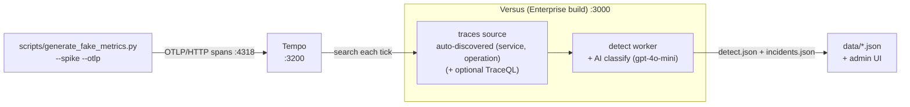
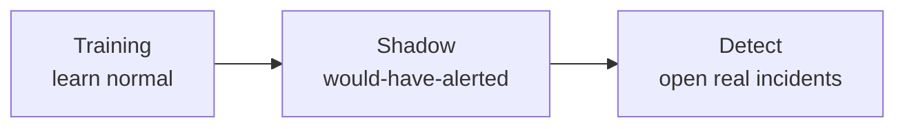

# Traces demo — Tempo

_Enterprise_

A hands-on walkthrough: stand up **Grafana Tempo**, point the `traces`
data source at it, drive a stream of **slow, erroring spans**, and watch Versus discover
the targets, fire an anomaly, classify it with the detect AI, and open a real incident.

This is the **demo companion** to the reference page
[Traces / Tempo](../agent/data-sources/traces.md). That page explains the options and
the learned p99/error-rate baseline; this page is the copy-paste reproduction. The
standing `traces` source is a **Versus Enterprise** feature — on an OSS build it
refuses to start (see [Troubleshooting](#troubleshooting)).

> This walkthrough is the **baseline-first** demo path: run a healthy stream until the
> source has learned each operation's normal, then spike it so the deviation pages.

## What you'll build



The host-run generator POSTs OTLP spans to Tempo — during a spike roughly half are
**error spans** with fat latency. The enterprise `traces` source **auto-discovers each
`(service, operation)`** and learns its p99/error-rate baseline from a healthy stream.
Once an operation has a learned normal and then goes clearly anomalous, it emits a
signal, a lightweight AI classification labels it, and an incident lands in
`data/incidents.json`.

## Prerequisites

| Need | Why |
|---|---|
| **Docker** (Compose v2) | run the Tempo stack |
| A **Versus Enterprise license** with the **`intelligence`** entitlement, supplied via the `LICENSE_KEY` environment variable | the standing `traces` source is gated on this feature |
| An **AI API key** (e.g. OpenAI) | the detect AI that triages the anomaly and writes the incident summary |
| **Python 3** | runs `scripts/generate_fake_metrics.py` (stdlib only — no `pip install`) |

> **First time running Enterprise?** Start with
> [Getting Started — Running the Enterprise Agent](./getting-started.md). It
> covers signing in as the default admin, turning on AI, and switching modes
> from the UI — the controls this walkthrough uses.

## 1. Bring up the stack

Start the trace stack from the metrics example
([examples/docker-compose/metrics/](../../examples/docker-compose/metrics/)). The traces
overlay adds **Tempo** (API on `:3200`, OTLP/HTTP receiver on `:4318`):

```bash
cd examples/docker-compose/metrics
docker compose -f docker-compose.yml -f docker-compose.traces.yml up -d
```

Check Tempo is ready at <http://localhost:3200/ready> and Prometheus at
<http://localhost:9090>.

## 2. Configure the source

Declare the enterprise `traces` source in
[config/agent_sources.yaml](../../config/agent_sources.yaml) — the file Versus loads
from next to `config.yaml`. The headline config is **auto-learning**: give it the
`address` and `backend` and **nothing else** — no `query:`, no TraceQL. The source
enumerates every `(service, operation)` and learns each one's p99/error-rate baseline
itself:

```yaml
sources:
  - name: demo-traces
    type: traces
    enable: true
    options:
      backend: tempo
      address: http://localhost:3200   # host-published Tempo
```

## 3. Understand the three modes

Versus Enterprise runs in one of three **agent modes**. You pick the mode via `AGENT_MODE`
when you start the container. The demo walks through them in order:

| Mode | What it does | Use when |
|---|---|---|
| `training` | Discovers `(service, operation)` targets and **learns their p99/error-rate baseline**. No alerts, no incidents — pure observation. | First run — let it watch a healthy trace stream and build a model of "normal." |
| `shadow` | Scores every target against the learned baseline. Writes **"would have alerted"** verdicts to the UI — but **pages no one**. | Validating that the learned baseline is accurate before going live. |
| `detect` | Opens a **real incident automatically** when a target deviates from the learned baseline. A lightweight **AI classification** writes the incident's title, severity, and summary. (The deep, tool-using **AI analysis** is a separate, on-demand step — see [step 5](#5-watch-the-results).) | Production — the payoff mode. |

### In plain words

Think of the agent like a new on-call engineer learning your systems:

- **Training** — it just *watches* a healthy trace stream and learns the
  normal speed (p99 latency) and error rate of each `(service, operation)`,
  writing that down as a **baseline**. It never alerts in this mode.
- **Shadow** — now it *scores* live traffic against what it learned and
  notes *"I would have alerted here"* — but it stays silent and pages no one.
  Your dress rehearsal before trusting it.
- **Detect** — it *acts*. When an operation clearly breaks from its
  baseline, it opens a real incident and a lightweight AI classification
  writes the title, severity, and summary.



The recommended sequence for this demo:

1. Start in **`training`** with a healthy stream → builds the baseline.
2. Switch to **`shadow`** and introduce slow/erroring spans → it *flags* the
   anomaly without paging.
3. Switch to **`detect`** and spike again → it opens a real incident.

## 4. Run your Versus Enterprise

### Step A — Training mode (learn the baseline)

Start the Enterprise image in `training` mode. Mount this repo's `config/` and a `data/`
directory. `--network host` lets the container reach the host-published Redis and Tempo at
`localhost`. From the repo root:

```bash
docker run --rm --name versus-enterprise \
  --network host \
  -v "$PWD/config:/app/config" \
  -v "$PWD/data:/app/data" \
  -e REDIS_HOST=localhost -e REDIS_PORT=6379 -e REDIS_PASSWORD=versus \
  -e LICENSE_KEY=... \
  -e AGENT_ENABLE=true \
  -e AGENT_AI_ENABLE=true \
  -e AGENT_AI_API_KEY=sk-... \
  -e AGENT_AI_MODEL=gpt-4o-mini \
  -e AGENT_MODE=training \
  -e AGENT_NEW_SERVICE_GRACE=0 \
  ghcr.io/versuscontrol/versus-enterprise:latest
```

On boot you should see:

```text
enterprise: datasource: auto-wired query_traces tool from traces source "demo-traces"
agent: analyze agent enabled model=gpt-4o-mini tools=5
enterprise: agent started (mode=training, sources=1)
```

`sources=1` and **no** `requires Versus Enterprise` line confirm the license unlocked the
source.

**Now generate a healthy trace stream** so the source learns a normal baseline. The
`--otlp` flag makes the generator POST OTLP spans to Tempo; without `--spike` the spans
are fast and clean:

```bash
python3 scripts/generate_fake_metrics.py --service ec2-i-0abcd1234 \
    --otlp http://localhost:4318 --duration 600
```

Leave it running. The source watches the healthy spans and builds its model of "normal"
for each discovered `(service, operation)`. **Give it a couple of minutes** — an
operation needs enough samples before it's confident enough to flag anything. Nothing
alerts — that's correct for training.

### Step B — See what it learned

Open <http://localhost:3000/> and find the agent's **learned-signals** page
(*"What the agent knows right now"*). Each `(service, operation)` shows up with a
status pill:

- **Still learning** — gathering samples; it won't flag this operation yet.
- **Ready to detect** — it has seen enough to catch slow or failing requests.

### Step C — Shadow mode (flag without paging)

Switch the agent to **`shadow`** so it scores live traffic against those baselines
and tells you what it *would* have alerted on — without paging anyone. Switch the
mode from the **Agent** page in the UI (see
[Getting Started → switch the agent mode](./getting-started.md#6-use-the-key-to-run--switch-the-agent-mode)),
or restart with `AGENT_MODE=shadow`. The baselines you just learned are **persisted**
and reload automatically — the agent does not start over.

Now introduce slow/erroring spans — about half are **error spans** with 800–3000ms
latency:

```bash
python3 scripts/generate_fake_metrics.py --spike --service ec2-i-0abcd1234 \
    --otlp http://localhost:4318 --duration 120
```

Let it sustain — the agent flags only after a few consecutive anomalous ticks, not a
single blip. On the **Shadow** page you'll see *would-have-alerted* events for the
affected operations, and **no incident is opened**. That's shadow doing its job:
catching the anomaly, paging no one.

### Step D — Detect mode (fire the incident)

Happy with what shadow flagged? Switch the agent to **`detect`** — again from the
**Agent** page (or restart with `AGENT_MODE=detect`). Detect **requires AI to be
enabled**, which you set up in
[Getting Started → activate the AI key](./getting-started.md#5-activate-the-ai-key).

If you're using the restart path instead of the UI control, the full command is just
the training one with `AGENT_MODE=detect`:

```bash
docker run --rm --name versus-enterprise \
  --network host \
  -v "$PWD/config:/app/config" \
  -v "$PWD/data:/app/data" \
  -e REDIS_HOST=localhost -e REDIS_PORT=6379 -e REDIS_PASSWORD=versus \
  -e LICENSE_KEY=... \
  -e AGENT_ENABLE=true \
  -e AGENT_AI_ENABLE=true \
  -e AGENT_AI_API_KEY=sk-... \
  -e AGENT_AI_MODEL=gpt-4o-mini \
  -e AGENT_MODE=detect \
  -e AGENT_NEW_SERVICE_GRACE=0 \
  ghcr.io/versuscontrol/versus-enterprise:latest
```

Now spike again:

```bash
python3 scripts/generate_fake_metrics.py --spike --service ec2-i-0abcd1234 \
    --otlp http://localhost:4318 --duration 180
```

The auto-discovered targets deviate from the baseline learned in training, and Versus
**opens an incident automatically** — a lightweight AI classification (the detect agent)
writes its title, severity, and summary. The deeper tool-using investigation does **not**
run yet; it's an on-demand step you trigger from the incident itself (next).

## 5. Watch the results

**See the incident in the admin UI.** Open <http://localhost:3000/> and go to the
**Incidents** page — the new incident appears with the AI classification from detect mode:
source `demo-traces`, a title, a severity, a confidence, and status *firing*. The
**Shadow** page shows what the source scored for each discovered `(service, operation)`.

**Run the deep AI analysis (on demand).** Detect mode opens the incident with the
lightweight classification above; the full **AI analysis** — the tool-using root-cause
investigation that calls `query_traces`, searches runbooks, and correlates related
signals — runs **only when you open the incident and click *Analyze*** on its detail page.
That keeps every firing signal cheap and reserves the expensive multi-step investigation
for the incidents you choose to dig into. The boot line
`agent: analyze agent enabled ... tools=5` means this analyzer is *available*, not that it
ran during detect.

## Going further: name your own target (optional)

Once the demo is running on auto-discovery, you can also have the source watch a
**target you name yourself** — pick the exact TraceQL. Edit `demo-traces` in
[config/agent_sources.yaml](../../config/agent_sources.yaml) to append a `query:`, then
restart the run command. A pinned search is layered **on top of** auto-discovery (it does
**not** replace the learned `(service, operation)` targets); see
[Traces / Tempo → What it watches](../agent/data-sources/traces.md#what-it-watches):

```yaml
sources:
  - name: demo-traces
    type: traces
    enable: true
    options:
      backend: tempo
      address: http://localhost:3200
      query: '{ status = error }'   # fires on every error trace the generator emits
      page_size: 100
```

The `{ status = error }` search shapes *which* traces the source tracks — it matches the
generator's error spans out of the box. **A pinned search is not a tripwire:** its result
still flows through the same auto-learning baseline brain, so — like every target — it
must establish a baseline from a healthy stream before a deviation pages. It does **not**
open an incident the instant a matching trace appears. The working trigger is still
**baseline-first** (step 4).

## 6. Tear down

```bash
cd examples/docker-compose/metrics
docker compose -f docker-compose.yml -f docker-compose.traces.yml down -v
```

## Troubleshooting

| Symptom | Cause / fix |
|---|---|
| `requires Versus Enterprise` on every tick, `sources=0`, `mode=community` | The license is missing the **`intelligence`** feature (or you're on an OSS build). Mint a key that includes `intelligence`. This is the open-core line: OSS keeps only the on-demand `query_traces` tool, not the standing source. |
| Boot fails to connect to Redis | Ensure the `versus-metrics-redis` container is healthy and published on `:6379`, and that `REDIS_HOST=localhost` / `REDIS_PORT=6379` / `REDIS_PASSWORD` are set in the run command. Redis here is **TLS-only** — Versus dials TLS by default, so do **not** set `REDIS_TLS=false`. See [Connect to Redis (TLS + password)](./metrics.md#connect-to-redis-tls--password). |
| `analyze agent enabled` never appears, no AI summary | `AGENT_AI_ENABLE=true` and a real `AGENT_AI_API_KEY` are both required — set both in the run command. |
| No signals even during a spike | Confirm `--otlp http://localhost:4318` is set and Tempo is ready (<http://localhost:3200/ready>). The generator's metrics push also needs the Pushgateway up, or it exits before sending spans. |
| Demo emits nothing / `matched=0 skipped_no_match` every tick | Trace sources learn-all by default — there is no regex to set. Confirm you're on a build with the per-kind default (trace `type`s bypass the log text-regex) and that the source `type` is a traces type (`traces`). Do **not** edit the global `agent.regex.default_pattern` to widen it — that's logs-only and would loosen your log sources. To *intentionally* narrow the traces kind, set the optional top-level `agent.regex.traces` key (empty = learn-all). |
| Incident not in `data/incidents.json` | Storage defaults to `file` (`storage.type: file`), writing `data/*.json`. If you changed `storage.type`, incidents go to that backend instead (the admin UI shows them either way). |

## See also

- New here? [Getting Started — Running the Enterprise Agent](./getting-started.md)
- Reference: [Traces / Tempo (Enterprise)](../agent/data-sources/traces.md)
- The metric twin of this demo: [Metrics demo, end to end](./metrics.md)
- The logs lifecycle this mirrors: [Shadow Mode](../agent/shadow-mode.md) · [AI Detect Mode](../agent/ai-detect-mode.md) · [AI Analyze Mode](../agent/ai-analyze-mode.md)
- On-demand correlation tools: [Analyze Tools](../agent/analyze-tools/tools.md)
