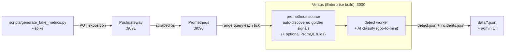

# Metrics demo — Prometheus

_Enterprise_

A hands-on walkthrough: stand up Prometheus, point the `prometheus`
data source at it, drive a synthetic **EC2-style 5xx + latency spike**, and watch
Versus discover the signals, fire an anomaly, classify it with the detect AI, and open a
real incident.

This is the **demo companion** to the reference page
[Prometheus / Metrics](../agent/data-sources/prometheus.md). That page explains the
options and the learning model; this page is the copy-paste reproduction.

> This walkthrough is the **baseline-first** demo path: run steady, healthy traffic
> until the source has learned each signal's normal, then spike it so the now-anomalous
> signal pages.

## What you'll build



A host-run generator **pushes** synthetic series to a Pushgateway; Prometheus scrapes
them; the enterprise `prometheus` source **auto-discovers the golden signals** for each
service and learns their baseline from steady traffic. Once a signal has a learned normal
and then goes clearly anomalous, it emits a signal.

## Prerequisites

| Need | Why |
|---|---|
| **Docker** (Compose v2) | run the Prometheus stack; the standing source runs from your **Versus Enterprise distribution** (below) |
| A **Versus Enterprise license**, supply it via the `LICENSE_KEY` environment variable | the standing `prometheus` source is gated on this feature |
| An **AI API key** (e.g. OpenAI) | the detect AI that triages the anomaly and writes the incident summary |
| **Python 3** | runs `scripts/generate_fake_metrics.py` (stdlib only — no `pip install`) |

## 1. Bring up the stack

Everything runs from assets shipped in this repo. Start the **Pushgateway + Prometheus + Redis** from the metrics example
([examples/docker-compose/metrics/](../../examples/docker-compose/metrics/)):

```bash
cd examples/docker-compose/metrics
docker compose up -d
```

Check Prometheus is up at <http://localhost:9090> and the Pushgateway at
<http://localhost:9091>.

## 2. Configure the source

Declare the enterprise `prometheus` source in
[config/agent_sources.yaml](../../config/agent_sources.yaml) — the file Versus loads
from next to `config.yaml`. The headline config is **auto-learning**: give it the
`address` (and auth if needed). The
source auto-discovers each service's golden signals (traffic, errors, latency, resource
use) and learns their baseline itself:

```yaml
sources:
  - name: demo-prom
    type: prometheus
    enable: true
    options:
      address: http://localhost:9090   # host-published Prometheus
```

## 3. Understand the three modes

Versus Enterprise runs in one of three **agent modes**. You pick the mode via `AGENT_MODE`
when you start the container. The demo walks through them in order:

| Mode | What it does | Use when |
|---|---|---|
| `training` | Discovers golden signals and **learns their baseline** (normal behavior). No alerts, no incidents — pure observation. | First run — let it watch healthy traffic and build a model of "normal." |
| `shadow` | Scores every signal against the learned baseline. Writes **"would have alerted"** verdicts to the UI — but **pages no one**. | Validating that the learned baseline is accurate before going live. |
| `detect` | Opens a **real incident automatically** when a signal deviates from the learned baseline. A lightweight **AI classification** writes the incident's title, severity, and summary. (The deep, tool-using **AI analysis** is a separate, on-demand step — see [step 5](#5-watch-the-results).) | Production — the payoff mode. |

The recommended sequence for this demo:

1. Start in **`training`** with healthy traffic → builds the baseline.
2. Switch to **`detect`** and introduce the spike → fires a real incident.

## 4. Run your Versus Enterprise

### Step A — Training mode (learn the baseline)

Start the Enterprise image in `training` mode. Mount this repo's `config/` and a `data/`
directory. `--network host` lets the container reach the host-published Redis and
Prometheus at `localhost`. From the repo root:

```bash
docker run --rm --name versus-enterprise \
  --network host \
  -v "$PWD/config:/app/config" \
  -v "$PWD/data:/app/data" \
  -e GATEWAY_SECRET=dev-gateway-secret \
  -e REDIS_HOST=localhost -e REDIS_PORT=6379 -e REDIS_PASSWORD=versus \
  -e LICENSE_KEY=... \
  -e AGENT_ENABLE=true \
  -e AGENT_AI_ENABLE=true \
  -e AGENT_AI_API_KEY=sk-... \
  -e AGENT_AI_MODEL=gpt-4o-mini \
  -e AGENT_MODE=training \
  -e AGENT_NEW_SERVICE_GRACE=0 \
  ghcr.io/versuscontrol/versus-enterprise:latest
```

On boot you should see:

```text
enterprise: datasource: auto-wired query_metrics tool from prometheus source "demo-prom"
agent: standing metric source "demo-prom" discovered 12 signal(s) across N service(s) ...
agent: analyze agent enabled model=gpt-4o-mini tools=5
enterprise: agent started (mode=training, sources=1)
```

`sources=1` and **no** `requires Versus Enterprise` line confirm the license unlocked the
source.

**Now generate steady, healthy traffic** so the source learns a low baseline:

```bash
python3 scripts/generate_fake_metrics.py --service ec2-i-0abcd1234 --duration 600
```

Leave it running. The source watches the healthy metrics and builds its model of "normal"
for each discovered signal. Nothing alerts — that's correct for training mode.

### Step B — Detect mode (fire the incident)

Stop the container (`Ctrl-C` or `docker stop versus-enterprise`) and restart in
**`detect`** mode — change only `AGENT_MODE`:

```bash
docker run --rm --name versus-enterprise \
  --network host \
  -v "$PWD/config:/app/config" \
  -v "$PWD/data:/app/data" \
  -e GATEWAY_SECRET=dev-gateway-secret \
  -e REDIS_HOST=localhost -e REDIS_PORT=6379 -e REDIS_PASSWORD=versus \
  -e LICENSE_KEY=... \
  -e AGENT_ENABLE=true \
  -e AGENT_AI_ENABLE=true \
  -e AGENT_AI_API_KEY=sk-... \
  -e AGENT_AI_MODEL=gpt-4o-mini \
  -e AGENT_MODE=detect \
  -e AGENT_NEW_SERVICE_GRACE=0 \
  ghcr.io/versuscontrol/versus-enterprise:latest
```

Now introduce the spike:

```bash
python3 scripts/generate_fake_metrics.py --spike --service ec2-i-0abcd1234 --duration 180
```

This pushes `~45%` `500`s and a fat-tailed latency distribution (p95 > 500ms). The
auto-discovered signals deviate from the baseline learned in training, and Versus
**opens an incident automatically** — a lightweight AI classification (the detect agent)
writes its title, severity, and summary. The deeper tool-using investigation does **not**
run yet; it's an on-demand step you trigger from the incident itself (next).

## 5. Watch the results

**Cross-check the raw anomaly in Prometheus.** Open <http://localhost:9090>, *Graph*
tab, and run:

```promql
sum by (service) (rate(demo_http_requests_total{code=~"5.."}[1m]))
```

It climbs past `0.5` during the spike.

**See the incident in the admin UI.** Open <http://localhost:3000/> and go to the
**Incidents** page — the new incident appears with the AI classification from detect mode:
source `demo-prom`, a title, a severity, a confidence, and status *firing*. The **Shadow**
page shows what the source scored for each discovered signal.

**Run the deep AI analysis (on demand).** Detect mode opens the incident with the
lightweight classification above; the full **AI analysis** — the tool-using root-cause
investigation that calls `query_metrics`, searches runbooks, and correlates related
signals — runs **only when you open the incident and click *Analyze*** on its detail page.
That keeps every firing signal cheap and reserves the expensive multi-step investigation
for the incidents you choose to dig into. The boot line
`agent: analyze agent enabled ... tools=5` means this analyzer is *available*, not that it
ran during detect.

## Going further: name your own signals (optional)

Once the demo is running on auto-discovery, you can also have the source watch **signals
you name yourself** — pick the exact PromQL and attach a declared `severity`. Edit
`demo-prom` in [config/agent_sources.yaml](../../config/agent_sources.yaml) to append a
`queries:` block, then restart the run command. These pinned signals are layered **on top
of** auto-discovery and mirror the reference page's
*Advanced: custom signals* (see [Prometheus / Metrics](../agent/data-sources/prometheus.md)):

```yaml
sources:
  - name: demo-prom
    type: prometheus
    enable: true
    options:
      address: http://localhost:9090
      step: 30s
      page_size: 500
      queries:
        # 5xx error rate above 0.5 req/s — silent at the ~0.5% normal error
        # ratio, fires hard during a spike.
        - query: 'sum by (service) (rate(demo_http_requests_total{code=~"5.."}[1m])) > 0.5'
          severity: critical
          service_label: service
        # p95 request latency above 500ms.
        - query: 'histogram_quantile(0.95, sum by (service, le) (rate(demo_http_request_duration_seconds_bucket[1m]))) > 0.5'
          severity: high
          service_label: service
```

The metric names (`demo_http_requests_total`,
`demo_http_request_duration_seconds_bucket`) are exactly what the generator emits, so the
pinned signals attach to the generator's series out of the box. **A pinned signal is not
a threshold tripwire:** its value still flows through the same auto-learning baseline
brain, so — like every signal — it must establish a baseline from steady traffic before a
deviation pages. The `> 0.5` in the PromQL shapes *which* series the source tracks and the
declared `severity` rides along; it does **not** open an incident the instant a series
crosses it. The working trigger is still **baseline-first**.

## 6. Tear down

```bash
cd examples/docker-compose/metrics
docker compose down -v
```

## Troubleshooting

| Symptom | Cause / fix |
|---|---|
| `requires Versus Enterprise` on every tick, `sources=0`, `mode=community` | The license is missing the **`intelligence`** feature (or you're on an OSS build). Mint a key that includes `intelligence`. This is the open-core line: OSS keeps only the on-demand `query_metrics` tool, not the standing source. |
| Boot fails to connect to Redis | Ensure the `versus-metrics-redis` container is healthy and published on `:6379`, and that `REDIS_HOST=localhost` / `REDIS_PORT=6379` / `REDIS_PASSWORD` are set in the run command. Redis here is **TLS-only** — Versus dials TLS by default, so do **not** set `REDIS_TLS=false`. |
| `NOAUTH` / `WRONGPASS` from Redis | `REDIS_PASSWORD` in the run command must match the password the container started with (`versus` unless you exported `REDIS_PASSWORD` before `docker compose up`). |
| TLS handshake / `certificate signed by unknown authority` on Redis | The example uses a self-signed cert; keep `redis.insecure_skip_verify: true` in `config.yaml`, or set `REDIS_CA_CERT` to a real CA bundle. |
| `analyze agent enabled` never appears, no AI summary | `AGENT_AI_ENABLE=true` and a real `AGENT_AI_API_KEY` are both required — set both in the run command. |
| Rules never fire even during a spike | Confirm the generator targets the Pushgateway (`--target http://localhost:9091`, the default) and that the source `address` is `http://localhost:9090`. Check the PromQL in Prometheus directly. |
| Demo emits nothing / `matched=0 skipped_no_match` every tick | Metric sources learn-all by default — there is no regex to set. Confirm you're on a build with the per-kind default (metric `type`s bypass the log text-regex) and that the source `type` is a metrics type (`prometheus`). Do **not** edit the global `agent.regex.default_pattern` to widen it — that's logs-only and would loosen your log sources. To *intentionally* narrow the metrics kind, set the optional top-level `agent.regex.metrics` key (empty = learn-all). |
| Incident not in `data/incidents.json` | Storage defaults to `file` (`storage.type: file`), writing `data/*.json`. If you changed `storage.type`, incidents go to that backend instead (the admin UI shows them either way). |

## See also

- Reference: [Prometheus / Metrics (Enterprise)](../agent/data-sources/prometheus.md)
- The trace twin of this demo: [Traces demo, end to end](./traces.md)
- The logs lifecycle this mirrors: [Shadow Mode](../agent/shadow-mode.md) · [AI Detect Mode](../agent/ai-detect-mode.md) · [AI Analyze Mode](../agent/ai-analyze-mode.md)
- On-demand correlation tools: [Analyze Tools](../agent/analyze-tools/tools.md)
