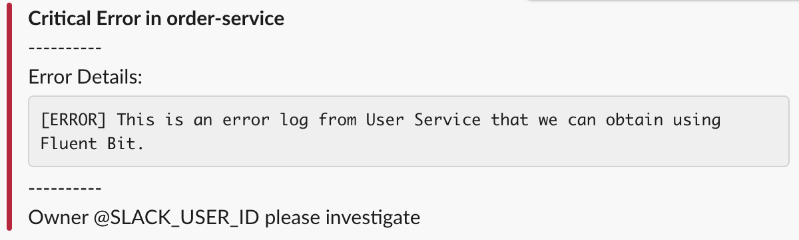

## Getting Started

### Prerequisites

- Go 1.20+
- Docker 20.10+ (optional)
- Slack workspace (for Slack notifications)

### Installation

```bash
docker run -p 3000:3000 -e SLACK_ENABLE=true -e SLACK_TOKEN=your_token -e SLACK_CHANNEL_ID=your_channel ghcr.io/versuscontrol/versus-incident
```

### Build from source

```bash
# Clone the repository
git clone https://github.com/yourusername/versus.git
cd versus

# Build with Go
go build -o versus ./cmd/main.go

# Or run with Docker
docker build -t versus-incident .

docker run -p 3000:3000 -e SLACK_ENABLE=true -e SLACK_TOKEN=your_token -e SLACK_CHANNEL_ID=your_channel versus-incident
```

## Configuration

Edit `config/config.yaml`:

```yaml
name: versus
host: 0.0.0.0
port: 3000

alert:
  slack:
    enable: false  # Default value, will be overridden by SLACK_ENABLE env var
    token: ${SLACK_TOKEN}            # From environment
    channel_id: ${SLACK_CHANNEL_ID}  # From environment
    template_path: "config/slack_message.tmpl"

  telegram:
    enable: false  # Default value, will be overridden by TELEGRAM_ENABLE env var
    bot_token: ${TELEGRAM_BOT_TOKEN} # From environment
    chat_id: ${TELEGRAM_CHAT_ID} # From environment
    template_path: "config/telegram_message.tmpl"

```
## Environment Variables

The application relies on several environment variables to configure alerting services. Below is an explanation of each variable:

### Slack Configuration
| Variable          | Description |
|------------------|-------------|
| `SLACK_ENABLE`   | Set to `true` to enable Slack notifications. |
| `SLACK_TOKEN`    | The authentication token for your Slack bot. |
| `SLACK_CHANNEL_ID` | The ID of the Slack channel where alerts will be sent. |

### Telegram Configuration
| Variable              | Description |
|----------------------|-------------|
| `TELEGRAM_ENABLE`    | Set to `true` to enable Telegram notifications. |
| `TELEGRAM_BOT_TOKEN` | The authentication token for your Telegram bot. |
| `TELEGRAM_CHAT_ID`   | The chat ID where alerts will be sent. |

Ensure these environment variables are properly set before running the application. You can configure them in your `.env` file, Docker environment variables, or Kubernetes secrets.

## Custom Alert Templates

### Slack Template
Create your Slack message template, for example `config/slack_message.tmpl`:

```
*Critical Error in {{.ServiceName}}*
----------
Error Details:
{{.Logs}}
----------
Owner <@{{.UserID}}> please investigate
```
### Telegram Template

For Telegram, you can use HTML formatting. Create your Telegram message template, for example `config/telegram_message.tmpl`:
```
🚨 <b>Critical Error Detected!</b> 🚨
📌 <b>Service:</b> {{.ServiceName}}
⚠️ <b>Error Details:</b>
{{.Logs}}
```
This template will be parsed with HTML tags when sending the alert to Telegram.

## Development

### Docker

#### Basic Deployment
```bash
# Build image
docker build -t versus-incident .

# Run container
docker run -d \
  -p 3000:3000 \
  -e SLACK_ENABLE=true \
  -e SLACK_TOKEN=your_slack_token \
  -e SLACK_CHANNEL_ID=your_channel_id \
  --name versus \
  versus-incident
```

#### With Custom Templates

**Configuration Notes**
- Ensure `template_path` in config.yaml matches container path:
  ```yaml
  alert:
    slack:
      template_path: "/app/config/slack_message.tmpl" # For containerized env
  ```
- File permissions: Templates must be readable by the app user (UID 1000 in Dockerfile)

1. Create local config directory with your templates:
```bash
mkdir -p ./config
cp your-custom-template.tmpl ./config/slack_message.tmpl
```

2. Run with volume mount:
```bash
docker run -d \
  -p 3000:3000 \
  -v $(pwd)/config:/app/config \
  -e SLACK_ENABLE=true \
  -e SLACK_TOKEN=your_slack_token \
  -e SLACK_CHANNEL_ID=your_channel_id \
  --name versus \
  versus-incident
```

3. Verify template mounting:
```bash
docker exec versus ls -l /app/config
```

### Kubernetes

1. Create a secret for Slack:
```bash
# Create secret
kubectl create secret generic versus-secrets \
  --from-literal=slack_token=$SLACK_TOKEN \
  --from-literal=slack_channel_id=$SLACK_CHANNEL_ID
```

2. Create ConfigMap for config and template file, for example `versus-config.yaml`:
```yaml
apiVersion: v1
kind: ConfigMap
metadata:
  name: versus-config
data:
  config.yaml: |
    name: versus
    host: 0.0.0.0
    port: 3000

    alert:
      slack:
        enable: true
        token: ${SLACK_TOKEN}
        channel_id: ${SLACK_CHANNEL_ID}
        template_path: "/app/config/slack_message.tmpl"

      telegram:
        enable: false

  slack_message.tmpl: |
    *Critical Error in {{.ServiceName}}*
    ----------
    Error Details:
    ```
    {{.Logs}}
    ```
    ----------
    Owner <@{{.UserID}}> please investigate

```

```bash
kubectl apply -f versus-config.yaml
```

3. Create `versus-deployment.yaml`:
```yaml
apiVersion: apps/v1
kind: Deployment
metadata:
  name: versus-incident
spec:
  replicas: 2
  selector:
    matchLabels:
      app: versus-incident
  template:
    metadata:
      labels:
        app: versus-incident
    spec:
      containers:
      - name: versus-incident
        image: ghcr.io/versuscontrol/versus-incident:v1.0.0
        ports:
        - containerPort: 3000
        livenessProbe:
          httpGet:
            path: /healthz
            port: 3000
        env:
          - name: SLACK_CHANNEL_ID
            valueFrom:
              secretKeyRef:
                name: versus-secrets
                key: slack_channel_id
          - name: SLACK_TOKEN
            valueFrom:
              secretKeyRef:
                name: versus-secrets
                key: slack_token
        volumeMounts:
        - name: versus-config
          mountPath: /app/config/config.yaml
          subPath: config.yaml
        - name: versus-config
          mountPath: /app/config/slack_message.tmpl
          subPath: slack_message.tmpl
      volumes:
      - name: versus-config
        configMap:
          name: versus-config

---
apiVersion: v1
kind: Service
metadata:
  name: versus-service
spec:
  selector:
    app: versus
  ports:
    - protocol: TCP
      port: 3000
      targetPort: 3000
```

4. Apply changes:
```bash
kubectl apply -f versus-deployment.yaml
```

5. Verify template mounting:
```bash
kubectl exec -it <pod-name> -- ls -l /app/config
```

## API Usage

Create an incident:

```bash
curl -X POST http://localhost:3000/api/incidents \
  -H "Content-Type: application/json" \
  -d '{
    "Logs": "[ERROR] This is an error log from User Service that we can obtain using Fluent Bit.",
    "ServiceName": "order-service",
    "UserID": "SLACK_USER_ID"
  }'
```

**Response:**
```json
{
    "status":"Incident created"
}
```

**Result:**

***Slack***



***Telegram***

