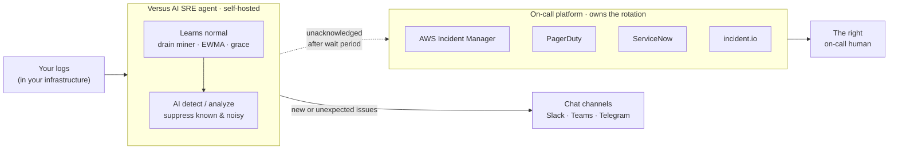

# Upstream of On-Call

**Versus does not replace your on-call platform — it sits upstream of it.**
Your on-call tool owns rotations, schedules, and escalation policies. Versus is
the **self-hosted AI noise-reduction layer** in front of it: it reads your logs,
learns what normal looks like, and only escalates what is new or unexpected issues. The
result is **fewer pages, not another rotation to manage.**

Versus escalates unacknowledged incidents to every on-call platform it supports:

- **[AWS Incident Manager](./aws-incident-manager.md)** — start an Incident
  Manager response plan.
- **[PagerDuty](./pagerduty.md)** — trigger a PagerDuty incident.
- **[ServiceNow](./servicenow.md)** — open a ServiceNow incident record.
- **[incident.io](./incident-io.md)** — raise an incident.io HTTP alert event.

It works the same way with Opsgenie and any tool reachable by webhook. See the
[On-Call — Introduction](./on-call-introduction.md) to pick a provider.

## The problem: pages you didn't need

Most teams don't page too little — they page too much. Threshold rules fire on
known-noisy conditions, duplicate alerts stack up, and the 3 a.m. page is too
often something that was never actionable. Alert fatigue is an on-call retention
problem.

On-call platforms are excellent at *getting the right human on a real incident.*
They are not designed to *decide which raw log noise deserves a human at all.*
That decision is the Versus job.

## The pattern: Versus detects, your on-call platform escalates

1. **Versus reads your logs in place.** Self-hosted — nothing leaves your infrastructure for
   analysis.
2. **It suppresses the known and the noisy.** Drain miner + EWMA + grace periods
   collapse repeats and learned-normal patterns; AI detect/analyze triages the
   rest. Every decision is recorded and auditable.
3. **Only the new or unexpected issues becomes an incident.** It is templated and fanned out
   to your chat channels.
4. **If it goes unacknowledged, Versus escalates** to AWS Incident Manager,
   PagerDuty, ServiceNow, or incident.io — which does what it does best:
   rotations, schedules, and escalation policies route it to the right human.

Your on-call platform stays your system of record for on-call. Versus just makes
sure it only rings for things worth waking someone up over.

## Why upstream noise reduction beats more routing rules

- **Cut page volume at the source.** Suppressing noise *before* it reaches your
  on-call platform reduces pages and the per-event cost pressure that comes with
  them — you are not paying to route alerts that should never have fired.
- **Catch the unknowns too.** Versus raises anomalies nobody wrote a rule for, so
  reducing noise doesn't mean missing novel failures.
- **Keep your data in your infrastructure.** Detection happens self-hosted; only the incident
  notification is sent onward.
- **Auditable triage.** Every suppress/escalate decision is recorded — defensible
  for regulated teams.

## Set it up

Versus ships first-class on-call integrations for every supported platform:

| Platform | Concepts | Step-by-step |
|---|---|---|
| AWS Incident Manager | [AWS Incident Manager](./aws-incident-manager.md) | [How to Integrate (basic)](./how-to-integration-aws-icm.md) · [advanced](./how-to-integration-aws-icm-adv.md) |
| PagerDuty | [PagerDuty](./pagerduty.md) | [How to Integrate PagerDuty](./how-to-integration-pagerduty.md) |
| ServiceNow | [ServiceNow](./servicenow.md) | [How to Integrate ServiceNow](./how-to-integration-servicenow.md) |
| incident.io | [incident.io](./incident-io.md) | [How to Integrate incident.io](./how-to-integration-incident-io.md) |

New to the model? Start with the [On-Call — Introduction](./on-call-introduction.md).

## Works with your whole on-call stack

The same upstream pattern applies to **Opsgenie** and any webhook-reachable
tool — Versus is the detection and noise-reduction layer; they own the rotation.
Versus never introduces its own schedules or escalation policies.

## Try it

Run the MIT core in under 30 minutes and route your first incident to your on-call
platform: [AI Agent — Getting Started](../agent/getting-started.md). Email
<a href="mailto:supports@devopsvn.tech?subject=Versus%20%2B%20on-call">supports@devopsvn.tech</a> for enterprise pricing.
